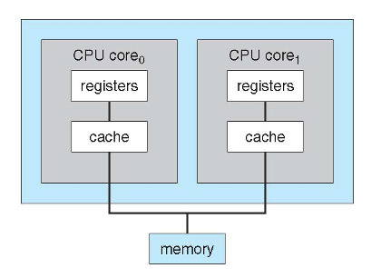
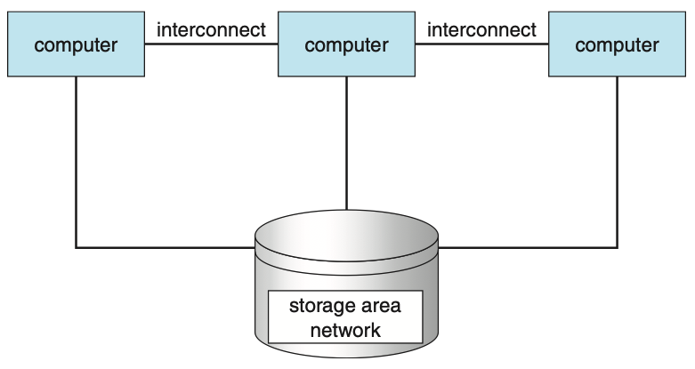

# Chapter 01 - Introduction


**TOCs**
- [Chapter01 - Introduction](#chapter01---introduction)
  - [What Operating Systems Do](#what-operating-systems-do)
    - [Operating system goals:](#operating-system-goals)
  - [Computer system structure](#computer-system-structure)
    - [OS is a resource allocator](#os-is-a-resource-allocator)
    - [OS is a control program](#os-is-a-control-program)
  - [Operating-System Operations](#operating-system-operations)
  - [Storage Management](#storage-management)
    - [Storage Hierarchy](#storage-hierarchy)
  - [Memory Management](#memory-management)
    - [Cache](#cache)
    - [DMA (Direct Memory Access)](#dma-direct-memory-access)
    - [Computer-System Architecture](#computer-system-architecture)


## What Operating Systems Do

A program that acts as an intermediary between a user of a computer and the computer hardware
```
                        OS
a user of a computer <------> the computer hardware
```

### Operating system goals:

- Execute user programs and make solving user problems easier
- Make the computer system convenient to use
- Use the computer hardware in an efficient manner

## Computer system structure

- **Hardware** provides basic computing resources (CPU, memory, I/O devices)
- **Operating system** controls and coordinates use of the hardware among the various application programs for various users
- **Application programs** define the ways in which the system resources are used to solve the computing problems of the users
- **Users** can be people, machines, other computers


### OS is a resource allocator
- Manages all resources
- Decides between conflicting requests for efficient and fair resource use

### OS is a control program
- Controls execution of programs to prevent errors and improper use of the computer

## Operating-System Operations
Interrupt transfers control to the interrupt service routine generally, through the interrupt vector, which contains the addresses of all the service routines
Interrupt architecture must save the address of the interrupted instruction
A trap or exception is a software-generated interrupt caused either by an error or a user request

> **An operating system is interrupt driven**

- The operating system preserves the state of the CPU by storing registers and the program counter
- Determines which type of interrupt has occurred:
  - polling
  - vectored interrupt system
- Separate segments of code determine what action should be taken for each type of interrupt


## Storage Management
### Storage Hierarchy

- Storage systems organized in hierarchy
  - Speed
  - Cost
  - Volatility
- Caching – copying information into faster storage system; main memory can be viewed as a cache for secondary storage
- Device Driver for each device controller to manage I/O
  - Provides uniform interface between controller and kernel

## Memory Management

### Cache
- Important principle, performed at many levels in a computer (in hardware, operating system, software)
- Information in use copied from slower to faster storage temporarily
- Faster storage (cache) checked first to determine if information is there
  - If it is, information used directly from the cache (fast)
  - If not, data copied to cache and used there
- Cache smaller than storage being cached
  - Cache management important design problem
  - Cache size and replacement policy


### DMA (Direct Memory Access)

- Used for high-speed I/O devices able to transmit information at close to memory speeds
- Device controller transfers blocks of data from buffer storage directly to main memory without CPU intervention
- Only one interrupt is generated per block, rather than the one interrupt per byte


### Computer-System Architecture

- Most systems use a single general-purpose processor
  - Most systems have special-purpose processors as well
- **Multiprocessors** systems growing in use and importance
  - Also known as **parallel systems, tightly-coupled systems**
  - Advantages include:
    1. **Increased throughput**
    2. **Economy of scale**
    3. **Increased reliability** – graceful degradation or fault tolerance
  - Two types:
    1. **Asymmetric Multiprocessing** – each processor is assigned a specie task.
    2. **Symmetric Multiprocessing** – each processor performs all tasks

| Symmetric Multiprocessing Architecture | A Dual-Core Design |
| --- | --- |
|  |  |
| each processor performs all tasks | <ul><li>Multi-chip and multicore</li><li>system contains all chips (Chassis containing multiple separate systems)</li></ul> |





- Like multiprocessor systems, but multiple systems working together
  - Usually sharing storage via a **storage-area network (SAN)**
  - Provides a **high-availability** service which survives failures
    - **Asymmetric clustering** has one machine in hot-standby mode
    - **Symmetric clustering** has multiple nodes running applications, monitoring each other
  - Some clusters are for **high-performance computing (HPC)**
    - Applications must be written to use **parallelization**
  - Some have **distributed lock manager (DLM)** to avoid conflicting operations


