# Chapter 05 - CPU Scheduling <!-- omit in toc -->

**Table of Contents**
- [Basic Concepts](#basic-concepts)
  - [Histogram of CPU-burst Times](#histogram-of-cpu-burst-times)
  - [CPU Scheduler](#cpu-scheduler)
  - [Preemptive and Nonpreemptive Scheduling](#preemptive-and-nonpreemptive-scheduling)
  - [Dispatcher](#dispatcher)
- [Scheduling Algorithms](#scheduling-algorithms)
  - [Scheduling Criteria](#scheduling-criteria)
  - [Scheduling Algorithm Optimization Criteria](#scheduling-algorithm-optimization-criteria)
  - [First- Come, First-Served (FCFS) Scheduling](#first--come-first-served-fcfs-scheduling)
  - [Shortest-Job-First (SJF) Scheduling](#shortest-job-first-sjf-scheduling)
    - [Example](#example)
  - [Determining Length of Next CPU Burst](#determining-length-of-next-cpu-burst)
  - [Prediction of the Length of the Next CPU Burst](#prediction-of-the-length-of-the-next-cpu-burst)
  - [Examples of Exponential Averaging](#examples-of-exponential-averaging)
  - [Example of Shortest-remaining-time-first](#example-of-shortest-remaining-time-first)
  - [Round Robin (RR)](#round-robin-rr)
    - [Example of RR with Time Quantum = 4](#example-of-rr-with-time-quantum--4)
  - [Time Quantum and Context Switch Time](#time-quantum-and-context-switch-time)
  - [Turnaround Time Varies With The Time Quantum](#turnaround-time-varies-with-the-time-quantum)
  - [Priority Scheduling](#priority-scheduling)
    - [Example of Priority Scheduling](#example-of-priority-scheduling)
    - [Priority Scheduling w/ Round-Robin](#priority-scheduling-w-round-robin)
  - [Multilevel Queue](#multilevel-queue)
  - [Multilevel Feedback Queue](#multilevel-feedback-queue)
    - [Example of Multilevel Feedback Queue](#example-of-multilevel-feedback-queue)
- [Thread Scheduling](#thread-scheduling)
  - [Pthread Scheduling](#pthread-scheduling)
    - [Pthread Scheduling API](#pthread-scheduling-api)
- [Multi-Processor Scheduling](#multi-processor-scheduling)
  - [Multicore Processors](#multicore-processors)
  - [Multithreaded Multicore System](#multithreaded-multicore-system)
  - [Multithreaded Multicore System](#multithreaded-multicore-system-1)
    - [Multiple-Processor Scheduling – Load Balancing](#multiple-processor-scheduling--load-balancing)
    - [Multiple-Processor Scheduling – Processor Affinity](#multiple-processor-scheduling--processor-affinity)
  - [NUMA and CPU Scheduling](#numa-and-cpu-scheduling)
- [Real-Time CPU Scheduling](#real-time-cpu-scheduling)
  - [Interrupt Latency](#interrupt-latency)
  - [Dispatch Latency](#dispatch-latency)
  - [Priority-based Scheduling](#priority-based-scheduling)
  - [Rate Monotonic Scheduling](#rate-monotonic-scheduling)
  - [Missed Deadlines with Rate Monotonic Scheduling](#missed-deadlines-with-rate-monotonic-scheduling)
  - [Earliest Deadline First Scheduling (EDF)](#earliest-deadline-first-scheduling-edf)
  - [Proportional Share Scheduling](#proportional-share-scheduling)
  - [POSIX Real-Time Scheduling](#posix-real-time-scheduling)
  - [POSIX Real-Time Scheduling API](#posix-real-time-scheduling-api)
- [Operating Systems Examples](#operating-systems-examples)
  - [Linux scheduling](#linux-scheduling)
    - [Linux Scheduling Through Version 2.5](#linux-scheduling-through-version-25)
    - [Linux Scheduling in Version 2.6.23 +](#linux-scheduling-in-version-2623-)
    - [CFS Performance](#cfs-performance)
  - [Windows scheduling](#windows-scheduling)
    - [Windows Priority Classes](#windows-priority-classes)
    - [Windows Priority](#windows-priority)
  - [Solaris scheduling](#solaris-scheduling)
    - [Solaris Dispatch Table](#solaris-dispatch-table)
    - [Solaris Scheduling](#solaris-scheduling-1)
- [Algorithm Evaluation](#algorithm-evaluation)
  - [Deterministic Evaluation](#deterministic-evaluation)
  - [Queueing Models](#queueing-models)
  - [Little’s Formula](#littles-formula)
  - [Simulations](#simulations)
  - [Evaluation of CPU Schedulers by Simulation](#evaluation-of-cpu-schedulers-by-simulation)
  - [Implementation](#implementation)

## Basic Concepts

- Maximum CPU utilization obtained with multiprogramming
- CPU–I/O Burst Cycle – Process execution consists of a cycle of CPU execution and I/O wait
- CPU burst followed by I/O burst
- CPU burst distribution is of main concern

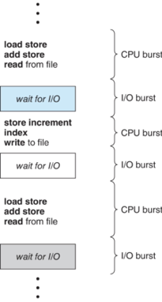

### Histogram of CPU-burst Times

- Large number of short bursts
- Small number of longer bursts


### CPU Scheduler

- The CPU scheduler selects from among the processes in ready queue, and allocates a CPU core to one of them
  - Queue may be ordered in various ways
- CPU scheduling decisions may take place when a process:
    1.	Switches from running to waiting state
    2.	Switches from running to ready state
    3.	Switches from waiting to ready
- Terminates
- For situations 1 and 4, there is no choice in terms of scheduling. A new process (if one exists in the ready queue) must be selected for execution. 
- For situations 2 and 3, however, there is  a choice.

### Preemptive and Nonpreemptive Scheduling

- When scheduling takes place only under circumstances 1 and 4, the scheduling scheme is nonpreemptive.
- Otherwise, it is preemptive. 
- Under Nonpreemptive scheduling, once the CPU has been allocated to a process, the process keeps the CPU until it releases it either by terminating or by switching to the waiting state. 
- Virtually all modern operating systems including Windows, MacOS, Linux, and UNIX use preemptive scheduling algorithms.
- Preemptive scheduling can result in race conditions when data are shared among several processes.
- Consider the case of two processes that share data. While one process is updating the data, it is preempted so that the second process can run. The second process then tries to read the data, which are in an inconsistent state. 
- This issue will be explored in detail in Chapter 6.

### Dispatcher

- Dispatcher module gives control of the CPU to the process selected by the CPU scheduler; this involves:
  - Switching context
  - Switching to user mode
  - Jumping to the proper location in the user program to restart that program
- Dispatch latency – time it takes for the dispatcher to stop one process and start another running


## Scheduling Algorithms

### Scheduling Criteria 

- CPU utilization – keep the CPU as busy as possible
- Throughput – # of processes that complete their execution per time unit
- Turnaround time – amount of time to execute a particular process
- Waiting time – amount of time a process has been waiting in the ready queue
- Response time – amount of time it takes from when a request was submitted until the first response is produced. 

### Scheduling Algorithm Optimization Criteria

- Max CPU utilization
- Max throughput
- Min turnaround time 
- Min waiting time 
- Min response time

### First- Come, First-Served (FCFS) Scheduling

```
Process	Burst Time	
   P1	      24
   P2       3
   P3	      3 
```

Suppose that the processes arrive in the order: P1 , P2 , P3  The Gantt Chart for the schedule is:
  
- Waiting time for $P1  = 0; P2  = 24; P3 = 27$
- Average waiting time: $(0 + 24 + 27)/3 = 17$

Suppose that the processes arrive in the order:
     $P2 , P3 , P1$
- The Gantt chart for the schedule is:  
  
- Waiting time for $P1 = 6; P2 = 0; P3 = 3$
- Average waiting time: $(6 + 0 + 3)/3 = 3$
- Much better than previous case
- Convoy effect - short process behind long process
  - Consider one CPU-bound and many I/O-bound processes

### Shortest-Job-First (SJF) Scheduling

- Associate with each process the length of its next CPU burst
  - Use these lengths to schedule the process with the shortest time
- SJF is optimal – gives minimum average waiting time for a given set of processes
  - The difficulty is knowing the length of the next CPU request
  - Could ask the user
- Associate with each process the length of its next CPU burst
  - Use these lengths to schedule the process with the shortest time
- SJF is optimal – gives minimum average waiting time for a given set of processes
- Preemptive version called shortest-remaining-time-first
- How do we determine the length of the next CPU burst?
  - Could ask the user
  - Estimate

#### Example

```
Process   Arrival Time	Burst Time
  P1	         0.0	         6
  P2 	         2.0	         8
  P3	         4.0	         7
  P4	         5.0	         3
```

- SJF scheduling chart
  
- Average waiting time = (3 + 16 + 9 + 0) / 4 = 7

### Determining Length of Next CPU Burst

- Can only estimate the length – should be similar to the previous one
  - Then pick process with shortest predicted next CPU burst
- Can be done by using the length of previous CPU bursts, using exponential averaging
  1. $t_n$ = actual length of $n^{th}$ CPU burst
  2. $\tau_{n+1}$ = predicted value for the next CPU burst
  3. $\alpha$ = 0 $\leq$ $\alpha$ $\leq$ 1
  4. Define:
- Commonly, $\alpha$ set to $\tau_{n+1}$ = $\alpha t_n$ + (1 - $\alpha$) $\tau_n$

### Prediction of the Length of the Next CPU Burst

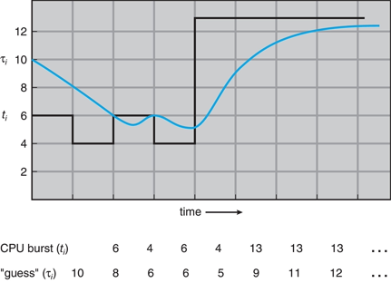

### Examples of Exponential Averaging

- $\alpha = 0$
  - $\tau_{n+1} = t_n$
  - Recent history does not count
- $\alpha = 1$
  - $\tau_{n+1} = \alpha t_n$
  - Only the last CPU burst counts
- If we expand the formula, we get:
  $$\tau_{n+1} = \alpha t_n + (1 - \alpha) \alpha t_{n-1} + ...$$
  $$+ (1 - \alpha)^j \alpha t_{n-j} + ...$$
  $$+ (1 - \alpha)^{n+1} \tau_0$$
- Since both $\alpha$ and $1 + \alpha$ are less than or equal to 1, each successive term has less weight than its predecessor

### Example of Shortest-remaining-time-first

- Now we add the concepts of varying arrival times and preemption to the analysis
```
Process    Arrival Time (T)	Burst Time
   P1	            0	            8
   P2             1             4
   P3	            2	            9
   P4	            3	            5
```
- Preemptive SJF Gantt Chart  
  
- Average waiting time = $[(10 - 1) + (1 - 1) + (17 - 2) + (5 - 3)] / 4 = 26 / 4 = 6.5$

https://ithelp.ithome.com.tw/articles/10277694?sc=rss.iron

### Round Robin (RR)

- Each process gets a small unit of CPU time (time quantum q), usually 10-100 milliseconds.  After this time has elapsed, the process is preempted and added to the end of the ready queue.
- If there are n processes in the ready queue and the time quantum is q, then each process gets $1 / n$ of the CPU time in chunks of at most q time units at once.  No process waits more than $(n - 1) q$ time units.
- Timer interrupts every quantum to schedule next process
- Performance
  - $q$ large -> FIFO
  - $q$ small -> q must be large with respect to context switch, otherwise overhead is too high

#### Example of RR with Time Quantum = 4

```
Process	    Burst Time
   P1	         24
   P2	         3
   P3	         3	
```
- The Gantt chart is:
    
- Typically, higher average turnaround than SJF, but better response
  - q should be large compared to context switch time
  - q usually 10 milliseconds  to 100 milliseconds, 
- Context switch < 10 microseconds

### Time Quantum and Context Switch Time

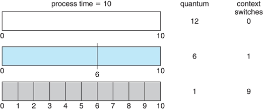

### Turnaround Time Varies With The Time Quantum

80% of CPU bursts should be shorter than q


### Priority Scheduling

- A priority number (integer) is associated with each process
- The CPU is allocated to the process with the highest priority (smallest integer $\equiv$ highest priority)
  - Preemptive
  - Nonpreemptive
- SJF is priority scheduling where priority is the inverse of predicted next CPU burst time
- Problem $\equiv$ Starvation – low priority processes may never execute
- Solution $\equiv$ Aging – as time progresses increase the priority of the process

#### Example of Priority Scheduling

```
Process    Aarrival Burst Time	Priority
  P1	              4              3
  P2 	              5	             2
  P3	              8	             2
  P4	              7	             1
  P5	              3	             3
```
- Priority scheduling Gantt Chart  
    
- Average waiting time = 8.2

#### Priority Scheduling w/ Round-Robin

```
Process    Aarrival Burst Time	Priority
  P1	              10             3
  P2 	              1	             1
  P3	              2	             4
  P4	              1	             5
  P5	              5	             2
```

- Run the process with the highest priority. Processes with the same priority run round-robin
- Gantt Chart with time quantum = 2
    

### Multilevel Queue

- With priority scheduling, have separate queues for each priority.
- Schedule the process in the highest-priority queue!
  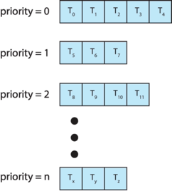
- Prioritization based upon process type
  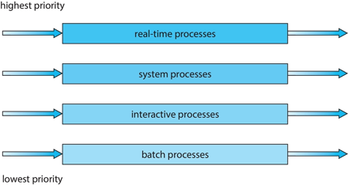

### Multilevel Feedback Queue

- A process can move between the various queues.
- Multilevel-feedback-queue scheduler defined by the following parameters:
  - Number of queues
  - Scheduling algorithms for each queue
  - Method used to determine when to upgrade a process
  - Method used to determine when to demote a process
  - Method used to determine which queue a process will enter when that process needs service
- Aging can be implemented using multilevel feedback queue

#### Example of Multilevel Feedback Queue

- Three queues: 
- $Q_0$ – RR with time quantum 8 milliseconds
- $Q_1$ – RR time quantum 16 milliseconds
- $Q_2$ – FCFS
- Scheduling
- A new process enters queue $Q_0$ which is served in RR
- When it gains CPU, the process receives 8 milliseconds
- If it does not finish in 8 milliseconds, the process  is moved to queue $Q_1$
- At $Q_1$ job is again served in RR and receives 16 additional milliseconds
- If it still does not complete, it is preempted and moved to queue $Q_2$

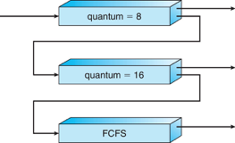


## Thread Scheduling

- Distinction between user-level and kernel-level threads
- When threads supported, threads scheduled, not processes
- Many-to-one and many-to-many models, thread library schedules user-level threads to run on LWP
  - Known as process-contention scope (PCS) since scheduling competition is within the process
  - Typically done via priority set by programmer
- Kernel thread scheduled onto available CPU is system-contention scope (SCS) – competition among all threads in system

### Pthread Scheduling

- API allows specifying either PCS or SCS during thread creation
  - `PTHREAD_SCOPE_PROCESS` schedules threads using PCS scheduling
  - `PTHREAD_SCOPE_SYSTEM` schedules threads using SCS scheduling
- Can be limited by OS – Linux and macOS only allow `PTHREAD_SCOPE_SYSTEM`

#### Pthread Scheduling API

```c
#include <pthread.h>
#include <stdio.h>
#define NUM_THREADS 5
int main(int argc, char *argv[]) {
    int i, scope;
    pthread_t tid[NUM THREADS];
    pthread_attr_t attr;
    /* get the default attributes */
    pthread_attr_init(&attr);
    /* first inquire on the current scope */ if (pthread_attr_getscope(&attr, &scope) != 0)
        fprintf(stderr, "Unable to get scheduling scope\n");
    else {
        if (scope == PTHREAD_SCOPE_PROCESS)
            printf("PTHREAD_SCOPE_PROCESS");
        else if (scope == PTHREAD_SCOPE_SYSTEM)
            printf("PTHREAD_SCOPE_SYSTEM");
        else
            fprintf(stderr, "Illegal scope value.\n");
    }
    /* set the scheduling algorithm to PCS or SCS */
    pthread_attr_setscope(&attr, PTHREAD_SCOPE_SYSTEM);
    /* create the threads */ for (i = 0; i < NUM_THREADS; i++)
        pthread_create(&tid[i], &attr, runner, NULL);
    /* now join on each thread */ for (i = 0; i < NUM_THREADS; i++)
        pthread_join(tid[i], NULL);
}
/* Each thread will begin control in this function */
void *runner(void *param) {
    /* do some work ... */
    pthread_exit(0);
}
```

## Multi-Processor Scheduling

- CPU scheduling more complex when multiple CPUs are available
- Multiprocess may be any one of the following architectures:
  - Multicore CPUs
  - Multithreaded cores
  - NUMA systems
  - Heterogeneous multiprocessing
- Symmetric multiprocessing (SMP) is where each processor is self scheduling.
- All threads may be in a common ready queue (a)
- Each processor may have its own private queue of threads (b)

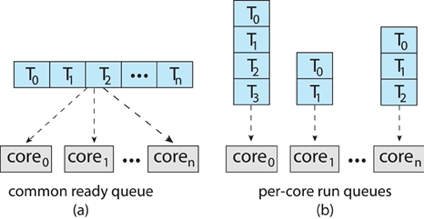

### Multicore Processors

- Recent trend to place multiple processor cores on same physical chip
- Faster and consumes less power
- Multiple threads per core also growing
- Takes advantage of memory stall to make progress on another thread while memory retrieve happens

  

### Multithreaded Multicore System

- Each core has > 1 hardware threads. 
- If one thread has a memory stall, switch to another thread!


### Multithreaded Multicore System

- Chip-multithreading (CMT) assigns each core multiple hardware threads. (Intel refers to this as hyperthreading.)
- On a quad-core system with 2 hardware threads per core, the operating system sees 8 logical processors.


#### Multiple-Processor Scheduling – Load Balancing

- If SMP, need to keep all CPUs loaded for efficiency
- Load balancing attempts to keep workload evenly distributed
- Push migration – periodic task checks load on each processor, and if found pushes task from overloaded CPU to other CPUs
- Pull migration – idle processors pulls waiting task from busy processor

#### Multiple-Processor Scheduling – Processor Affinity

- When a thread has been running on one processor, the cache contents of that processor stores the memory accesses by that thread.
- We refer to this as a thread having affinity for a processor (i.e., “processor affinity”)
- Load balancing may affect processor affinity as a thread may be moved from one processor to another to balance loads, yet that thread loses the contents of what it had in the cache of the processor it was moved off of.
- Soft affinity – the operating system attempts to keep a thread running on the same processor, but no guarantees.
- Hard affinity – allows a process to specify a set of processors it may run on.

### NUMA and CPU Scheduling

If the operating system is NUMA-aware, it will assign memory closes to the CPU the thread is running on. 

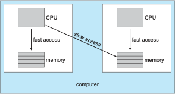

## Real-Time CPU Scheduling

- Can present obvious challenges
- Soft real-time systems – Critical real-time tasks have the highest priority, but no guarantee as to when tasks will be scheduled
- Hard real-time systems – task must be serviced by its deadline
- Event latency – the amount of time that elapses from when an event occurs to when it is serviced.
- Two types of latencies affect performance
  1. Interrupt latency – time from arrival of interrupt to start of routine that services interrupt
  2. Dispatch latency – time for schedule to take current process off CPU and switch to another

 

### Interrupt Latency

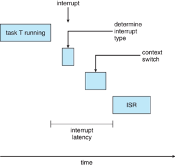

### Dispatch Latency

- Conflict phase of dispatch latency:
  1. Preemption of any process running in kernel mode
  2. Release by low-priority process of resources needed by high-priority processes

 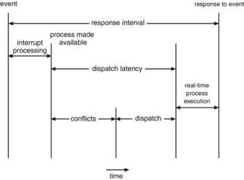

### Priority-based Scheduling

- For real-time scheduling, scheduler must support preemptive, priority-based scheduling
  - But only guarantees soft real-time
- For hard real-time must also provide ability to meet deadlines
- Processes have new characteristics: periodic ones require CPU at constant intervals
  - Has processing time t, deadline d, period p
  - 0 ≤ t ≤ d ≤ p
  - Rate of periodic task is 1/p


### Rate Monotonic Scheduling

- A priority is assigned based on the inverse of its period
- Shorter periods = higher priority;
- Longer periods = lower priority
- P1 is assigned a higher priority than P2.


### Missed Deadlines with Rate Monotonic Scheduling

Process P2 misses finishing its deadline at time 80


### Earliest Deadline First Scheduling (EDF)

- Priorities are assigned according to deadlines:
  - The earlier the deadline, the higher the priority
  - The later the deadline, the lower the priority


### Proportional Share Scheduling

- T shares are allocated among all processes in the system
- An application receives N shares where N < T
- This ensures each application will receive N / T of the total processor time

### POSIX Real-Time Scheduling

- The POSIX.1b standard
- API provides functions for managing real-time threads
- Defines two scheduling classes for real-time threads:
  1. `SCHED_FIFO` - threads are scheduled using a FCFS strategy with a FIFO queue. There is no time-slicing for threads of equal priority
  2. `SCHED_RR` - similar to `SCHED_FIFO` except time-slicing occurs for threads of equal priority
- Defines two functions for getting and setting scheduling policy:
  1. `pthread_attr_getsched_policy(pthread_attr_t *attr, int *policy)`
  2. `pthread_attr_setsched_policy(pthread_attr_t *attr, int policy)`

### POSIX Real-Time Scheduling API

```c
#include <pthread.h>
#include <stdio.h>
#define NUM_THREADS 5
int main(int argc, char *argv[]) {
    int i, policy;
    pthread_t_tid[NUM_THREADS];
    pthread_attr_t attr;
    /* get the default attributes */
    pthread_attr_init(&attr);
    /* get the current scheduling policy */ if (pthread_attr_getschedpolicy(&attr, &policy) != 0)
        fprintf(stderr, "Unable to get policy.\n");
    else {
        if (policy == SCHED_OTHER)
            printf("SCHED_OTHER\n");
        else if (policy == SCHED_RR)
            printf("SCHED_RR\n");
        else if (policy == SCHED_FIFO)
            printf("SCHED_FIFO\n");
    }
    /* set the scheduling policy - FIFO, RR, or OTHER */ if (pthread_attr_setschedpolicy(&attr, SCHED_FIFO) != 0)
        fprintf(stderr, "Unable to set policy.\n");
    /* create the threads */ for (i = 0; i < NUM_THREADS; i++)
        pthread_create(&tid[i], &attr, runner, NULL);
    /* now join on each thread */ for (i = 0; i < NUM_THREADS; i++)
        pthread_join(tid[i], NULL);
}

/* Each thread will begin control in this function */
void *runner(void *param) {
    /* do some work ... */
    pthread_exit(0);
}
```


## Operating Systems Examples


### Linux scheduling

#### Linux Scheduling Through Version 2.5

- Prior to kernel version 2.5, ran variation of standard UNIX scheduling algorithm
- Version 2.5 moved to constant order O(1) scheduling time
  - Preemptive, priority based
  - Two priority ranges: time-sharing and real-time
  - Real-time range from 0 to 99 and nice value from 100 to 140
  - Map into  global priority with numerically lower values indicating higher priority
  - Higher priority gets larger q
  - Task run-able as long as time left in time slice (active)
  - If no time left (expired), not run-able until all other tasks use their slices
  - All run-able tasks tracked in per-CPU runqueue data structure
    - Two priority arrays (active, expired)
    - Tasks indexed by priority
    - When no more active, arrays are exchanged
  - Worked well, but poor response times for interactive processes

#### Linux Scheduling in Version 2.6.23 +

- Completely Fair Scheduler (CFS)
- Scheduling classes
  - Each has specific priority
  - Scheduler picks highest priority task in highest scheduling class
  - Rather than quantum based on fixed time allotments, based on proportion of CPU time
  - Two scheduling classes included, others can be added
    1. default
    2. real-time
- Quantum calculated based on nice value from -20 to +19
  - Lower value is higher priority
  - Calculates target latency – interval of time during which task should run at least once
  - Target latency can increase if say number of active tasks increases
- CFS scheduler maintains per task virtual run time in variable vruntime
  - Associated with decay factor based on priority of task – lower priority is higher decay rate
  - Normal default priority yields virtual run time = actual run time
- To decide next task to run, scheduler picks task with lowest virtual run time

#### CFS Performance

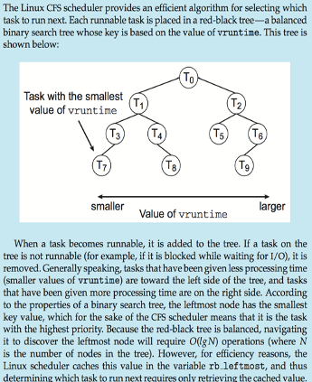

- Real-time scheduling according to POSIX.1b
- Real-time tasks have static priorities
- Real-time plus normal map into global priority scheme
- Nice value of -20 maps to global priority 100
- Nice value of +19 maps to priority 139
  
- Linux supports load balancing, but is also NUMA-aware.
- Scheduling domain is a set of CPU cores that can be balanced against one another. 
- Domains are organized by what they share (i.e., cache memory.) Goal is to keep threads from migrating between domains.
  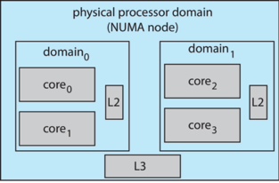


### Windows scheduling

- Windows uses priority-based preemptive scheduling
- Highest-priority thread runs next
- Dispatcher is scheduler
- Thread runs until (1) blocks, (2) uses time slice, (3) preempted by higher-priority thread
- Real-time threads can preempt non-real-time
- 32-level priority scheme
- Variable class is 1-15, real-time class is 16-31
- Priority 0 is memory-management thread
- Queue for each priority
- If no run-able thread, runs idle thread

#### Windows Priority Classes

- Win32 API identifies several priority classes to which a process can belong
  - `REALTIME_PRIORITY_CLASS, HIGH_PRIORITY_CLASS, ABOVE_NORMAL_PRIORITY_CLASS,NORMAL_PRIORITY_CLASS, BELOW_NORMAL_PRIORITY_CLASS, IDLE_PRIORITY_CLASS`
  - All are variable except `REALTIME`
- A thread within a given priority class has a relative priority
  - `TIME_CRITICAL, HIGHEST, ABOVE_NORMAL, NORMAL, BELOW_NORMAL, LOWEST, IDLE`
- Priority class and relative priority combine to give numeric priority
- Base priority is NORMAL within the class
- If quantum expires, priority lowered, but never below base
- If wait occurs, priority boosted depending on what was waited for
- Foreground window given 3x priority boost
- Windows 7 added user-mode scheduling (UMS) 
  - Applications create and manage threads independent of kernel
  - For large number of threads, much more efficient
  - UMS schedulers come from programming language libraries like                                         C++ Concurrent Runtime (ConcRT) framework

#### Windows Priority

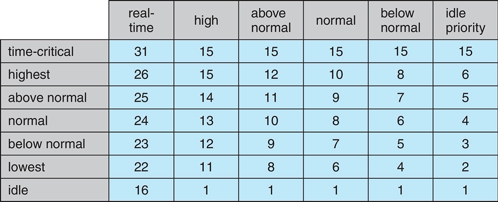


### Solaris scheduling

- Priority-based scheduling
- Six classes available
  - Time sharing (default) (TS)
  - Interactive (IA)
  - Real time (RT)
  - System (SYS)
  - Fair Share (FSS)
  - Fixed priority (FP)
- Given thread can be in one class at a time
- Each class has its own scheduling algorithm
- Time sharing is multi-level feedback queue
  - Loadable table configurable by sysadmin

#### Solaris Dispatch Table 


#### Solaris Scheduling


- Scheduler converts class-specific priorities into a per-thread global priority
  - Thread with highest priority runs next
  - Runs until (1) blocks, (2) uses time slice, (3) preempted by higher-priority thread
  - Multiple threads at same priority selected via RR

## Algorithm Evaluation

- How to select CPU-scheduling algorithm for an OS?
- Determine criteria, then evaluate algorithms
- Deterministic modeling
  - Type of analytic evaluation
  - Takes a particular predetermined workload and defines the performance of each algorithm  for that workload
- Consider 5 processes arriving at time 0:

```
Process    Burst Time
  P1	         10
  P2	         29
  P3	         3
  P4	         7
  P5	         12
```

### Deterministic Evaluation

- For each algorithm, calculate minimum average waiting time
- Simple and fast, but requires exact numbers for input, applies only to those inputs
  - FCS is 28ms:
    
  - Non-preemptive SFJ is 13ms:
    
  - RR is 23ms:
    

### Queueing Models

- Describes the arrival of processes, and CPU and I/O bursts probabilistically
  - Commonly exponential, and described by mean
  - Computes average throughput, utilization, waiting time, etc.
- Computer system described as network of servers, each with queue of waiting processes
  - Knowing arrival rates and service rates
  - Computes utilization, average queue length, average wait time, etc.

### Little’s Formula

- $n$ = average queue length
- $W$ = average waiting time in queue
- $\lambda$ = average arrival rate into queue
- Little’s law – in steady state, processes leaving queue must equal processes arriving, thus: 
   $$n = \lambda \times W$$
  - Valid for any scheduling algorithm and arrival distribution
- For example, if on average 7 processes arrive per second, and normally 14 processes in queue, then average wait time per process = 2 seconds


### Simulations

- Queueing models limited
- Simulations more accurate
  - Programmed model of computer system
  - Clock is a variable
  - Gather statistics  indicating algorithm performance
  - Data to drive simulation gathered via
    - Random number generator according to probabilities
    - Distributions defined mathematically or empirically
    - Trace tapes record sequences of real events in real systems

### Evaluation of CPU Schedulers by Simulation

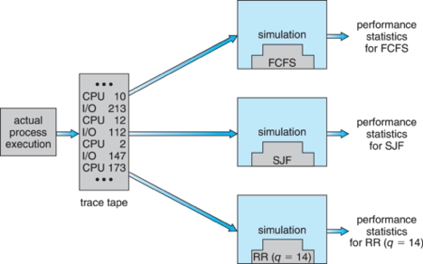

### Implementation

- Even simulations have limited accuracy
- Just implement new scheduler and test in real systems
  - High cost, high risk
  - Environments vary
- Most flexible schedulers can be modified per-site or per-system
- Or APIs to modify priorities
- But again environments vary


