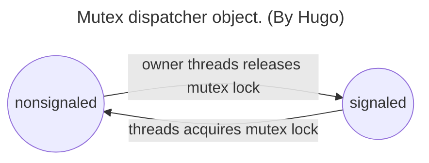
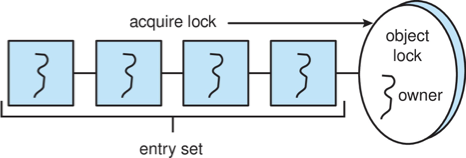

# Chapter 07 - Synchronization Examples     <!-- omit in toc -->

## Table of Contents<!-- omit in toc -->
- [Bounded-Buffer Problem](#bounded-buffer-problem)
  - [Producer Process](#producer-process)
  - [Consumer Process](#consumer-process)
- [Readers-Writers Problem](#readers-writers-problem)
  - [Writer Process](#writer-process)
  - [Reader Process](#reader-process)
- [Dining-Philosophers Problem](#dining-philosophers-problem)
  - [Monitor Solution](#monitor-solution)
    - [Resuming Processes within a Monitor](#resuming-processes-within-a-monitor)
  - [Semaphore Solution](#semaphore-solution)
    - [`x.wait()`](#xwait)
    - [`x.signal()`](#xsignal)
- [Kernel Synchronization - Windows](#kernel-synchronization---windows)
- [Linux Synchronization](#linux-synchronization)
- [POSIX Synchronization](#posix-synchronization)
  - [POSIX Mutex Locks](#posix-mutex-locks)
    - [Creating and initializing the lock](#creating-and-initializing-the-lock)
    - [Acquiring and releasing the lock](#acquiring-and-releasing-the-lock)
  - [POSIX Semaphores](#posix-semaphores)
    - [Creating an initializing the semaphore](#creating-an-initializing-the-semaphore)
    - [Acquiring and releasing the semaphore](#acquiring-and-releasing-the-semaphore)
  - [POSIX Condition Variables](#posix-condition-variables)
    - [Creating and initializing the condition variable](#creating-and-initializing-the-condition-variable)
    - [Thread waiting for the condition `a == b` to become true](#thread-waiting-for-the-condition-a--b-to-become-true)
    - [Thread signaling another thread waiting on the condition variable](#thread-signaling-another-thread-waiting-on-the-condition-variable)
- [Java Synchronization](#java-synchronization)
  - [Java Monitors](#java-monitors)
  - [Reentrant locks](#reentrant-locks)
  - [Semaphores](#semaphores)
  - [Condition variables](#condition-variables)
    - [Example](#example)
- [Alternative Approaches](#alternative-approaches)
  - [Transactional Memory](#transactional-memory)
  - [OpenMP](#openmp)
  - [Functional Programming Languages](#functional-programming-languages)


## Bounded-Buffer Problem

To illustrate the power of synchronization primitives.

```c
int n;

buffer = n;             // each can hold one item
semaphore mutex = 1;
semaphore empty = n;
semaphore full = 0;
```

> [!NOTE]
>
> **[Mutex]:**
>
> A mutex is an acronym for mutual exclusion, which is a technique to ensure that **only one thread or process can access a shared resource at a time.** (Type of lock can be acquired or released by a thread or process to control the access to the resource) 

[Mutex]: https://www.linkedin.com/advice/0/what-mutex-operating-system-skills-operating-systems-fzfvf

> [!NOTE]
> 每個 pool 有一個 item，mutex 對 pool 進行 mutual exclusion，empty 計算空 buffer 數量，full 計算滿 buffer 數量  👉🏻 知道 buffer pool 的狀態。

### Producer Process

```c
while (true) { 
        ...        
    /* produce an item in next_produced */ 
        ... 
    wait(empty);
    wait(mutex);
        ...        
    /* add next produced to the buffer */ 
        ... 
    signal(mutex);
    signal(full);
}
```


### Consumer Process

```c
while (true) { 
    wait(full); 
    wait(mutex); 
        ...      
    /* remove an item from buffer to next_consumed */ 
        ... 
    signal(mutex); 
    signal(empty); 
        ...
    /* consume the item in next consumed */ 
        ...     
}
```

> [!NOTE]
>
> The symmetry between the producer and the consumer. We can interpret this code as the producer producing full buffers for the consumer or as the consumer producing empty buffers for the producer.

<div align="right">
    <p>
        <a href="#table-of-contents" target="_blank"><b>☝🏼 [Back to TOP]</b></a> 
    </p>
</div>

## Readers-Writers Problem


A data set is shared among a number of concurrent processes, readers only read the data set nad do not perform any updates, writers can both read and write.

Problem: allow multiple readers to read at the same time, but **only one single writer** can access the shared data at the same time.

Several variations of how readers and writers are considered - all involve some form of priorities

1. 不會有任何新的 reader 在等待其他的 reader，因為只有遇到 writer 的時候，reader 才會等待。
2. 當今天有 writer 在等待的時候，不可以有新的 reader 進行 read。

> [!NOTE]
>
> Writer 👉🏻 Waiting !!!
>
> Reader-Writer Problem: while reading is performed, we can keep reading, but while writing is performed, only one writer can write, and reader also can't read.

Shared Data:

```c
data_set = ...;

semaphore rw_mutex = 1;
semaphore mutex = 1;
int read_count = 0;
```

### Writer Process

```c
while (true) {
    wait(rw_mutex);
        ...
    /* writing is performed */
        ...
    signal(rw_mutex);
}
```

> [!NOTE]
>
> `mutex` to ensure the `read_count` is updated. `rw_mutex` as a mutual exclusion semaphore for the writers which only used by the first or last reader that enters or exits the critical section.


### Reader Process

```c
while (true) {
    wait(mutex);
	read_count++;
	if (read_count == 1) /* first reader */ 
        wait(rw_mutex); 
        signal(mutex); 
        ...
    /* reading is performed */ 
        ... 
    wait(mutex);
    read count--;
    if (read_count == 0) /* last reader */
        signal(rw_mutex); 
    signal(mutex); 
}
```

> [!IMPORTANT]
>
> When a writer is ready to write, no "newly arrived reader" is allowed to read. Only the first reader will wait on `rw_mutex`, while the others will wait on `mutex`. Also, when the writer executes `signal(rw_mutex)`, it will continue to execute the waiting reader or writer.

> [!NOTE]
>
> 1. A process wishes only to read shared data, it requests the reader-writer lock in read mode.
> 2. A process wishes to modify the shared data must request the lock in write mode.
> 3. Multiple processes are permitted to concurrently acquire a reader–writer lock in read mode, but only one process may acquire the lock for writing, as exclusive access is required for writers.

> [!NOTE]
> **Readers-Writers Problem Variations**
> 
> - First: A situation where a writer process never writes. This is called the **starvation** problem. 
> - Second: Once a writer is ready to write, no "newly arrived reader" is allowed to read.
> 
> Solution: Some systems by kernel procide reader-writer locks.

## Dining-Philosophers Problem

- `N` philosophers' sit at a round table with a bowel of rice in the middle.
- They spend their lives alternating thinking and eating.
- They do not interact with their **neighbors**.
- Occasionally try to pick up 2 chopsticks (one at a time) to eat from bowl
  - Need both to eat, then release both when done
- In the case of 5 philosophers, the shared data 
  - Bowl of rice (data set)
  - `semaphore chopstick[5]` initialized to 1

```c
semaphore chopstick[5] = {1, 1, 1, 1, 1};
```

```c
while (true){ 
    wait (chopstick[i]);
    wait (chopStick[ (i + 1) % 5] );
        ...
    /* eat for awhile */
        ...

    signal (chopstick[i]);
    signal (chopstick[ (i + 1) % 5] );
        ...
    /* think for awhile */
        ...
}
```

> [!NOTE]
> What is the problem with this algorithm?
>
> 👉🏻 **All five philosophers become hungry at the same time and each grabs her left chopstick**
> 
> Although this solution guarantees that no two neighbors are eating simultaneously, it nevertheless must be rejected because it could create a **deadlock**. Suppose that all five philosophers become hungry at the same time and each grabs her left chopstick. All the elements of chopstick will now be equal to `0`. When each philosopher tries to grab her right chopstick, she will be delayed forever.


### Monitor Solution

> [!NOTE]
> 
> The monitor construct ensures that only **one process at a time** is active within the monitor.

This solution imposes the restriction that a philosopher may pick up her chopsticks **only if both of them are available.** To code this solution, we need to distinguish among three states in which we may find a philosopher. For this purpose, we introduce the following data structure:

```c
enum {THINKING, HUNGRY, EATING} state[5];
```

Philosopher `i` can set the variable `state[i] = EATING` only if her two neighborsarenoteating: `(state[(i+4) % 5] != EATING)` and `(state[(i+1) % 5] != EATING)`.

```c
monitor DiningPhilosophers { 
    enum {THINKING; HUNGRY, EATING} state [5] ;
    condition self [5];     // allows philosopher i to delay herself when she is hungry but is unable to obtain the chopsticks she needs.

    void pickup (int i) { 
        state[i] = HUNGRY;
        test(i);
        if (state[i] != EATING) 
            self[i].wait;
    }

    void putdown (int i) { 
        state[i] = THINKING;
        // test left and right neighbors
        test((i + 4) % 5);
        test((i + 1) % 5);
    }

    void test (int i) { 
        if ((state[(i + 4) % 5] != EATING) &&
        (state[i] == HUNGRY) &&
        (state[(i + 1) % 5] != EATING) ) { 
            state[i] = EATING ;
            self[i].signal () ;
        }
    }

    initialization_code() { 
        for (int i = 0; i < 5; i++)
        state[i] = THINKING;
    }
}
```

Each philosopher `i` invokes the operations `pickup()` and `putdown()` in the following sequence:

```c
DiningPhilosophers.pickup(i);

     /** EAT **/

DiningPhilosophers.putdown(i);
```

> [!NTOE]
> 
> No deadlock (no two neighbors are eating simultaneously and that no deadlocks will occur.), but starvation is possible !!!

#### Resuming Processes within a Monitor

We turn now to the subject of process-resumption order within a monitor. If several processes are suspended on condition `x`, and an `x.signal()` operation is executed by some process, then how do we determine which of the suspended processes should be resumed next? 

One simple solution is to use a **first-come, first-served (FCFS)** ordering, so that the process that has been waiting the longest is resumed first. In many circumstances, however, such a simple scheduling scheme is not adequate. For this purpose, the conditional-wait construct can be used. This construct has the form

```c
x.wait(c);  // c is priority number
```

```c
R.acquire(t);
    ...
access the resource;
    ...
R.release();
```

> [!NOTE]
> Unfortunately, the monitor concept cannot guarantee that the preceding access sequence will be observed. 

**In particular, the following problems can occur:**

- Aprocess might access a resource without first gaining access permission to the resource.

    ```c
    monitor ResourceAllocator {
        boolean busy;
        condition x;

        void acquire(int itme) {
            if (busy) {
                x.wait(item);
            }
            busy = true;
        }

        void release(int item) {
            busy = false;
            x.signal(item);
        }

        initialization_code() {
            busy = false;
        }
    }
    ```

    > [!NOTE]
    > Each process, when requesting an allocation of this resource, specifies the maximum time it plans to use the resource. The monitor allocates the resource to the process that has the shortest time-allocation request
- A process might never release a resource once it has been granted access to the resource.
- Aprocessmightattempttoreleasearesourcethatitneverrequested.
- A process might request the same resource twice (without first releasing the resource).

### Semaphore Solution

signaling process must wait until the resumed prossess either leaves or waits 👉🏻 introuduce `next` initialized to 0 which use to suspend themselves, also `next_count` 👉🏻 to count the number of processes suspended on `next`

```c
wait(mutex);
        ...
    body of F
        ...
if (next_count > 0)
    signal(next);
else
    signal(mutex);
```

> [!NOTE]
>
> Mutual exclusion within a monitor is ensured.


For each condition x, we introduce a semaphore `x_sem` and an integer variable `x_count`, both initialized to 0.


#### `x.wait()`

```c
x_count++;
if (next_count > 0)
    signal(next);
else
    signal(mutex);
wait(x_sem);
x_count--;
```

#### `x.signal()`

```c
if (x_count > 0) { 
    next_count++; 
    signal(x_sem); 
    wait(next); 
    next_count--;
}
```

[Exercise 5.30]


<div align="right">
    <p>
        <a href="#table-of-contents" target="_blank"><b>☝🏼 [Back to TOP]</b></a> 
    </p>
</div>

## Kernel Synchronization - Windows

> [!TIP]
> 
> multithreaded kernel

With interrupt masks, spinlocks, and dispatcher objects (mutexes, semaphores, events, and timers)

> [!NOTE]
> - Spinlocking-thread will never be preempted (protect access to global resources)
> - Event acts much like a condition variable
> - Timers notify one or more thread when time expired
> - Dispatcher objects either signaled-state (object available) or non-signaled state (thread will block)




<div align="right">
    <p>
        <a href="#table-of-contents" target="_blank"><b>☝🏼 [Back to TOP]</b></a> 
    </p>
</div>

## Linux Synchronization

> [!TIP]
> 
> nonpreemptive kernel 👉🏻 a task can be preempted when it is running in the kernel

On single-CPU system, spinlocks replaced by enabling and disabling kernel preemption

```c
atomic_t counter;               // atomic integer (performed without interruption)
int value;

atomic_set(&counter, 5);        // counter = 5
atomic_add(10, &counter);       // counter += 10
atomic_sub(4, &counter);        // counter -= 4
atomic_inc(&counter);           // counter++

value = atomic_read(&counter);  // value = 12
```

> [!NOTE]
>
> Atomic integers are particularly efficient in situations where an integer variable-—such as a counter—needs to be updated, since atomic operations do not require the overhead of locking mechanisms.

| Single Process | Multiple Process |
| -------------- | ---------------- |
| Disable kernel preemption. | Acquire spinlock. |
| Enable kernel preemption. | Release spinlock. |

<div align="right">
    <p>
        <a href="#table-of-contents" target="_blank"><b>☝🏼 [Back to TOP]</b></a> 
    </p>
</div>

## POSIX Synchronization

Widely used on UNIX, Linux, and macOS

### POSIX Mutex Locks

#### Creating and initializing the lock

```c
#include <pthread.h>

pthread_mutex_t mutex;

/* create and initialize the mutex lock */
pthread_mutex_init(&mutex, NULL);
```

#### Acquiring and releasing the lock
    
```c
/* acquire the mutex lock */
pthread_mutex_lock(&mutex);

/* critical section */

/* release the mutex lock */
pthread_mutex_unlock(&mutex);
```

### POSIX Semaphores

POSIX provides two versions – named and unnamed.
Named semaphores can be used by unrelated processes, unnamed cannot.

#### Creating an initializing the semaphore

```c
#include <semaphore.h>

sem_t *sem;

// Create the semaphore and initialize it to 1.
sem = sem_open("SEM", O_CREAT, 0666, 1);

// Another process can access the semaphore by referring to its name SEM.
```

#### Acquiring and releasing the semaphore

```c
// Acquire the semaphore.
sem_wait(sem);

/* Critical section. */

// Release the semaphore.
sem_post(sem);
```

### POSIX Condition Variables

> [!NOTE]
> Since POSIX is typically used in `C/C++` and these languages do not provide a monitor, POSIX condition variables are associated with a POSIX mutex lock to provide mutual exclusion 
 
#### Creating and initializing the condition variable

```c
pthread_mutex_t mutex;
pthread_cond_t cond_var;

pthread_mutex_init(&mutex, NULL);
pthread_cond_init(&cond_var, NULL);
```

#### Thread waiting for the condition `a == b` to become true

```c
pthread_mutex_lock(&mutex);

while (a != b)
    pthread_cond_wait(&cond_var, &mutex);

pthread_mutex_unlock(&mutex);
```

#### Thread signaling another thread waiting on the condition variable

```c
pthread_mutex_lock(&mutex);
a = b;
pthread_cond_signal(&cond_var);
pthread_mutex_unlock(&mutex);
```

<div align="right">
    <p>
        <a href="#table-of-contents" target="_blank"><b>☝🏼 [Back to TOP]</b></a> 
    </p>
</div>

## Java Synchronization

### Java Monitors

Every Java object has associated with it a single lock. If a method is declared as synchronized, the lock is acquired before the method is executed and released when the method exits.

```java
public class BoundedBuffer<E> {
    private static final int BUFFER_SIZE = 5;

    private int count;
    private int in;
    private int out;
    private E[] buffer;

    public BoundedBuffer() {
        count = 0;
        in = 0;
        out = 0;
        buffer = (E[]) new Object[BUFFER_SIZE];
    }

    /* Procedure call this method */
    public synchronized void insert(E item) {
        while (count == BUFFER_SIZE) {
            try {
                wait();
            } catch (InterruptedException ie) { }
        }
        
        buffer[in] = item;
        in = (in + 1) % BUFFER_SIZE;
        count++;
        notify();
    }

    /* Consumers call the method */
    public synchronized void remove() {
        while (count == 0) {
            try {
                wait();
            } catch (InterruptedException ie) { }
        }

        item = buffer[out];
        out = (out + 1) % BUFFER_SIZE;
        count--;
        notify();

        return item;
    }
}
```

A thread that tries to acquire an **unavailable lock** is placed in the object's entry set:



- Similarly, each object also has a wait set.
- When a thread calls `wait()`:
  1. It **releases the lock** for the object
  2. The state of the thread is set to **blocked**
  3. The thread is placed in the wait set for the object

```java
/* Procedure call this method */
public synchronized void insert(E item) {
    while (count == BUFFER_SIZE) {
        try {
            wait();
        } catch (InterruptedException e) { }
    }
    buffer[in] = item;
    in = (in + 1) % BUFFER_SIZE;
    count++;
    notify();
}
```


- A thread typically calls `wait()` when it is waiting for a condition to  become true.
- How does a thread get notified?
- When a thread calls `notify()`:
  1. An arbitrary thread `T` is selected from the wait set
  2. `T` is moved from the wait set to the entry set
  3. Set the state of `T` from blocked to runnable.
- `T` can now compete for the lock to check if the condition it was waiting for is now true.

```java
/* Consumers call the method */
public synchronized void remove() {
    while (count == 0) {
        try {
            wait();
        } catch (InterruptedException ie) { }
    }

    item = buffer[out];
    out = (out + 1) % BUFFER_SIZE;
    count--;
    notify();
    
    return item;
}
```


### Reentrant locks

Similar to mutex locks, the `finally` clause ensures the lock will be released in case an exception occurs in the try block.

```java
Lock lock = new ReentrantLock();

key.lock();
try {
    // critical section
} catch (InterruptedException e) { 
    // exception handling
} finally {
    lock.unlock();
}
```

### Semaphores

```java
Semaphores(int value);

Semaphore sem = new Semaphore(1);
try {
    sem.acquire();
    // critical section
} catch (InterruptedException e) {
    // exception handling
} finally {
    sem.release();
}
```


### Condition variables

Condition variables are associated with an `ReentrantLock`.
Creating a condition variable using `newCondition()` method of `ReentrantLock`.

```java
Lock key = new ReentrantLock();
Condition condVar = key.newCondition();
```

A thread waits by calling the `await()` method, and signals by calling the `signal()` method.

#### Example

- Five threads numbered `0 ... 4`
- Shared variable `turn` indicating which thread's turn it is.
- Thread calls `doWork()` when it wishes to do some work. (But it may only do work if it is their turn.
- If not their turn, wait
- If their turn, do some work for awhile ......
- When completed, notify the thread whose turn is next.
- Necessary data structures:
    ```java
    Lock key = new ReentrantLock();
    Condition[] condVars = new Condition[5];

    for (int i = 0; i < 5; i++)
        condVars[i] = key.newCondition();
    ```

```java
/* threadNumber is the thread that wishes to do some work */
public void doWork(int threadNumber) {
    key.lock();
    try {
        /**
         * If it's not my turn, then wait until I'm signaled
         */
        if (threadNumber != turn) {
            condVars[threadNumber].await();
        }
        /**
         * Do some work for awhile ...
         */

        /**
         * Now signal to the next thread
         */
        turn = (turn + 1) % 5;
        condVars[turn].signal();
    } catch (InterruptedException e) {
        // exception handling
    } finally {
        key.unlock();
    }
}
```

<div align="right">
    <p>
        <a href="#table-of-contents" target="_blank"><b>☝🏼 [Back to TOP]</b></a> 
    </p>
</div>

## Alternative Approaches

> [!NOTE]
>
> multithreaded applications present an increased risk of race conditions and deadlocks. 👉🏻 mutex locks, semaphores, and monitors; however, the number of processing cores increases 👉🏻 becomes increasingly difficult to design multithreaded applications that are free from race conditions and deadlocks


### Transactional Memory

A memory transaction is a sequence of memory `read–write` operations that are atomic. If all operations in a transaction are completed, the memory transaction is committed. Otherwise, the operations must be **aborted and rolled back**. The benefits of transactional memory can be obtained through features added to a programming language.


Consider a function `update()` that must be called atomically. One option is to use mutex locks:

```c
void update () { 
    acquire();
    /* critical section */
    release();
}
```

A memory transaction is a sequence of `read-write` operations to memory that are performed atomically. A transaction can be completed by adding `atomic{S}` which ensure statements in S are executed atomically:

```c
void update () { 
    atomic { 
        /* modify shared data */
    }
}
```

> [!NOTE]
>
> `atomic{S}` 👉🏻 NO Locks, Deadlock is inpossible

### OpenMP


OpenMP is a set of compiler directives and API that support **parallel** progamming.

```c
void update(int value) {
    #pragma omp critical    // parallel region
    {
        count += value
    }
}
```

> [!NOTE]
> 
> The code contained within the `#pragma omp critical` directive is treated as a critical section and performed atomically (only one thread may be active at a time).

### Functional Programming Languages

- Functional programming languages offer a **different paradigm than procedural languages** in that they do ***not maintain state***. 
- Variables are treated as **immutable** and cannot change state once they have been assigned a value.
- There is increasing interest in functional languages such as `Erlang` and `Scala` for their approach in handling data races.


<div align="right">
    <p>
        <a href="#table-of-contents" target="_blank"><b>☝🏼 [Back to TOP]</b></a> 
    </p>
</div>
