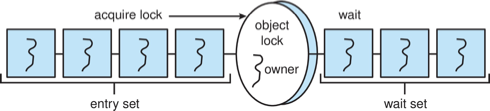

# Chapter 07 - Synchronization Examples

## Bounded-Buffer Problem

- `n` buffers, each can hold one item
- Semaphore `mutex` initialized to the value 1
- Semaphore `full` initialized to the value 0
- Semaphore `empty` initialized to the value n

```c
buffer = n;
mutex = 1;
full = 0;
empty = n;
```

### Producer Process

```c
while (true) { 
    ...        /* produce an item in next_produced */ 
    ... 
  wait(empty); 
  wait(mutex); 
    ...        /* add next produced to the buffer */ 
    ... 
  signal(mutex); 
  signal(full); 
}
```

### Consumer Process

```c
while (true) { 
  wait(full); 
  wait(mutex); 
  ...      
  /* remove an item from buffer to next_consumed */ 
  ... 
  signal(mutex); 
  signal(empty); 
  ...        
  /* consume the item in next consumed */ 
  ...     
}
```

## Readers-Writers Problem

A data set is shared among a number of concurrent processes, readers only read the data set nad do not perform any updates, writers can both read and write.

Problem: allow multiple readers to read at the same time, but **only one single writer** can access the shared data at the same time.

Several variations of how readers and writers are considered - all involve some form of priorities

Shared Data:

```c
data_set = ...;
rw_mutex = 1;
mutex = 1;
read_count = 0;
```

### Writer Process

```c
while (true) {
    wait(rw_mutex); 
        ...
        /* writing is performed */ 
        ... 
    signal(rw_mutex); 
}
```

### Reader Process

```c
while (true){
    wait(mutex);
	read_count++;
	if (read_count == 1) /* first reader */ 
        wait(rw_mutex); 
        signal(mutex); 
        ...
        /* reading is performed */ 
        ... 
    wait(mutex);
    read count--;
    if (read_count == 0) /* last reader */
        signal(rw_mutex); 
    signal(mutex); 
}
```

> [!NOTE]
> **Readers-Writers Problem Variations**
> 
> - First: A situation where a writer process never writes. This is called the **starvation** problem. 
> - Second: Once a writer is ready to write, no "newly arrived reader" is allowed to read.
> 
> Solution: Some systems by kernel procide reader-writer locks.

## Dining-Philosophers Problem

- `N` philosophers' sit at a round table with a bowel of rice in the middle.
- They spend their lives alternating thinking and eating.
- They do not interact with their **neighbors**.
- Occasionally try to pick up 2 chopsticks (one at a time) to eat from bowl
  - Need both to eat, then release both when done
- In the case of 5 philosophers, the shared data 
  - Bowl of rice (data set)
  - Semaphore `chopstick[5]` initialized to 1

```c
chopstick[5] = {1, 1, 1, 1, 1};
```

### Semaphore Solution

```c
while (true){ 
    wait (chopstick[i]);
    wait (chopStick[ (i + 1) % 5] );

    /* eat for awhile */

    signal (chopstick[i]);
    signal (chopstick[ (i + 1) % 5] );

    /* think for awhile */
}
```

> [!NOTE]
> What is the problem with this algorithm?

```c
monitor DiningPhilosophers { 
    enum {THINKING; HUNGRY, EATING} state [5] ;
    condition self [5];

    void pickup (int i) { 
        state[i] = HUNGRY;
        test(i);
        if (state[i] != EATING) 
            self[i].wait;
    }

    void putdown (int i) { 
        state[i] = THINKING;
            // test left and right neighbors
        test((i + 4) % 5);
        test((i + 1) % 5);
    }

    void test (int i) { 
        if ((state[(i + 4) % 5] != EATING) &&
        (state[i] == HUNGRY) &&
        (state[(i + 1) % 5] != EATING) ) { 
            state[i] = EATING ;
            self[i].signal () ;
        }
    }

    initialization_code() { 
        for (int i = 0; i < 5; i++)
        state[i] = THINKING;
    }
}
```

Each philosopher `i` invokes the operations `pickup()` and `putdown()` in the following sequence:

```c
DiningPhilosophers.pickup(i);

     /** EAT **/

DiningPhilosophers.putdown(i);
```

No deadlock, but starvation is possible

## Kernel Synchronization - Windows

With interrupt masks, spinlocks, and dispatcher objects (mutexes, semaphores, events, and timers)

> [!NOTE]
> - Spinlocking-thread will never be preempted
> - Event acts much like a condition variable
> - Timers notify one or more thread when time expired
> - Dispatcher objects either signaled-state (object available) or non-signaled state (thread will block)

- nonsigned -> signaled (owner thread releases mutex lock) 
- signaled -> nonsignaled (thread requests mutex lock)

## Linux Synchronization

On single-CPU system, spinlocks replaced by enabling and disabling kernel preemption

- Atomic variables: `atomic_t` is the type for atomic integer
- Consider the variables:
    - `atomic_t counter;`
    - `int value;`

```c
atomic_set(&counter, 5);        // counter = 5
atomic_add(10, &counter);       // counter += 10
atomic_sub(4, &counter);        // counter -= 4
atomic_inc(&counter);           // counter++

value = atomic_read(&counter);  // value = 12
```

## POSIX Synchronization

Widely used on UNIX, Linux, and macOS

### POSIX Mutex Locks

#### Creating and initializing the lock

```c
#include <pthread.h>

pthread_mutex_t mutex;

/* create and initialize the mutex lock */
pthread_mutex_init(&mutex, NULL);
```

#### Acquiring and releasing the lock
    
```c
/* acquire the mutex lock */
pthread_mutex_lock(&mutex);

/* critical section */

/* release the mutex lock */
pthread_mutex_unlock(&mutex);
```

### POSIX Semaphores

POSIX provides two versions – named and unnamed.
Named semaphores can be used by unrelated processes, unnamed cannot.

#### Creating an initializing the semaphore

```c
#include <semaphore.h>

sem_t *sem;

// Create the semaphore and initialize it to 1.
sem = sem_open("SEM", O_CREAT, 0666, 1);

// Another process can access the semaphore by referring to its name SEM.
```

#### Acquiring and releasing the semaphore

```c
// Acquire the semaphore.
sem_wait(sem);

/* Critical section. */

// Release the semaphore.
sem_post(sem);
```

### POSIX Condition Variables

> [!NOTE]
> Since POSIX is typically used in `C/C++` and these languages do not provide a monitor, POSIX condition variables are associated with a POSIX mutex lock to provide mutual exclusion 
 
#### Creating and initializing the condition variable

```c
pthread_mutex_t mutex;
pthread_cond_t cond_var;

pthread_mutex_init(&mutex, NULL);
pthread_cond_init(&cond_var, NULL);
```

#### Thread waiting for the condition `a == b` to become true

```c
pthread_mutex_lock(&mutex);

while (a != b)
    pthread_cond_wait(&cond_var, &mutex);

pthread_mutex_unlock(&mutex);
```

#### Thread signaling another thread waiting on the condition variable

```c
pthread_mutex_lock(&mutex);
a = b;
pthread_cond_signal(&cond_var);
pthread_mutex_unlock(&mutex);
```

## Java Synchronization

### Java Monitors

Every Java object has associated with it a single lock. If a method is declared as synchronized, the lock is acquired before the method is executed and released when the method exits.

```java
public class BoundedBuffer<E> {
    private static final int BUFFER_SIZE = 5;

    private int count;
    private int in;
    private int out;
    private E[] buffer;

    public BoundedBuffer() {
        count = 0;
        in = 0;
        out = 0;
        buffer = (E[]) new Object[BUFFER_SIZE];
    }

    /* Procedure call this method */
    public synchronized void insert(E item) {
        while (count == BUFFER_SIZE) {
            try {
                wait();
            } catch (InterruptedException ie) { }
        }
        
        buffer[in] = item;
        in = (in + 1) % BUFFER_SIZE;
        count++;
        notify();
    }

    /* Consumers call the method */
    public synchronized void remove() {
        while (count == 0) {
            try {
                wait();
            } catch (InterruptedException ie) { }
        }

        item = buffer[out];
        out = (out + 1) % BUFFER_SIZE;
        count--;
        notify();

        return item;
    }
}
```

A thread that tries to acquire an **unavailable lock** is placed in the object's entry set:


- Similarly, each object also has a wait set.
- When a thread calls `wait()`:
  1. It **releases the lock** for the object
  2. The state of the thread is set to **blocked**
  3. The thread is placed in the wait set for the object

```java
/* Procedure call this method */
public synchronized void insert(E item) {
    while (count == BUFFER_SIZE) {
        try {
            wait();
        } catch (InterruptedException e) { }
    }
    buffer[in] = item;
    in = (in + 1) % BUFFER_SIZE;
    count++;
    notify();
}
```



- A thread typically calls `wait()` when it is waiting for a condition to  become true.
- How does a thread get notified?
- When a thread calls `notify()`:
  1. An arbitrary thread `T` is selected from the wait set
  2. `T` is moved from the wait set to the entry set
  3. Set the state of `T` from blocked to runnable.
- `T` can now compete for the lock to check if the condition it was waiting for is now true.

```java
/* Consumers call the method */
public synchronized void remove() {
    while (count == 0) {
        try {
            wait();
        } catch (InterruptedException ie) { }
    }

    item = buffer[out];
    out = (out + 1) % BUFFER_SIZE;
    count--;
    notify();
    
    return item;
}
```


### Reentrant locks

Similar to mutex locks, the `finally` clause ensures the lock will be released in case an exception occurs in the try block.

```java
Lock lock = new ReentrantLock();

key.lock();
try {
    // critical section
} catch (InterruptedException e) { 
    // exception handling
} finally {
    lock.unlock();
}
```

### Semaphores

```java
Semaphores(int value);

Semaphore sem = new Semaphore(1);
try {
    sem.acquire();
    // critical section
} catch (InterruptedException e) {
    // exception handling
} finally {
    sem.release();
}
```


### Condition variables

Condition variables are associated with an `ReentrantLock`.
Creating a condition variable using `newCondition()` method of `ReentrantLock`.

```java
Lock key = new ReentrantLock();
Condition condVar = key.newCondition();
```

A thread waits by calling the `await()` method, and signals by calling the `signal()` method.

#### Example

- Five threads numbered `0 ... 4`
- Shared variable `turn` indicating which thread's turn it is.
- Thread calls `doWork()` when it wishes to do some work. (But it may only do work if it is their turn.
- If not their turn, wait
- If their turn, do some work for awhile ......
- When completed, notify the thread whose turn is next.
- Necessary data structures:
    ```java
    Lock key = new ReentrantLock();
    Condition[] condVars = new Condition[5];

    for (int i = 0; i < 5; i++)
        condVars[i] = key.newCondition();
    ```

```java
/* threadNumber is the thread that wishes to do some work */
public void doWork(int threadNumber) {
    key.lock();
    try {
        /**
         * If it's not my turn, then wait until I'm signaled
         */
        if (threadNumber != turn) {
            condVars[threadNumber].await();
        }
        /**
         * Do some work for awhile ...
         */

        /**
         * Now signal to the next thread
         */
        turn = (turn + 1) % 5;
        condVars[turn].signal();
    } catch (InterruptedException e) {
        // exception handling
    } finally {
        key.unlock();
    }
}
```

## Transactional Memory


Consider a function `update()` that must be called atomically. One option is to use mutex locks:

```c
void update () { 
    acquire();
    /* critical section */
    release();
}
```

A memory transaction is a sequence of `read-write` operations to memory that are performed atomically. A transaction can be completed by adding `atomic{S}` which ensure statements in S are executed atomically:

```c
void update () { 
    atomic { 
        /* modify shared data */
    }
}
```

### OpenMP


OpenMP is a set of compiler directives and API that support **parallel** progamming.

```c
void update(int value) {
    #pragma omp critical
    {
        count += value
    }
}
```

The code contained within the `#pragma omp critical` directive is treated as a critical section and performed atomically.

## Functional Programming Languages

- Functional programming languages offer a **different paradigm than procedural languages** in that they do not maintain state. 
- Variables are treated as **immutable** and cannot change state once they have been assigned a value.
- There is increasing interest in functional languages such as `Erlang` and `Scala` for their approach in handling data races.
