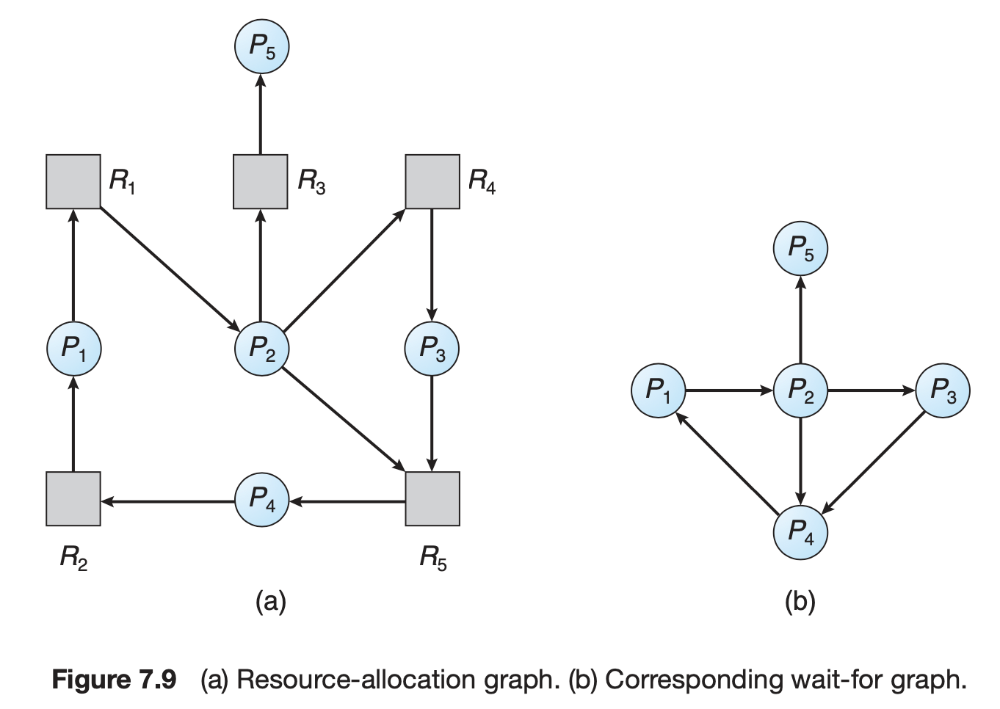

# Chapter 08 - Deadlocks        <!-- omit in toc -->

## Table of Contents        <!-- omit in toc -->
- [System Model](#system-model)
  - [Deadlock with Semaphores](#deadlock-with-semaphores)
- [Deadlock Characterization](#deadlock-characterization)
  - [DEADLOCK WITH MUTEX LOCKS](#deadlock-with-mutex-locks)
  - [Deadlock Conditions](#deadlock-conditions)
  - [Resource Allocation Graph](#resource-allocation-graph)
  - [Resource Allocation Graph Example](#resource-allocation-graph-example)
- [Methods for Handling Deadlocks](#methods-for-handling-deadlocks)
- [Deadlock Prevention](#deadlock-prevention)
  - [Mutual Exclusion](#mutual-exclusion)
  - [Hold and Wait](#hold-and-wait)
  - [No Preemption](#no-preemption)
  - [Circular Wait](#circular-wait)
- [Deadlock Avoidance](#deadlock-avoidance)
  - [Safe State](#safe-state)
  - [Resource-Allocation Graph Algorithms(Single Instance of a Resource Type)](#resource-allocation-graph-algorithmssingle-instance-of-a-resource-type)
  - [Banker's Algorithm (Multiple Instances of a Resource Type)](#bankers-algorithm-multiple-instances-of-a-resource-type)
    - [Data Structures](#data-structures)
    - [Safety Algorithm](#safety-algorithm)
    - [Resource-Request Algorithm](#resource-request-algorithm)
    - [Example](#example)
    - [Another Example $P\_1$ Request $(1, 0, 2)$](#another-example-p_1-request-1-0-2)
- [Deadlock Detection](#deadlock-detection)
  - [Single Instance of Each Resource Type](#single-instance-of-each-resource-type)
  - [Several Instances of a Resource Type](#several-instances-of-a-resource-type)
  - [Detection Algorithm](#detection-algorithm)
    - [Example](#example-1)
    - [Another Example $P\_2$ requests an additional instance of type C](#another-example-p_2-requests-an-additional-instance-of-type-c)
  - [Detection-Algorithm Usage](#detection-algorithm-usage)
- [Recovery from Deadlock](#recovery-from-deadlock)
  - [Process Termination](#process-termination)
  - [Resource Preemption](#resource-preemption)


## System Model

- Resource types $R_1, R_2, . . ., R_m$
- Each resource type $R_i$ has $W_i$ instances.
- Each process utilizes a resource as follows:
    1. request 
    2. use 
    3. release


### Deadlock with Semaphores

**Data:**

- A semaphore S1 initialized to 1
- A semaphore S2 initialized to 1

**Two processes P1 and P2:**

```cpp
P1:  
    wait(s1)
    wait(s2)
P2:  
    wait(s2)
    wait(s1)
```

<div align="right">
    <p>
        <a href="#table-of-contents-------" target="_blank"><b>☝🏼 [Back to TOP]</b></a> 
    </p>
</div>

## Deadlock Characterization

### DEADLOCK WITH MUTEX LOCKS


```c
/* Create and initialize the mutex locks */ 
pthread_mutex_t first_mutex;
pthread_mutex_t second_mutex;
pthread_mutex_init(&first_mutex, NULL); 
pthread_mutex_init(&second_mutex, NULL);
```

> [!NOTE]
>
> 1. `pthread_mutex_init()` initializes an unlock `mutex`.
> 2. `mutex` are required by `pthread_mutex_lock()` and released by `pthread_mutex_unlock()`.


`thread_one` and `thread_two` are two threads that run concurrently. 

```c
/* thread one runs in this function */ 
void *do_work_one(void *param)
{
    pthread_mutex_lock(&first_mutex);
    pthread_mutex_lock(&second_mutex);
    /**
    * Do some work
    */
    pthread_mutex_unlock(&second_mutex);
    pthread_mutex_unlock(&first_mutex);
    pthread_exit(0);
}

/* thread two runs in this function */ 
void *do_work_one(void *param)
{
    pthread_mutex_lock(&second_mutex);
    pthread_mutex_lock(&first_mutex);
    /**
    * Do some work
    */
    pthread_mutex_unlock(&first_mutex);
    pthread_mutex_unlock(&second_mutex);
    pthread_exit(0);
}
```

> [!WARNING]
>
> Deadlock is possible if `thread_one` acquires `first_mutex` while `thread_two` acquires `second_mutex`.

> [!NOTE]
>
> If `thread_one` can acquire and realease the mutex locks for `first_mutex` before `thread_two` attempts to acquire the locks, deadlock will not occur. (It depends on how they are scheduled by the CPU scheduler.) 👉🏻 It's difficult to identify and test for deadlocks that may occur only under certain scheduling circumstances.

### Deadlock Conditions

Deadlock can arise if four conditions hold **simultaneously**.

- **Mutual exclusion:** only one process at a time can use a resource 👉🏻 If another process requests that resource, it MUST be delayed until the resource is released.
- **Hold and wait:** a process holding at least one resource is waiting to acquire additional resources held by other processes
- **No preemption:** a resource can be released only **voluntarily** by the process holding it, after that process has completed its task
- **Circular wait:**  there exists a set $\{P_0, P_1, . . . , P_n\}$ of waiting processes such that $P_0$ is waiting for a resource that is held by $P_1$, $P_1$ is waiting for a resource that is held by $P_2, . . . , P_{n-1}$ is waiting for a resource that is held by $P_n$, and $P_n$ is waiting for a resource that is held by $P_0$.

> [!NOTE]
>
> All four conditions must hold for a deadlock to occur. If any one of these conditions does not hold, a deadlock cannot occur.

### Resource Allocation Graph

A set of vertices $V$ and a set of edges $E$.

- $V$ is partitioned into two types:
  - $P = {P_1, P_2, . . . , P_n}$, the set consisting of all the **active processes** in the system
  - $R = {R_1, R_2, . . . , R_m}$, the set consisting of all **resource types** in the system
- request edge – directed edge $P_i \rightarrow R_j$ 👉🏻 $P_i$ has requested an instance of resource type $R_j$
- assignment edge – directed edge $R_j \rightarrow P_i$ 👉🏻 $R_j$ has been allocated to process $P_i$

### Resource Allocation Graph Example


- $P = {P_1, P_2, P_3}$
- $R = {R_1, R_2, R_3, R_4}$
- $E = {P_1 \rightarrow R_1, P_2 \rightarrow R_3, R_1 \rightarrow P_2, R_2 \rightarrow P_2, R_2 \rightarrow P_1, R_3 \rightarrow P_3}$ (list the edges by orders of $P$ then $R$)

> [!NOTE]
> - One instance of R1
> - Two instances of R2
> - One instance of R3
> - Three instance of R4
> - P1 holds one instance of R2 and is waiting for an instance of R1
> - P2 holds one instance of R1, one instance of R2, and is waiting for an instance of R3
> - P3 is holds one instance of R3

> [!TIP]
>
> If the graph does contain a cycle, then a deadlock may exist


$$E = \{P_1 \rightarrow R_1, P_2 \rightarrow R_3, P3 \rightarrow R2, R_1 \rightarrow P_2, R_2 \rightarrow P_2, R_2 \rightarrow P_1, R_3 \rightarrow P_3\}$$
$$P_1 \rightarrow R_1 \rightarrow P_2 \rightarrow R_3 \rightarrow P_3 \rightarrow R_2 \rightarrow P_1$$
$$P_2 \rightarrow R_3 \rightarrow P_3 \rightarrow R_2 \rightarrow P_2$$

> [!NOTE]
>
> Processes $P_1$, $P_2$, and $P_3$ are deadlocked because $P_2$ is waiting for $P_3$ held by $P_3$, $P_3$ is waiting for $P_1$ and $P_2$ to release for $R_2$, and $P_1$ is waiting for $P_2$ held by $P_1$.


$$P_1 \rightarrow R_1 \rightarrow P_3 \rightarrow R_2 \rightarrow P_1$$


> [!NOTE]
> - If graph contains no cycles $\rightarrow$ no deadlock
> - If graph contains a cycle $\rightarrow$ 
>    - if only one instance per resource type, then deadlock
>    - if several instances per resource type, possibility of deadlock

<div align="right">
    <p>
        <a href="#table-of-contents-------" target="_blank"><b>☝🏼 [Back to TOP]</b></a> 
    </p>
</div>

## Methods for Handling Deadlocks

1. We can use a protocol to prevent or avoid deadlocks, ensuring that the system will never enter a deadlocked state.
2. We can allow the system to enter a deadlocked state, detect it, and recover.
3. We can ignore the problem altogether and pretend that deadlocks never occur in the system.

Ensure that the system will never enter a deadlock state by using **deadlock prevention or avoidance techniques**, or allow the system to enter a state and then recover, or ignore the problem and pretend that deadlocks never occur in the system.

<div align="right">
    <p>
        <a href="#table-of-contents-------" target="_blank"><b>☝🏼 [Back to TOP]</b></a> 
    </p>
</div>

## Deadlock Prevention

Invalidate one of the four necessary conditions for deadlock:


### Mutual Exclusion

not required for sharable resources (e.g., read-only files); must hold for non-sharable resources

> [!NOTE]
>
> The mutual exclusion condition must hold. That is, at least one resource must be nonsharable. Sharable resources, in contrast, do not require mutually exclusive access and thus cannot be involved in a deadlock.


### Hold and Wait

must guarantee that whenever a process requests a resource, it does not hold any other resources

> [!NOTE]
> 
> Require process to request and be allocated all its resources before it begins execution, or allow process to request resources only when the process has none allocated to it.
> 
> Low resource utilization; starvation possible

### No Preemption

This protocol is often applied to resources whose state can be easily saved and restored later, such as **CPU registers and memory space.** It cannot generally be applied to such resources as mutex locks and semaphores.

- If a process that is holding some resources requests another resource that cannot be immediately allocated to it, then all resources currently being held are released
- Preempted resources are added to the list of resources for which the process is waiting
- Process will be restarted only when it can regain its old resources, as well as the new ones that it is requesting


### Circular Wait

Impose a total ordering of all resource types, and require that each process requests resources in an increasing order of enumeration

```c
F(tape_drive) = 1
F(disk_drive) = 5
F(printer) = 12
```

- Invalidating the circular wait condition is most common.
- Simply assign each resource (i.e., mutex locks) a unique number.
- Resources must be acquired in order.

If:
```c
first_mutex = 1
second_mutex = 5
```

> [!TIP]
>
> Compare: $F( R_i ) \ge F( R_j )$

```c
/* thread_one runs in this function */
void *do_work_one(void *param) {
    pthread_mutex_lock(&first_mutex);
    pthread_mutex_lock(&second_mutex);
    /* do some work */
    pthread_mutex_unlock(&second_mutex);
    pthread_mutex_unlock(&first_mutex);

    pthread_exit(0);
}

/* thread_two runs in this function */
void *do_work_two(void *param) {
    pthread_mutex_lock(&second_mutex);
    pthread_mutex_lock(&first_mutex);
    /* do some work */
    pthread_mutex_unlock(&first_mutex);
    pthread_mutex_unlock(&second_mutex);

    pthread_exit(0);
}
```

> [!NOTE]
>
> Imposing a lock ordering does not guarantee deadlock prevention if locks can be acquired dynamically.

```c
/* Deadlock example with lock ordering. */
void transaction(Account from, Account to, double amount) {
    mutex lock1, lock2;

    lock1 = get_lock(from);
    lock2 = get_lock(to);

    acquire(lock1);
        acquire(lock2);
            withdraw(from, amount);
            deposit(to, amount);
        release(lock2);
    release(lock1);
}
```

Deadlock is possible if two threads simultaneously invoke the `transaction()` function, transposing different accounts.

That is, one thread might invoke `transaction(checking account, savings account, 25);` and another might invoke `transaction(savings account, checking account, 50);`

## Deadlock Avoidance

Requires that the system has some additional a priori information available


1. each process declare the maximum number of resources of each type that it may need
2. Deadlock-avoidance algorithm dynamically examines the resource-allocation state to ensure that there can never be a circular-wait condition
3. Define the Resource-allocation state of the system by the number of available and allocated resources, as well as the maximum demands of the processes

### Safe State

When a process requests an available resource, system must decide if immediate allocation leaves the system in a safe state. System is in safe state if there exists a sequence $\{P_1, P_2, . . . , P_n\}$ of ALL the processes in the systems such that for each $P_i$, the resources that $P_i$ can still request can be satisfied by currently **available** resources + resources **held** by all the $P_j$, with $j < I$.

> [!NOTE]
> 
> In other words, the system can ensure that all processes can complete their execution in some order **without leading to a deadlock**. The "currently available resources + resources" phrase means that the resources available for each process include both the resources presently free in the system and the resources that will be freed by the preceding processes in the safe sequence.

> [!NOTE]
> 
> **Basic Facts**
>
> - If a system is in safe state 👉🏻 no deadlocks
> - If a system is in unsafe state 👉🏻 possibility of deadlock
> - Avoidance 👉🏻 ensure that a system will never enter an unsafe state.


Twelve magnetic tape drives and three processes

**At t0:**

| Process | Maximum Needs | Current Needs |
| --- | --- | --- |
| P0 | 10 | 5 |
| P1 | 4 | 2 |
| P2 | 9 | 2 |


`<P1, P0, P2>` is a safe sequence

**[NOT OK]At t1:**

| Process | Maximum Needs | Current Needs |
| --- | --- | --- |
| P0 | 10 | 5 |
| P1 | 4 | 2 |
| P2 | 9 | 3 |

`<P0, P1, P2>` is a unsafe sequence


In this diagram:
- "Currently Available Resources" (A) are the resources that the system has available at the start.
- "Resources held by P1" (B), "Resources held by P2" (C), and "Resources held by P3" (D) are the resources held by each respective process.
- Each process \(P_i\) can be allocated resources based on the currently available resources and the resources held by all processes before it in the sequence. 

This ensures that there's a way to allocate resources such that each process can eventually get what it needs and complete, thus avoiding deadlock.

**That is:**

- If $P_i$ resource needs are not immediately available, then Pi can wait until all $P_j$ have finished
- When $P_j$ is finished, $P_i$ can obtain needed resources, execute, return allocated resources, and terminate
- When $P_i$ terminates, $P_i + 1$ can obtain its needed resources, and so on 


### Resource-Allocation Graph Algorithms(Single Instance of a Resource Type)

- Claim edge $P_i  \rightarrow R_j$ indicated that process $P_i$ may request resource $P_j$; represented by a dashed line
- Claim edge converts to request edge when a process requests a resource
- Request edge converted to an assignment edge when the  resource is allocated to the process
- When a resource is released by a process, assignment edge reconverts to a claim edge

> [!NOTE]
>
> Resources must be claimed a priori in the system


**Unsafe State:**


> [!NOTE]
> 
> - Suppose that process $P_i$ requests a resource $R_j$
> - The request can be granted only if converting the request edge to an assignment edge does not result in the formation of a cycle in the resource allocation graph

### Banker's Algorithm (Multiple Instances of a Resource Type)

- Each process must a priori claim maximum use
- When a process requests a resource it **may have to wait**
- When a process gets all its resources it must **return them in a finite amount of time**

#### Data Structures

Let n = number of processes, and m = number of resources types. 

- **Available:**  Vector of length $m$. If $available [j] = k$, there are $k$ instances of resource type $R_j$ available
- **Max:** $n \times m$ matrix. If $Max [i,j] = k$, then process $P_i$ may request at most $k$ instances of resource type $R_j$
- **Allocation:**  $n \times m$ matrix.  If $Allocation[i, j] = k$ then $P_i$ is currently allocated $k$ instances of $R_j$
- **Need:**  $n x m matrix$. If $Need[i, j] = k$, then $P_i$ may need $k$ more instances of $R_j$ to complete its task


$$Need [i, j] = Max[i, j] – Allocation [i, j]$$

#### Safety Algorithm

1. Let `Work` and `Finish` be vectors of length m and n, respectively. **Initialize:**

    $Work = Available$
    
    $Finish [i] = false \ for \ i = 0, 1, ..., n - 1$
2. Find an i such that both: 
    - (a) $Finish [i] = false$
    - (b) $Needi \leq Work$
   
    If no such $i$ exists, go to step 4.
3. $Work = Work + Allocation_{i}$

    $Finish[i] = true$
    
    go to step 2.
4. If $Finish [i] == true$ for all $i$, then the system is in a **safe state**

> [!NOTE]
>
> This algorithm may require an order of $m \times n^{2}$ operations to determine whether a state is safe.

#### Resource-Request Algorithm

$Request_{i}$ = request vector for process $P_i$. If $Request_{i} [j] = k$ then process $P_i$ wants $k$ instances of resource type $R_j$
1. If $Request_{i} \leq Need_{i}$ go to step 2. Otherwise, **raise error condition**, since process has exceeded its maximum claim
2. If $Request_{i} \leq Available$, go to step 3. Otherwise $P_i$ must wait, since resources **are not available**
3. Pretend to allocate requested resources to $P_i$ by modifying the state as follows:
    
    $Available = Available  – Request_{i};$

    $Allocation_{i} = Allocation_{i} + Request_{i};$
        
    $Need_{i} = Need_{i} – Request_{i};$
    - If safe 👉🏻 the resources are allocated to $P_i$
    - If unsafe 👉🏻 $P_i$ must wait, and the old resource-allocation state is restored

#### Example

- 5 processes $P_0$ through $P_4$;
- 3 resource types: A (10 instances), B (5 instances), C (7 instances)

**Snapshot at time $T_0$:**

| Process | Allocation	| Max | Available |
|---|---|---|---|
| | A B C | A B C | A B C |
| P0 | 0 1 0 | 7 5 3 | 3 3 2 |
| P1 | 2 0 0 | 3 2 2 |  |
| P2 | 3 0 2 | 9 0 2 |  |
| P3 | 2 1 1 | 2 2 2 |  |
| P4 | 0 0 2 | 4 3 3 |  |

> [!TIP]
>
> Need = Max - Allocation

| Process | Allocation	| Need | Available |
|---|---|---|---|
| | A B C | A B C | A B C |
| P0 | 0 1 0 | 7 4 3 | 3 3 2 |
| P1 | 2 0 0 | 1 2 2 | $P_1$ 👉🏻 5 3 2  |
| P2 | 3 0 2 | 6 0 0 | $P_3$ 👉🏻 7 4 3  |
| P3 | 2 1 1 | 0 1 1 | $P_4$ 👉🏻 7 4 5  |
| P4 | 0 0 2 | 4 3 1 | $P_2$ 👉🏻 10 4 7 |
|    |       |       | $P_0$ 👉🏻 10 5 7 | 

> [!NOTE]
> 
> 拿 P0 的 Available 來比對 P1 ~ P4 的 Need，發現只有 P1, P3 可滿足，因此先分配給 P1，因此 P1 的 Allocation 會先還回 Available，再依序分配給 P4, P2, P0
>
> 👉🏻 **Safe Sequence: `<P1, P3, P4, P2, P0>`**

- A (10 instances)
- B (5instances)
- C (7 instances)

> [!TIP]
> (Allocation + Abailable)


#### Another Example $P_1$ Request $(1, 0, 2)$

**Snapshot at time $T_0$:**

| Process | Allocation	| Max | Available |
|---|---|---|---|
| | A B C | A B C | A B C |
| P0 | 0 1 0 | 7 5 3 | 3 3 2 |
| P1 | 2 0 0 | 3 2 2 |  |
| P2 | 3 0 2 | 9 0 2 |  |
| P3 | 2 1 1 | 2 2 2 |  |
| P4 | 0 0 2 | 4 3 3 |  |

Check that $Request \leq Available$ (that is, $(1, 0, 2) \leq (3, 3, 2) \Rightarrow true$

| Process | Allocation	| Need | Available |
|---|---|---|---|
|    | A B C | A B C | A B C |
| P0 | 0 1 0 | 7 4 3 | 👉🏻 **2 3 0** |
| P1 | 👉🏻 **3 0 2** | 👉🏻 **0 2 0** |   |
| P2 | 3 0 2 | 6 0 0 |   |
| P3 | 2 1 1 | 0 1 1 |   |
| P4 | 0 0 2 | 4 3 1 |   |
|    |       |       |   |

> [!TIP]
>
> P1 Request (1, 0, 2) 👉🏻 P1 的 Allocation 需要加上 (1, 0, 2)，因此 P1 的 Need 以及 P0 的 Avaliable 要減去 (1, 0, 2)

| Process | Allocation	| Need | Available |
|---|---|---|---|
|    | A B C | A B C | A B C |
| P0 | 0 1 0 | 7 4 3 | 2 3 0 | x
| P1 | 3 0 2 | 0 2 0 | $P_1$ 👉🏻 5 3 2 |
| P2 | 3 0 2 | 6 0 0 | $P_3$ 👉🏻 7 4 3 |
| P3 | 2 1 1 | 0 1 1 | $P_4$ 👉🏻 7 4 5 |
| P4 | 0 0 2 | 4 3 1 | $P_0$ 👉🏻 7 5 5 |
|    |       |       | $P_2$ 👉🏻 10 5 7 |

> [!TIP]
>
> 如果有兩個都小於 Available，則先滿足第一個，再依序滿足第二個！

Executing safety algorithm shows that sequence `< P1, P3, P4, P0, P2>` satisfies safety requirement


Practical Example:

1. an request for (3,3,0) by $P_4$ be granted? $(3, 3, 0) \leq (3, 3, 2) \Rightarrow true$
    - `| P4 | 3 3 2 | 1 0 1 | 0, 0, 2  Fail`

        > [!NOTE]
        > (0, 0, 2) 對於所有 Need, Not granted
2. Can request for (0,2,0) by $P_0$ be granted? $(0,2,0) \leq (3,3,2) \Rightarrow true$
    - `| P0 | 0 3 0 | 7 2 3 | 3,1,2 | < P3, P1, P2 >10,2,5 fail |`

<div align="right">
    <p>
        <a href="#table-of-contents-------" target="_blank"><b>☝🏼 [Back to TOP]</b></a> 
    </p>
</div>

## Deadlock Detection

### Single Instance of Each Resource Type

- Maintain wait-for graph
    - Nodes are processes
    - $P_i \rightarrow P_j$   if $P_i$ is waiting for $P_j$
- Periodically invoke an algorithm that searches for a cycle in the graph. If there is a cycle, there exists a deadlock
- An algorithm to detect a cycle in a graph requires an order of $n^2$ operations, where n is the number of vertices in the graph




### Several Instances of a Resource Type

- **Available:** A vector of length $m$ indicates the number of available resources of each type
- **Allocation:** An $n \times m$ matrix defines the number of resources of each type currently allocated to each process
- **Request:** An $n \times m$ matrix indicates the current request of each process. If $Request [i][j] = k$, then process $P_i$ is requesting $k$ more instances of resource type $R_j$.

### Detection Algorithm

1. Let Work and Finish be vectors of length m and n, respectively

    **Initialize:**
    
    - $Work = Available$

    - For $i = 1, 2, ..., n$, if $Allocation_{i} \neq 0$, then
    
        $Finish[i] = false;$ otherwise, $Finish[i] = true$
2. Find an index $i$ such that both:

    - $Finish[i] == false$
    - $Request_{i} \leq Work$

    If no such $i$ exists, go to step 4.
3. $Work = Work + Allocationi$

    $Finish[i] = true$
    
    go to step 2.
4. If $Finish[i] == false$, for some $i$, $1 \leq i \leq n$, then the system is in deadlock state. Moreover, if $Finish[i] == false$, then $P_i$ is deadlocked
    
Algorithm requires an order of $O(m \times n^{2})$ operations to detect whether the system is in deadlocked state

#### Example

- 5 processes $P_0$ through $P_4$;
- 3 resource types: A (7 instances), B (2 instances), C (6 instances)


**(Resource-Allocation State) Snapshot at time $T_0$:**

|  | Allocation	| Request | Available |
|---|---|---|---|
| | A B C | A B C | A B C |
| P0 | 0 1 0 | 0 0 0 | 0 0 0 |
| P1 | 2 0 0 | 2 0 2 | $P_1$ 👉🏻 0 1 0 |
| P2 | 3 0 3 | 0 0 0 | $P_3$ 👉🏻 3 1 3 |
| P3 | 2 1 1 | 1 0 0 | $P_4$ 👉🏻 5 2 4 |
| P4 | 0 0 2 | 0 0 2 | $P_2$ 👉🏻 7 2 4 |
|    |       |       | $P_0$ 👉🏻 7 2 6 | 

> [!TIP]
>
> 看 Request 是否小於 Availabe，如果是將 Allocation 還回去 Available。

Sequence `<P0, P2, P3, P1, P4>` will result in $Finish[i] = true$ for all $i$ 

#### Another Example $P_2$ requests an additional instance of type C

|  | Request |
|---|---|
| | A B C |
| P0 | 0 0 0 |
| P1 | 2 0 2 |
| P2 | 0 0 **1** |
| P3 | 1 0 0 |
| P4 | 0 0 2 |

**State of system?**

Alougth we can satisy $P_0$; however, (0, 1, 0) cannot be satisfied by any other process. 👉🏻 Deadlock exists, consisting of processes P1,  P2, P3, and P4


### Detection-Algorithm Usage

When, and how often, to invoke depends on:

- How often a deadlock is likely to occur?
- How many processes will need to be rolled back?
    - one for each disjoint cycle

> [!NOTE]
> 
> If detection algorithm is invoked arbitrarily, there may be **many cycles** in the resource graph and so we would not be able to tell which of the many deadlocked processes "caused" the deadlock.

<div align="right">
    <p>
        <a href="#table-of-contents-------" target="_blank"><b>☝🏼 [Back to TOP]</b></a> 
    </p>
</div>

## Recovery from Deadlock

### Process Termination

- Abort all deadlocked processes
- Abort one process at a time until the deadlock cycle is eliminated
- In which order should we choose to abort?
  1. Priority of the process
  2. How long process has computed, and how much longer to completion
  3. Resources the process has used
  4. Resources process needs to complete
  5. How many processes will need to be terminated
  6. Is process interactive or batch?

### Resource Preemption

- **Selecting a victim** – minimize cost
- **Rollback** – return to some safe state, restart process for that state
- **Starvation** – same process may always be picked as victim, include number of rollback in cost factor

<div align="right">
    <p>
        <a href="#table-of-contents-------" target="_blank"><b>☝🏼 [Back to TOP]</b></a> 
    </p>
</div>