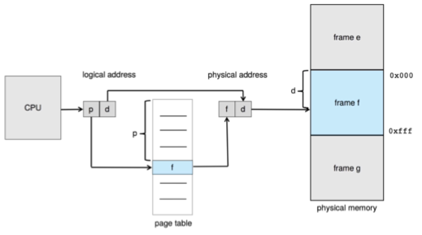

# Chapter 09 - Main Memory    <!-- omit in toc -->


## Table of Contents<!-- omit in toc -->
- [Background](#background)
  - [Hardware Address Protection](#hardware-address-protection)
  - [Address Binding](#address-binding)
  - [Binding of Instructions and Data to Memory](#binding-of-instructions-and-data-to-memory)
  - [Logical vs. Physical Address Space](#logical-vs-physical-address-space)
  - [Memory-Management Unit (MMU)](#memory-management-unit-mmu)
  - [Dynamic Loading](#dynamic-loading)
- [Swapping](#swapping)
  - [Schematic View of Swapping](#schematic-view-of-swapping)
  - [Context Switch Time including Swapping](#context-switch-time-including-swapping)
  - [Swapping on Mobile Systems](#swapping-on-mobile-systems)
  - [Swapping with Paging](#swapping-with-paging)
- [Contiguous Memory Allocation](#contiguous-memory-allocation)
  - [Variable Partition](#variable-partition)
  - [Dynamic Storage-Allocation Problem](#dynamic-storage-allocation-problem)
  - [Fragmentation](#fragmentation)
- [Paging](#paging)
  - [Address Translation Scheme](#address-translation-scheme)
  - [Hardware](#hardware)
  - [Example](#example)
  - [Paging -- Calculating internal fragmentation](#paging----calculating-internal-fragmentation)
  - [Free Frames (Before and After)](#free-frames-before-and-after)
  - [Implementation of Page Table](#implementation-of-page-table)
  - [Translation Look-Aside Buffer (TLB)](#translation-look-aside-buffer-tlb)
  - [Hardware](#hardware-1)
  - [Effective Access Time](#effective-access-time)
  - [Memory Protection](#memory-protection)
  - [Valid (v) or Invalid (i) Bit In A Page Table](#valid-v-or-invalid-i-bit-in-a-page-table)
  - [Shared Pages](#shared-pages)
- [Structure of the Page Table](#structure-of-the-page-table)
  - [Hierarchical Page Tables](#hierarchical-page-tables)
    - [Two-Level Paging Example](#two-level-paging-example)
    - [Address-Translation Scheme](#address-translation-scheme-1)
    - [64-bit Logical Address Space](#64-bit-logical-address-space)
    - [Three-level Paging Scheme](#three-level-paging-scheme)
  - [Hashed Page Tables](#hashed-page-tables)
  - [Inverted Page Table](#inverted-page-table)
  - [Oracle SPARC Solaris](#oracle-sparc-solaris)
- [Example: The Intel 32 and 64-bit Architectures](#example-the-intel-32-and-64-bit-architectures)
- [Example: The Intel IA-32 Architecture](#example-the-intel-ia-32-architecture)
  - [Logical to Physical Address Translation in IA-32](#logical-to-physical-address-translation-in-ia-32)
  - [Intel IA-32 Segmentation](#intel-ia-32-segmentation)
  - [Intel IA-32 Paging Architecture](#intel-ia-32-paging-architecture)
  - [Intel IA-32 Page Address Extensions](#intel-ia-32-page-address-extensions)
  - [Intel x86-64](#intel-x86-64)
- [Example: ARMv8 Architecture](#example-armv8-architecture)


## Background

- **Program** is brought (from disk) into memory and placed within a process for it to be run.
- CPU can access main memory and registers directly.
- Memory unit only sees a stream of: `addresses + read requests`, or `address + data and write requests`
- Register access is done in one CPU clock (or less)
- Main memory can take many cycles, causing a **stall**
- **Cache** sits between main memory and CPU registers
- Protection of memory required to ensure correct operation


> [!NOTE]
>
> Programs are loaded into memory from disk to run, with the CPU accessing memory and registers directly, while managing memory units, register access, cache, and memory protection to ensure efficient and correct operation


We need to censure that a process can access only those addresses in its address space.

> [!NOTE]
> 
> We can provide this protection by using a pair of base and limit registers define the logical address space of a process


### Hardware Address Protection

CPU must check every memory access generated in user mode to be sure it is between base and limit for that user


the instructions to loading the base and limit registers are privileged 

### Address Binding

Most systems allow a user process to reside in any part of the physical memory. Thus, although the address space of the computer may start at `00000`, the first address of the user process need not be `00000`.

Addresses represented in different ways at different stages of a program's life

- Source code addresses usually **symbolic**
- Compiled code addresses bind to relocatable addresses
    - i.e., "`14 bytes` from beginning of this module"
- Linker or loader will bind relocatable addresses to absolute addresses
    - i.e., `74014`

> [!NOTE]
>
> Each binding is a mapping from one address space to another.

### Binding of Instructions and Data to Memory

- **Compile time:** Process will reside in memory, then absolute code can be generated. If the starting location changes, the code must be recompiled
- **Load time:** Must generate relocatable code if **memory location is not known** at compile time. If the starting location changes, no need to recompile, just reload
- **Execution time:** Binding delayed until run time if the process can be moved during its execution from one memory segment to another


> [!NOTE]
> 
> Execution time need hardware support for address maps (e.g., base and limit registers)


### Logical vs. Physical Address Space

1. The concept of a **logical address space** that is bound to a **separate physical address space** is central to proper memory management
    - **Logical address** – generated by the CPU; 👉🏻 virtual address
    - **Physical address** – address seen by the memory unit
2. Logical and physical addresses are the **same in compile-time and load-time** address-binding schemes; logical (virtual) and physical addresses differ in execution-time address-binding scheme

> [!NOTE]
> 
> 1. **Logical address space** is the set of all logical addresses generated by a program
> 2. **Physical address space** is the set of all physical addresses generated by a program

### Memory-Management Unit (MMU)


- Consider simple scheme. which is a generalization of the base-register scheme.
- The base register now called **relocation register**
- The value in the relocation register is added to every address generated by a user process at the time it is sent to memory
- The user program deals with **logical addresses**; it never sees the **real physical** addresses
    - Execution-time binding occurs when reference is made to location in memory
    - Logical address bound to physical addresses
- Consider simple scheme. which is a generalization of the base-register scheme.
- The base register now called relocation register
- The value in the relocation register is added to every address generated by a user process at the time it is sent to memory


### Dynamic Loading

With dynamic loading, a routine is not loaded until it is called. All routines are kept on disk in a relocatable load format.

> [!NOTE]
>
> - The entire program does need to be in memory to execute 👉🏻 to be better memory-space utilization (unused routine is never loaded). All routines kept on disk in relocatable load format.
> - Useful when large amounts of code are needed to handle **infrequently** occurring cases.
> - No special support from the operating system is required, implemented through program design. Also OS can help by providing libraries to implement dynamic loading

- **Static linking** – system libraries and program code combined by the **loader into the binary program image**
- **Dynamic linking** – linking postponed until execution time
- Small piece of code, `stub`, used to locate the appropriate memory-resident library routine
- Stub replaces itself with the address of the routine, and executes the routine
- Operating system checks if routine is in processes' memory address (If not in address space, add to address space)
- Dynamic linking is particularly useful for libraries
- System also known as **shared libraries**
- Consider applicability to patching system libraries (Versioning may be needed)

<div align="right">
    <p>
        <a href="#table-of-contents" target="_blank"><b>☝🏼 [Back to TOP]</b></a> 
    </p>
</div>

## Swapping

Moving processes between main memory and a backing store. (Total physical memory space of processes can exceed physical memory)

- Backing store – fast disk large enough to accommodate copies of all memory images for all users; must provide direct access to these memory images
- Roll out, roll in – swapping variant used for priority-based scheduling algorithms; lower-priority process is swapped out so higher-priority process can be loaded and executed
- Major part of swap time is transfer time; total transfer time is directly proportional to the amount of memory swapped
- System maintains a ready queue of ready-to-run processes which have memory images on disk
- Does the swapped out process need to swap back in to same physical addresses?
- Depends on address binding method
  - Plus consider pending I/O to / from process memory space
- Modified versions of swapping are found on many systems (i.e., UNIX, Linux, and Windows)
  - Swapping normally disabled
  - Started if more than threshold amount of memory allocated
  - Disabled again once memory demand reduced below threshold

### Schematic View of Swapping


> [!TIP]
>
> The dispatcher checks to see whether the next process in the queue is in memory. 
>   - If it is not, and if there is no free memory region, the dispatcher swaps out a process currently in memory and swaps in the desired process. It then reloads registers and transfers control to the selected process.

### Context Switch Time including Swapping

- If next processes to be put on CPU is not in memory, need to swap out a process and swap in target process
- Context switch time can then be very high
- 100MB process swapping to hard disk with transfer rate of 50MB/sec
  - Swap out time of 2000 ms
  - Plus swap in of same sized process
  - Total context switch swapping component time of 4000ms (4 seconds)
- Can reduce if reduce size of memory swapped – by knowing how much memory really being used
  - System calls to inform OS of memory use via `request_memory()` and `release_memory()`
- Other constraints as well on swapping
  - Pending I/O – can’t swap out as I/O would occur to wrong process
  - Or always transfer I/O to kernel space, then to I/O device
    - Known as double buffering, adds overhead
- Standard swapping not used in modern operating systems
  - But modified version common
    - Swap only when free memory extremely low

### Swapping on Mobile Systems

- Not typically supported
  - Flash memory based
    - Small amount of space
    - Limited number of write cycles
    - Poor throughput between flash memory and CPU on mobile platform
- Instead use other methods to free memory if low
  - iOS asks apps to voluntarily relinquish allocated memory
    - Read-only data thrown out and reloaded from flash if needed
    - Failure to free can result in termination
  - Android terminates apps if low free memory, but first writes application state to flash for fast restart
  - Both OSes support paging as discussed below

### Swapping with Paging


<div align="right">
    <p>
        <a href="#table-of-contents" target="_blank"><b>☝🏼 [Back to TOP]</b></a> 
    </p>
</div>

## Contiguous Memory Allocation

- Main memory must support both OS and user processes
- Limited resource, must allocate efficiently
- Contiguous allocation is one early method
- Main memory usually into two partitions:
  - Resident operating system, usually held in low memory with interrupt vector
  - User processes then held in high memory
  - Each process contained in single contiguous section of memory
- Relocation registers used to protect user processes from each other, and from changing operating-system code and data

> [!NOTE]
>
> - Base register 👉🏻 Smallest physical addrress
> - Limit register 👉🏻 a range of logical addresses (each logical address < limit address)
> - MMU maps logical address dynamically
> - Kernel code can be transient and kernel can change size


### Variable Partition

Allocating memory is to divide memory into several fixed-sized partitions.

- Degree of multiprogramming limited by number of partitions
- Variable-partition sizes for efficiency (sized to a given process' needs)
- Hole – block of available memory; holes of various size are scattered throughout memory
- When a process arrives, it is allocated memory from a hole large enough to accommodate it
- Process exiting frees its partition, adjacent free partitions combined
- Operating system maintains information about:
    1. allocated partitions
    2. free partitions (hole)


When a process arrives and needs memory, the system searches the set for a hole that is large enough for this process. If the hole is too large, it is split into two parts. One part is allocated to the arriving process; the other is returned to the set of holes.

### Dynamic Storage-Allocation Problem

How to satisfy a request of size n from a list of free holes?

- **First-fit:** Allocate the first hole that is big enough
- **Best-fit:** Allocate the smallest hole that is big enough; must search entire list, unless ordered by size  
  - Produces the smallest leftover hole
- **Worst-fit:** Allocate the largest hole; must also search entire list
  - Produces the largest leftover hole

First-fit and best-fit better than worst-fit in terms of speed and storage utilization

### Fragmentation

- External Fragmentation – total memory space exists to satisfy a request, but it is not contiguous
- Internal Fragmentation – allocated memory may be slightly larger than requested memory; this size difference is memory internal to a partition, but not being used
- First fit analysis reveals that given N blocks allocated, 0.5 N blocks lost to fragmentation
  - 1/3 may be unusable -> 50-percent rule
- Reduce external fragmentation by compaction
  - Shuffle memory contents to place all free memory together in one large block
  - Compaction is possible only if relocation is dynamic, and is done at execution time
  - I/O problem
    - Latch job in memory while it is involved in I/O
    - Do I/O only into OS buffers
- Now consider that backing store has same fragmentation problems


> [!NOTE]
> compaction. The goal is to shuffle the memory contents so as to place all free memory together in one large block. Compaction is not always possible, however. If relocation is static and is done at assembly or load time, compaction cannot be done.

<div align="right">
    <p>
        <a href="#table-of-contents" target="_blank"><b>☝🏼 [Back to TOP]</b></a> 
    </p>
</div>

## Paging

- Physical address space of a process can be noncontiguous; process is allocated physical memory whenever the latter is available
  - Avoids external fragmentation
  - Avoids problem of varying sized memory chunks
- Divide physical memory into fixed-sized blocks called frames
  - Size is power of 2, between 512 bytes and 16 Mbytes
- Divide logical memory into blocks of same size called pages
- Keep track of all free frames
- To run a program of size N pages, need to find N free frames and load program
- Set up a page table to translate logical to physical addresses
- Backing store likewise split into pages
- Still have Internal fragmentation

> [!NOTE]
>
> Paging is a memory management technique in operating systems that enables processes to access more memory than is physically available. [Paging in Operating Systems: What it Is & How it Works]

[Paging in Operating Systems: What it Is & How it Works]: https://phoenixnap.com/kb/paging

### Address Translation Scheme

- **Page number (p)** – used as an index into a page table which contains base address of each page in physical memory
- **Page offset (d)** – combined with base address to define the physical memory address that is sent to the memory unit

  ```
  +-------------+-------------+
  | page number | page offset |
  +-------------+-------------+
  |     p       |     d       |
  +-------------+-------------+
  |    m - n    |     n       |
  +-------------+-------------+
  ```

- For given logical address space $2^m$ and page size $2^n$

### Hardware



> [!TIP]
>
> logical memory 的 p 對應到 page table，page table 會得知 frame number，再加上 d 就是 physical memory 的 address


### Example

- Logical address:  `n = 2` and  `m = 4`.
- Physical memory: 32 bytes (8 pages)
- page size $2^n = 4$ bytes
- logical address space $2^m = 16$ (p0, p1, p2, p3)


### Paging -- Calculating internal fragmentation

- Page size = 2,048 bytes
- Process size = 72,766 bytes = 35* 2048 + 1086
- 35 pages + 1,086 bytes
- Internal fragmentation of 2,048 - 1,086 = 962 bytes
- Worst case fragmentation = 1 frame – 1 byte
- On average fragmentation = 1 / 2 frame size
- So small frame sizes desirable?
- But each page table entry takes memory to track
- Page sizes growing over time
  - Solaris supports two page sizes – 8 KB and 4 MB

> [!TIP]
> 用 Process Size 除以 Page Size 找出幾個 Pages，剩下的拿 Page Size 減掉就是 Internal Fragmentation

### Free Frames (Before and After)


### Implementation of Page Table

- Page table is kept in main memory
  - **Page-table base register (PTBR)** points to the page table
  - **Page-table length register (PTLR)** indicates size of the page table
- In this scheme every data/instruction access requires two memory accesses
  - One for the page table and one for the data / instruction
- The two-memory access problem can be solved by the use of a special fast-lookup hardware cache called **translation look-aside buffers (TLBs)** (also called associative memory).

### Translation Look-Aside Buffer (TLB)

- Some TLBs store address-space identifiers (ASIDs) in each TLB entry – uniquely identifies each process to provide address-space protection for that process
  - Otherwise need to flush at every context switch
- TLBs typically small (64 to 1,024 entries)
- On a TLB miss, value is loaded into the TLB for faster access next time
  - Replacement policies must be considered
  - Some entries can be wired down for permanent fast access

### Hardware

- Associative memory – parallel search 

    

- Address translation (p, d)
  - If p is in associative register, get frame # out
  - Otherwise get frame # from page table in memory

> [!TIP]
> 
> 如果 p 在 associative register 找不到 frame number，否則到主記憶的 page table 找


### Effective Access Time

- Hit ratio – percentage of times that a page number is found in the  TLB
- An 80% hit ratio means that we find the desired  page number  in the TLB 80% of the time.
- Suppose that 10 nanoseconds to access memory.  
  - If we find the desired page in TLB then a mapped-memory access take 10 ns
  - Otherwise we need two memory access so it is 20 ns
- Effective Access Time (EAT)
    
    $$EAT = 0.80 x 10 + 0.20 x 20 = 12 (ns)$$
    
    👉🏻 implying 20% slowdown in access time
- Consider  amore realistic hit ratio of 99%, 
    
    $$EAT = 0.99 x 10 + 0.01 x 20 = 10.1 (ns)$$

    👉🏻 implying  only 1% slowdown in access time.

### Memory Protection

- Memory protection implemented by associating protection bit with each frame to indicate if read-only or read-write access is allowed
  - Can also add more bits to indicate page execute-only, and so on
- Valid-invalid bit attached to each entry in the page table:
  - "valid" indicates that the associated page is in the process' logical address space, and is thus a legal page
  - "invalid" indicates that the page is not in the process' logical address space
  - Or use page-table length register (PTLR)
- Any violations result in a trap to the kernel

### Valid (v) or Invalid (i) Bit In A Page Table


### Shared Pages

**Shared code**

- One copy of read-only (reentrant) code shared among processes (i.e., text editors, compilers, window systems)
- Similar to multiple threads sharing the same process space
- Also useful for interprocess communication if sharing of read-write pages is allowed

**Private code and data**

- Each process keeps a separate copy of the code and data
- The pages for the private code and data can appear anywhere in the logical address space


<div align="right">
    <p>
        <a href="#table-of-contents" target="_blank"><b>☝🏼 [Back to TOP]</b></a> 
    </p>
</div>

## Structure of the Page Table

Memory structures for paging can get huge using straight-forward methods

- Consider a 32-bit logical address space as on modern computers
- Page size of 4 KB ($2^{12}$)
- Page table would have 1 million entries ($2^{32} / 2^{12}$)
- If each entry is 4 bytes 👉🏻 each process 4 MB of physical address space for the  page table alone
  - Don't want to allocate that contiguously in main memory
- One simple solution is to divide the page table into smaller units
  - Hierarchical Paging
  - Hashed Page Tables
  - Inverted Page Tables

### Hierarchical Page Tables

- Break up the logical address space into multiple page tables
- A simple technique is a two-level page table
- We then page the page table


#### Two-Level Paging Example

- A logical address (on 32-bit machine with 4K page size) is divided into:
  - a page number consisting of 20 bits
  - a page offset consisting of 12 bits
- Since the page table is paged, the page number is further divided into:
  - a 10-bit page number 
  - a 10-bit page offset

- Thus, a logical address is as follows:

  
- where p1 is an index into the outer page table, and p2 is the displacement within the page of the inner page table
- Known as **forward-mapped page table**

#### Address-Translation Scheme


#### 64-bit Logical Address Space

- Even two-level paging scheme not sufficient
- If page size is 4 KB ($2^12$)
  - Then page table has $2^52$ entries
  - If two level scheme, inner page tables could be $2^10$ 4-byte entries
  - Address would look like

    

  - Outer page table has $2^42$ entries or $2^44$ bytes
  - One solution is to add a 2nd outer page table
  - But in the following example the 2nd outer page table is still $2^34$ bytes in size
  - And possibly 4 memory access to get to one physical memory location

#### Three-level Paging Scheme


### Hashed Page Tables

- Common in address spaces > 32 bits
- The virtual page number is hashed into a page table
  - This page table contains a chain of elements hashing to the same location
- Each element contains

    ```c
    struct {
        unsigned key;   // virtual page number
        unsigned value; // page frame number
        struct *next;   // pointer to next element
    }
    ```
- Virtual page numbers are compared in this chain searching for a match
  - If a match is found, the corresponding physical frame is extracted
- Variation for 64-bit addresses is clustered page tables
  - Similar to hashed but each entry refers to several pages (such as 16) rather than 1

> [!NOTE]
> 
> Especially useful for sparse address spaces (where memory references are non-contiguous and scattered) 


### Inverted Page Table

- Rather than each process having a page table and keeping track of all possible logical pages, track all physical pages
- One entry for each real page of memory
- Entry consists of the virtual address of the page stored in that real memory location, with information about the process that owns that page
- Decreases memory needed to store each page table, but increases time needed to search the table when a page reference occurs
- Use hash table to limit the search to one — or at most a few — page-table entries
  - TLB can accelerate access
- But how to implement shared memory?
  - One mapping of a virtual address to the shared physical address

```c
struct {
    processID;
    pageNumber;
    offset;
}
```


> [!TIP]
>
> Recall that the TLB is searched first, before the hash table is consulted, offering some performance improvement.

### Oracle SPARC Solaris

- Consider modern, 64-bit operating system example with tightly integrated Hardware
  - Goals are efficiency, low overhead
- Based on hashing, but more complex
- Two hash tables
  - One kernel and one for all user processes
  - Each maps memory addresses from virtual to physical memory
  - Each entry represents a contiguous area of mapped virtual memory,
    - More efficient than having a separate hash-table entry for each page
  - Each entry has base address and span (indicating the number of pages the entry represents)
- TLB holds translation table entries (TTEs) for fast hardware lookups
  - A cache of TTEs reside in a translation storage buffer (TSB)
    - Includes an entry per recently accessed page
- Virtual address reference causes TLB search 
  - If miss, hardware walks the in-memory TSB looking for the TTE corresponding to the address
    - If match found, the CPU copies the TSB entry into the TLB and translation completes
    - If no match found, kernel interrupted to search the hash table
      - The kernel then creates a TTE from the appropriate hash table and stores it in the TSB, Interrupt handler returns control to the MMU, which completes the address translation. 

<div align="right">
    <p>
        <a href="#table-of-contents" target="_blank"><b>☝🏼 [Back to TOP]</b></a> 
    </p>
</div>

## Example: The Intel 32 and 64-bit Architectures

- Dominant industry chips
- Pentium CPUs are 32-bit and called IA-32 architecture
- Current Intel CPUs are 64-bit and called IA-64 architecture
- Many variations in the chips, cover the main ideas here

<div align="right">
    <p>
        <a href="#table-of-contents" target="_blank"><b>☝🏼 [Back to TOP]</b></a> 
    </p>
</div>

## Example: The Intel IA-32 Architecture

- Supports both segmentation and segmentation with paging
  - Each segment can be 4 GB
  - Up to 16 K segments per process
  - Divided into two partitions
    - First partition of up to 8 K segments are private to process (kept in local descriptor table (LDT))
    - Second partition of up to 8K segments shared among all processes (kept in global descriptor table (GDT))
- CPU generates logical address
  - Selector given to segmentation unit
    - Which produces linear addresses 

      
  - Linear address given to paging unit
    - Which generates physical address in main memory
    - Paging units form equivalent of MMU
    - Pages sizes can be 4 KB or 4 MB

### Logical to Physical Address Translation in IA-32


```
   Page Number   Page Offset
 +------+------+-------------+
 |  P1  |  P2  |      d      |
 +------+------+-------------+
    10     10         12
```


### Intel IA-32 Segmentation


### Intel IA-32 Paging Architecture


### Intel IA-32 Page Address Extensions

- 32-bit address limits led Intel to create page address extension (PAE), allowing 32-bit apps access to more than 4GB of memory space
  - Paging went to a 3-level scheme
  - Top two bits refer to a page directory pointer table
  - Page-directory and page-table entries moved to 64-bits in size
  - Net effect is increasing address space to 36 bits – 64GB of physical memory(增加4bits =16 * 4GB =64 GB)


### Intel x86-64

- Current generation Intel x86 architecture
- 64 bits is ginormous (> 16 exabytes)
- In practice only implement 48 bit addressing
  - Page sizes of 4 KB, 2 MB, 1 GB
  - Four levels of paging hierarchy
- Can also use PAE so virtual addresses are 48 bits and physical addresses are 52 bits


<div align="right">
    <p>
        <a href="#table-of-contents" target="_blank"><b>☝🏼 [Back to TOP]</b></a> 
    </p>
</div>

## Example: ARMv8 Architecture

- Dominant mobile platform chip (Apple iOS and Google Android devices for example)
- Modern, energy efficient, 32-bit CPU
- 4 KB and 16 KB pages
- 1 MB and 16 MB pages (termed sections)
- One-level paging for sections, two-level for smaller pages
- Two levels of TLBs
  - Outer level has two micro TLBs (one data, one instruction)
  - Inner is single main TLB
  - First inner is checked, on miss outers are checked, and on miss page table walk performed by CPU


<div align="right">
    <p>
        <a href="#table-of-contents" target="_blank"><b>☝🏼 [Back to TOP]</b></a> 
    </p>
</div>


https://hackmd.io/@Chang-Chia-Chi/OS/https%3A%2F%2Fhackmd.io%2F%40Chang-Chia-Chi%2FOS-CH5


