# Chapter 10 - Virtual Memory <!-- omit in toc -->

> [!NOTE]
>
> - Define virtual memory and describe its benefits.
> - Illustrate how pages are loaded into memory using demand paging.
> - Apply the FIFO, optimal, and  LRU page-replacement algorithms.
> - Describe the working set of a process, and explain how it is related to program locality.
> - Describe how Linux, Windows 10, and Solaris manage virtual memory.
> - Design a virtual memory manager simulation in the C programming language.

## Table of Contents <!-- omit in toc -->
- [Background](#background)
  - [Virtual memory](#virtual-memory)
  - [Virtual-address Space](#virtual-address-space)
  - [Shared Library Using Virtual Memory](#shared-library-using-virtual-memory)
- [Demand Paging](#demand-paging)
  - [Basic Concepts](#basic-concepts)
  - [Valid-Invalid Bit](#valid-invalid-bit)
  - [Steps in Handling Page Fault](#steps-in-handling-page-fault)
  - [Aspects of Demand Paging](#aspects-of-demand-paging)
    - [Instruction Restart](#instruction-restart)
  - [Free-Frame List](#free-frame-list)
  - [Stages in Demand Paging – Worse Case](#stages-in-demand-paging--worse-case)
  - [Performance of Demand Paging](#performance-of-demand-paging)
  - [Demand Paging Example](#demand-paging-example)
  - [Demand Paging Optimizations](#demand-paging-optimizations)
  - [Performance of Demand Paging](#performance-of-demand-paging-1)
- [Copy-on-Write (COW)](#copy-on-write-cow)
  - [What Happens if There is no Free Frame?](#what-happens-if-there-is-no-free-frame)
- [Page Replacement](#page-replacement)
  - [Basic Page Replacement](#basic-page-replacement)
  - [Page and Frame Replacement Algorithms](#page-and-frame-replacement-algorithms)
  - [Graph of Page Faults Versus the Number of Frames](#graph-of-page-faults-versus-the-number-of-frames)
  - [\[NEED HELP!!!\] First-In-First-Out (FIFO) Algorithm](#need-help-first-in-first-out-fifo-algorithm)
  - [Optimal (Belady) Algorithm](#optimal-belady-algorithm)
  - [Least Recently Used (LRU) Algorithm](#least-recently-used-lru-algorithm)
    - [Implementation](#implementation)
  - [LRU Approximation Algorithms](#lru-approximation-algorithms)
    - [Reference bit](#reference-bit)
    - [Second-chance algorithm](#second-chance-algorithm)
  - [Enhanced Second-Chance Algorithm](#enhanced-second-chance-algorithm)
  - [Counting Algorithms](#counting-algorithms)
  - [Page-Buffering Algorithms](#page-buffering-algorithms)
  - [Applications and Page Replacement](#applications-and-page-replacement)
- [Allocation of Frames](#allocation-of-frames)
  - [Fixed Allocation](#fixed-allocation)
    - [Equal allocation](#equal-allocation)
    - [Proportional allocation](#proportional-allocation)
    - [Example](#example)
  - [Priority Allocation](#priority-allocation)
  - [Global vs. Local Allocation](#global-vs-local-allocation)
    - [Global replacement](#global-replacement)
    - [Local replacement](#local-replacement)
  - [Reclaiming Pages](#reclaiming-pages)
  - [Non-Uniform Memory Access](#non-uniform-memory-access)
- [Thrashing](#thrashing)
  - [Demand Paging and Thrashing](#demand-paging-and-thrashing)
  - [Locality In A Memory-Reference Pattern](#locality-in-a-memory-reference-pattern)
  - [Working-Set Model](#working-set-model)
  - [Keeping Track of the Working Set](#keeping-track-of-the-working-set)
  - [Page-Fault Frequency](#page-fault-frequency)
  - [Working Sets and Page Fault Rates](#working-sets-and-page-fault-rates)
- [Allocating Kernel Memory](#allocating-kernel-memory)
  - [Buddy System](#buddy-system)
    - [Buddy System Allocator](#buddy-system-allocator)
  - [Slab Allocator](#slab-allocator)
    - [Slab Allocator in Linux](#slab-allocator-in-linux)
- [Other Considerations](#other-considerations)
  - [Prepaging](#prepaging)
  - [Page Size](#page-size)
  - [TLB Reach](#tlb-reach)
  - [Program Structure](#program-structure)
  - [I/O interlock](#io-interlock)
- [Operating-System Examples](#operating-system-examples)
  - [Windows](#windows)
  - [Solaris](#solaris)
- [Memory Compression](#memory-compression)


## Background

- Code needs to be in memory to execute, but entire program rarely used
  - Error code, unusual routines, large data structures
- Entire program code not needed at same time
- Consider ability to execute partially-loaded program
  - Program no longer constrained by limits of physical memory
  - Each program takes less memory while running -> more programs run at the same time
    - Increased CPU utilization and throughput with no increase in response time or turnaround time
  - Less I/O needed to load or swap programs into memory -> each user program runs faster

### Virtual memory 

- Virtual memory – separation of user logical memory from physical memory
  - Only part of the program needs to be in memory for execution
  - Logical address space can therefore be much larger than physical address space
  - Allows address spaces to be shared by several processes
  - Allows for more efficient process creation
  - More programs running concurrently
  - Less I/O needed to load or swap processes
- Virtual address space – logical view of how process is stored in memory
  - Usually start at address 0, contiguous addresses until end of space
  - Meanwhile, physical memory organized in page frames
  - MMU must map logical to physical
- Virtual memory can be implemented via:
  - Demand paging 
  - Demand segmentation

> [!NOTE]
>
> Virtual Memory That is Larger Than Physical Memory
>
> 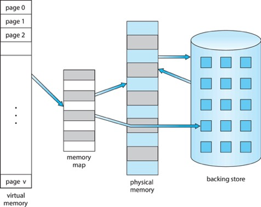

### Virtual-address Space

- Usually design logical address space for stack to start at Max logical address and grow "down" while heap grows "up"
  - Maximizes address space use
  - Unused address space between the two is hole
    - No physical memory needed until heap or stack grows to a given new page
- Enables **sparse address spaces** with holes left for growth, dynamically linked libraries, etc.
- System libraries shared via mapping into virtual address space
- Shared memory by mapping pages read-write into virtual address space
- Pages can be shared during `fork()`, speeding process creation
 
### Shared Library Using Virtual Memory

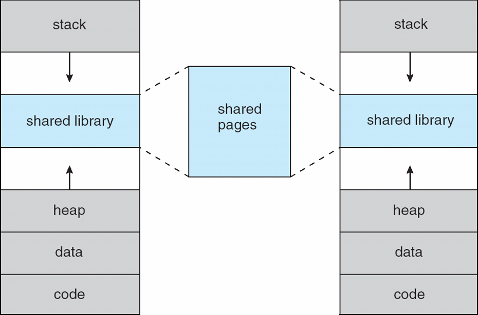

<div align="right">
    <p>
        <a href="#table-of-contents-------" target="_blank"><b>☝🏼 [Back to TOP]</b></a> 
    </p>
</div>

## Demand Paging

- Could bring entire process into memory at load time
- Or bring a page into memory only when it is needed
  - Less I/O needed, no unnecessary I/O
  - Less memory needed 
  - Faster response
  - More users
- Similar to paging system with swapping (diagram on right)
- Page is needed 👉🏻 reference to it
  - invalid reference 👉🏻 abort
  - not-in-memory 👉🏻 bring to memory
- Lazy swapper – never swaps a page into memory unless page will be needed
  - Swapper that deals with pages is a pager
- Could bring entire process into memory at load time
- Or bring a page into memory only when it is needed
  - Less I/O needed, no unnecessary I/O
  - Less memory needed 
  - Faster response
  - More users
- Similar to paging system with swapping (diagram on right)

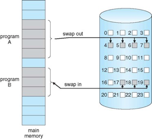

### Basic Concepts

- With swapping, pager guesses which pages will be used before swapping out again
- Instead, pager brings in only those pages into memory
- How to determine that set of pages?
  - Need new MMU functionality to implement demand paging
- If pages needed are already memory resident
  - No difference from non demand-paging
- If page needed and not memory resident
  - Need to detect and load the page into memory from storage
    - Without changing program behavior
    - Without programmer needing to change code

### Valid-Invalid Bit

- With each page table entry a valid–invalid bit is associated (v 👉🏻 in-memory – memory resident, i 👉🏻 not-in-memory)
- Initially valid–invalid bit is set to i on all entries
- Example of a page table snapshot:

    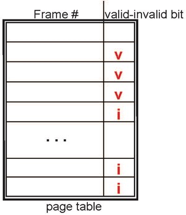
- During MMU address translation, if valid–invalid bit in page table entry is i 👉🏻 page fault

Page Table When Some Pages Are Not in Main Memory

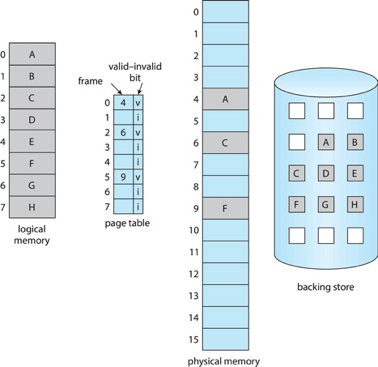

### Steps in Handling Page Fault

1. If there is a reference to a page, first reference to that page will trap to operating system 
    - Page fault
2. Operating system looks at another table to decide:
    - Invalid reference 👉🏻 abort
    - Just not in memory
3. Find free frame
4. Swap page into frame via scheduled disk operation
5. Reset tables to indicate page now in memory

    Set validation bit = v
6. Restart the instruction that caused the page fault


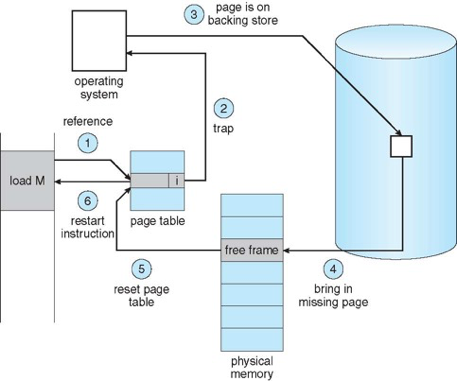

> [!TIP]
> 把 memory reference 到 page table，找不到 👉🏻 page fault 👉🏻 trap 到 OS 👉🏻 OS 就去 Backing Store 去找 Free Frame 如果有得話，就更改 page table 👉🏻 restart

### Aspects of Demand Paging

- Extreme case – start process with no pages in memory
  - OS sets instruction pointer to first instruction of process, non-memory-resident -> page fault
  - And for every other process pages on first access
  - Pure demand paging
- Actually, a given instruction could access multiple pages -> multiple page faults
  - Consider fetch and decode of instruction which adds 2 numbers from memory and stores result back to memory
  - Pain decreased because of locality of reference
- Hardware support needed for demand paging
  - Page table with valid / invalid bit
  - Secondary memory (swap device with swap space)
  - Instruction restart

#### Instruction Restart

- Consider an instruction that could access several different locations
  - Block move

    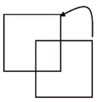
  - Auto increment/decrement location
  - Restart the whole operation?
    - What if source and destination overlap?

### Free-Frame List

- When a page fault occurs, the operating system must bring the desired page from secondary storage into main memory. 
- Most operating systems maintain a free-frame list -- a pool of free frames for satisfying such requests.

    ```mermaid
    graph LR
        head --> node1[7]
        node1[7] --> node2[97]
        node2[97] --> node3[15]
        node3[15] --> node4[126]
        node4[126] --> |...| node5[75]
    ```

- Operating system typically allocate free frames using a technique known as **zero-fill-on-demand** --  the content of the frames zeroed-out before being allocated.
- When a system starts up, all available memory is placed on the free-frame list. 

### Stages in Demand Paging – Worse Case

1. Trap to the operating system
2. Save the user registers and process state
3. Determine that the interrupt was a page fault
4. Check that the page reference was legal and determine the location of the page on the disk
5. Issue a read from the disk to a free frame:
    - (A) Wait in a queue for this device until the read request is serviced
    - (B) Wait for the device seek and/or latency time
    - (C) Begin the transfer of the page to a free frame
6. While waiting, allocate the CPU to some other user
7. Receive an interrupt from the disk I/O subsystem (I/O   completed)
8. Save the registers and process state for the other user
9. Determine that the interrupt was from the disk
10. Correct the page table and other tables to show page is now in memory
11. Wait for the CPU to be allocated to this process again
12. Restore the user registers, process state, and new page table, and then resume the interrupted instruction

### Performance of Demand Paging

- Three major activities
  - Service the interrupt – careful coding means just several hundred instructions needed
  - Read the page – lots of time
  - Restart the process – again just a small amount of time
- Page Fault Rate 0  p  1
  - if p = 0 no page faults 
  - if p = 1, every reference is a fault
- Effective Access Time (EAT)
    
    $$EAT = (1 – p) \times memory access$$
    $$+ p (page fault overhead$$
    $$+ swap page out$$
    $$+ swap page in )$$

### Demand Paging Example

- Memory access time = 200 nanoseconds
- Average page-fault service time = 8 milliseconds

    $$EAT = (1 – p) \times 200 + p (8 milliseconds)$$
    $$= (1 – p) \times 200 + p \times 8,000,000$$
    $$= 200 + p \times 7,999,800$$
- If one access out of 1,000 causes a page fault ($p=0.001$), then
    
    $$EAT = 8.2 microseconds.$$
    
    This is a slowdown by a factor of 40!!
- If want performance degradation < 10 percent
  
    $$220 > 200 + 7,999,800 \times p$$
  
    $$20 > 7,999,800 \times p$$
  - p < .0000025
  - < one page fault in every 400,000 memory accesses
    
### Demand Paging Optimizations

- Swap space I/O faster than file system I/O even if on the same device
  - Swap allocated in larger chunks, less management needed than file system
- Copy entire process image to swap space at process load time
  - Then page in and out of swap space
  - Used in older BSD Unix
- Demand page in from program binary on disk, but discard rather than paging out when freeing frame
  - Used in Solaris and current BSD
  - Still need to write to swap space
    - Pages not associated with a file (like stack and heap) – anonymous memory
    - Pages modified in memory but not yet written back to the file system
- Mobile systems
  - Typically don’t support swapping
  - Instead, demand page from file system and reclaim read-only pages (such as code)

### Performance of Demand Paging

1. Trap to the operating system
2. Save the user registers and process state
3. Determine that the interrupt was a page fault
4. Check that the page reference was legal and determine the location of the page on the disk
5. Issue a read from the disk to a free frame:
   1. Wait in a queue for this device until the read request is serviced
   2. Wait for the device seek and/or latency time
   3. Begin the transfer of the page to a free frame
6. While waiting, allocate the CPU to some other user
7.  Receive an interrupt from the disk I/O subsystem (I/O completed)
8.  Save the registers and process state for the other user
9.  Determine that the interrupt was from the disk
10. Correct the page table and other tables to show page is now in memory
11. Wait for the CPU to be allocated to this process again
12. Restore the user registers, process state, and new page table, and then resume the interrupted instruction

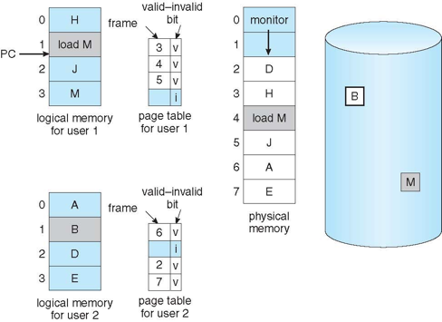

<div align="right">
    <p>
        <a href="#table-of-contents-------" target="_blank"><b>☝🏼 [Back to TOP]</b></a> 
    </p>
</div>

## Copy-on-Write (COW)

> [!TIP]
>
> works by allowing the parent and child processes initially to share the same pages. (If either process modifies a shared page, only then is the page copied)

- COW allows more efficient process creation as only modified pages are copied
- In general, free pages are allocated from a pool of zero-fill-on-demand pages
  - Pool should always have free frames for fast demand page execution
    - Don't want to have to free a frame as well as other processing on page fault
  - Why zero-out a page before allocating it?
- `vfork()` variation on `fork()` system call has parent suspend and child using copy-on-write address space of parent
  - Designed to have child call `exec()`
  - Very efficient

| Before Process 1 Modifies Page C | After Process 1 Modifies Page C |
| -------------------------------- | ------------------------------- |
| 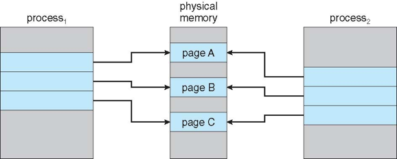         | 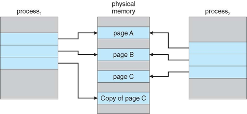        |

### What Happens if There is no Free Frame?

- Used up by process pages
- Also in demand from the kernel, I/O buffers, etc
- How much to allocate to each?
- Page replacement – find some page in memory, but not really in use, page it out
  - Algorithm – terminate? swap out? replace the page?
  - Performance – want an algorithm which will result in minimum number of page faults
- Same page may be brought into memory several times

<div align="right">
    <p>
        <a href="#table-of-contents-------" target="_blank"><b>☝🏼 [Back to TOP]</b></a> 
    </p>
</div>

## Page Replacement

- Prevent over-allocation of memory by modifying page-fault service routine to include page replacement
- Use modify (dirty) bit to reduce overhead of page transfers – only modified pages are written to disk
- Page replacement completes separation between logical memory and physical memory – large virtual memory can be provided on a smaller physical memory

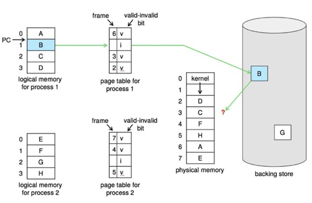

### Basic Page Replacement

1. Find the location of the desired page on disk
2. Find a free frame:
   -  If there is a free frame, use it
   - If there is no free frame, use a page replacement algorithm to select a victim frame
   - Write victim frame to disk if dirty
3. Bring  the desired page into the (newly) free frame; update the page and frame tables
4. Continue the process by restarting the instruction that caused the trap
 
> [!NOTE]
> now potentially 2 page transfers for page fault – increasing EAT

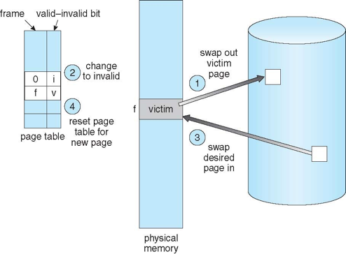

### Page and Frame Replacement Algorithms

- Frame-allocation algorithm determines 
  - How many frames to give each process
  - Which frames to replace
- Page-replacement algorithm
  - Want lowest page-fault rate on both first access and re-access
- Evaluate algorithm by running it on a particular string of memory references (reference string) and computing the number of page faults on that string
  - String is just page numbers, not full addresses
  - Repeated access to the same page does not cause a page fault
  - Results depend on number of frames available
- In all our examples, the reference string of referenced page numbers is 
    `7, 0, 1, 2, 0, 3, 0, 4, 2, 3, 0, 3, 0, 3, 2, 1, 2, 0, 1, 7, 0, 1`

### Graph of Page Faults Versus the Number of Frames

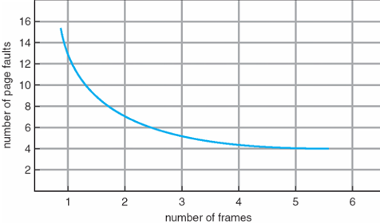

### [NEED HELP!!!] First-In-First-Out (FIFO) Algorithm

- Reference string: `7, 0, 1, 2, 0, 3, 0, 4, 2, 3, 0, 3, 0, 3, 2, 1, 2, 0, 1, 7, 0, 1`
- 3 frames (3 pages can be in memory at a time per process)

    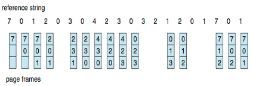

- Can vary by reference string: consider `1, 2, 3, 4, 1, 2, 5, 1, 2, 3, 4, 5`
  - Adding more frames can cause more page faults!
    - Belady's Anomaly
- How to track ages of pages? 
  - Just a FIFO queue
- Reference string: `7, 0, 1, 2, 0, 3, 0, 4, 2, 3, 0, 3, 0, 3, 2, 1, 2, 0, 1, 7, 0, 1`
- 3 frames (3 pages can be in memory at a time per process)
- `7, 0, 1, 2, 0, 3, 0, 4, 2, 3, 0, 3, 0, 3, 2, 1, 2, 0, 1, 7, 0, 1`

[NEED HELP!!!]
```
|    7 0 1 2  . 3 0 4 2 3 0  .  .  .  .  1 2  .  . 7 0 1
|      7 0 1    2 3 0 4 2 3              0 1       2 7 0
|        7 0    1 2 3 0 4 2              3 0       1 2 7
|------------------------------------------------------------
|          7    0 1 2 3 0 4              2 3       0 1 2        page fault: 15
v
```

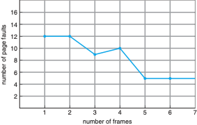

> [!NOTE]
>
> **Belady's Anomaly:**
> 
> 即便增加 frames 的數量，page fault 的數量不一定會減少，還有可能會增加

### Optimal (Belady) Algorithm

- Replace page that will not be used for longest period of time
  - 9 is optimal for the example
- Used for measuring how well your algorithm performs

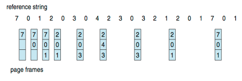

> [!TIP]
>
> 取代未來最長時間不會被使用的 page

> [!NOTE]
>
> Can't read the future


### Least Recently Used (LRU) Algorithm

Use past knowledge rather than future 👉🏻 Associate time of last use with each page

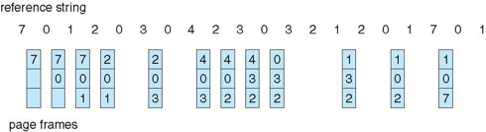

> [!TIP]
>
> Replace page that has not been used in the most amount of time

- 12 faults – better than FIFO but worse than OPT
- Generally good algorithm and frequently used

#### Implementation

**Counter implementation**

- Every page entry has a counter; every time page is referenced through this entry, copy the clock into the counter
- When a page needs to be changed, look at the counters to find smallest value
  - Search through table needed

**Stack implementation**

- Keep a stack of page numbers in a double link form:
- Page referenced:
  - move it to the top
  - requires 6 pointers to be changed
- But each update more expensive
- No search for replacement

> [!NOTE]
> 
> LRU and OPT are cases of stack algorithms that don’t have Belady's Anomaly

Use Of A Stack to Record Most Recent Page References

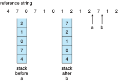

### LRU Approximation Algorithms

LRU needs special hardware and still slow

#### Reference bit

- With each page associate a bit, initially = 0
- When page is referenced bit set to 1
- Replace any with reference bit = 0 (if one exists)
  - We do not know the order, however

#### Second-chance algorithm

- Generally FIFO, plus hardware-provided reference bit
- Clock replacement
- If page to be replaced has 
  - Reference bit = 0 -> replace it
  - reference bit = 1 then:
    - set reference bit 0, leave page in memory
    - replace next page, subject to same rules

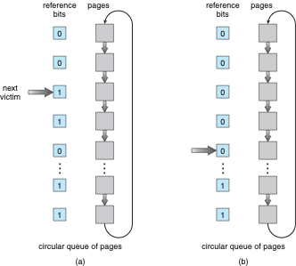

> [!TIP]
>
> 有 reference bits 我們把 pages 做成 circular 循環，當發現 bit = 1 👉🏻 0，但是遇到 bit = 0 👉🏻 1，當成可以替換掉的 page

### Enhanced Second-Chance Algorithm

Improve algorithm by using reference bit and modify bit (if available) in concert

- Take ordered pair (reference, modify):
  - `(0, 0)` neither recently used not modified – best page to replace
  - `(0, 1)` not recently used but modified – not quite as good, must write out before replacement
  - `(1, 0)` recently used but clean – probably will be used again soon
  - `(1, 1)` recently used and modified – probably will be used again soon and need to write out before replacement
- When page replacement called for, use the clock scheme  but use the four classes replace page in lowest non-empty class
  - Might need to search circular queue several times

### Counting Algorithms

- Keep a counter of the number of references that have been made to each page
  - Not common
- Lease Frequently Used (LFU) Algorithm:
  - Replaces page with smallest count
- Most Frequently Used (MFU) Algorithm: 
  - Based on the argument that the page with the smallest count was probably just brought in and has yet to be used

### Page-Buffering Algorithms

- Keep a pool of free frames, always
  - Then frame available when needed, not found at fault time
  - Read page into free frame and select victim to evict and add to free pool
  - When convenient, evict victim
- Possibly, keep list of modified pages
  - When backing store otherwise idle, write pages there and set to non-dirty
- Possibly, keep free frame contents intact and note what is in them
  - If referenced again before reused, no need to load contents again from disk
  - Generally useful to reduce penalty if wrong victim frame selected  

### Applications and Page Replacement

- All of these algorithms have OS guessing about future page access
- Some applications have better knowledge – i.e. databases
- Memory intensive applications can cause double buffering
  - OS keeps copy of page in memory as I/O buffer
  - Application keeps page in memory for its own work
- Operating system can given direct access to the disk, getting out of the way of the applications
  - Raw disk mode
- Bypasses buffering, locking, etc.

<div align="right">
    <p>
        <a href="#table-of-contents-------" target="_blank"><b>☝🏼 [Back to TOP]</b></a> 
    </p>
</div>


## Allocation of Frames 

- Each process needs minimum number of frames
- Example: IBM 370 – 6 pages to handle SS MOVE instruction:
  - instruction is 6 bytes, might span 2 pages
  - 2 pages to handle `from`
  - 2 pages to handle `to`
- Maximum of course is total frames in the system
- Two major allocation schemes
  - fixed allocation
  - priority allocation
- Many variations

### Fixed Allocation

#### Equal allocation

According the sizes of frames and divided equally among the processes (Maybe keep some as free frame buffer pool)


#### Proportional allocation

Allocate according to the size of process

- Dynamic as degree of multiprogramming, process sizes change

#### Example
- $S_i$ = size of process $P_i$
- $S = \sum S_i$, $m$ = total number of frames
- $a_i$ = allocation for process
- $p_i = \frac{S_i}{S} \times m$
- $m = 62$

| $S_1$ | $S_2$ | $a_1$ | $a_2$ |
| ----- | ----- | ----- | ----- |
| 10    | 127   | $a_1 = \frac{10}{137} \times 62 \approx 4$ | $a_2 = \frac{127}{137} \times 62 \approx 57$ |


### Priority Allocation

- Use a proportional allocation scheme using priorities rather than size
- If process $P_i$ generates a page fault,
  - select for replacement one of its frames
  - select for replacement a frame from a process with lower priority number


### Global vs. Local Allocation

#### Global replacement

process selects a replacement frame from the set of all frames; one process can take a frame from another

- But then process execution time can vary greatly
- But greater throughput so more common

#### Local replacement

each process selects from only its own set of allocated frames

- More consistent per-process performance
- But possibly underutilized memory

### Reclaiming Pages

- A strategy to implement global page-replacement policy 
- All memory requests  are satisfied from the free-frame list,  rather than waiting for the list to drop to zero before we begin selecting pages for replacement, 
- Page replacement  is triggered when the list falls below a certain threshold. 
- This strategy attempts to ensure there is always sufficient free memory to satisfy new requests.

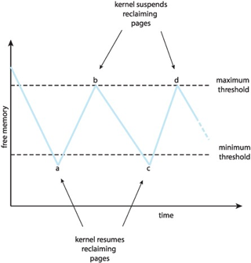

### Non-Uniform Memory Access

- So far, we assumed that all memory accessed equally
- Many systems are NUMA – speed of access to memory varies
  - Consider system boards containing CPUs and memory, interconnected over a system bus
- NUMA multiprocessing architecture

    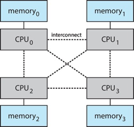

- Optimal performance comes from allocating memory "close to" the CPU on which the thread is scheduled
  - And modifying the scheduler to schedule the thread on the same system board when possible
  - Solved by Solaris by creating lgroups 
    - Structure to track CPU / Memory low latency groups
    - Used my schedule and pager
    - When possible schedule all threads of a process and allocate all memory for that process within the lgroup

<div align="right">
    <p>
        <a href="#table-of-contents-------" target="_blank"><b>☝🏼 [Back to TOP]</b></a> 
    </p>
</div>


## Thrashing

If a process does not have "enough" pages, the page-fault rate is very high


> [!TIP]
> Page fault rate too high 👉🏻 OS need more page 👉🏻 replace existing frame but quickly need replaced frame back
>
> 👉🏻 CPU utilization decrease instantly, also OS thinks it needs to increase the degree of multiprogramming 👉🏻 another process added to system

> [!NOTE]
>
> Thrashing 👉🏻 A process is busy swapping pages in and out
>
> 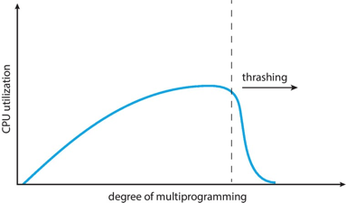

### Demand Paging and Thrashing 

- Why does demand paging work?

    Locality model
    - Process migrates from one locality to another
    - Localities may overlap
- Why does thrashing occur?

    $\sum$ size of locality $>$ total memory size

- Limit effects by using local or priority page replacement

### Locality In A Memory-Reference Pattern

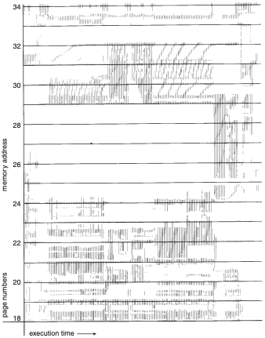

### Working-Set Model

- $\Delta \equiv$ working-set window $\equiv$ a fixed number of page references

    Example:  10,000 instructions
- $WSS_i$ (working set of Process $P_i$) =  total number of pages referenced in the most recent $\Delta$ (varies in time)
  - if $\Delta$ too small will not encompass entire locality
  - if $\Delta$ too large will encompass several localities
  - if $\Delta = \infin$ 👉🏻 will encompass entire program
- $D = \sum WSS_i \equiv$ total demand frames 
  - Approximation of locality
- if $D > m$ 👉🏻 Thrashing
- Policy if $D > m$, then suspend or swap out one of the processes 

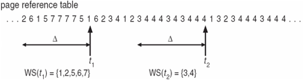

### Keeping Track of the Working Set

- Approximate with interval timer + a reference bit
- Example: $\Delta = 10,000$
  - Timer interrupts after every 5000 time units
  - Keep in memory 2 bits for each page
  - Whenever a timer interrupts copy and sets the values of all reference bits to 0
  - If one of the bits in memory = 1 👉🏻 page in working set
- Why is this not completely accurate?
- Improvement = 10 bits and interrupt every 1000 time units

### Page-Fault Frequency

- More direct approach than WSS
- Establish acceptable page-fault frequency (PFF) rate and use local replacement policy
  - If actual rate too low, process loses frame
  - If actual rate too high, process gains frame

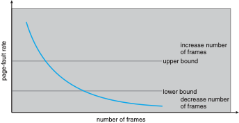

### Working Sets and Page Fault Rates

- Direct relationship between working set of a process and its page-fault rate
- Working set changes over time
- Peaks and valleys over time

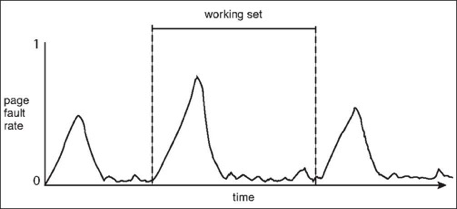

<div align="right">
    <p>
        <a href="#table-of-contents-------" target="_blank"><b>☝🏼 [Back to TOP]</b></a> 
    </p>
</div>

## Allocating Kernel Memory

- Treated differently from user memory
- Often allocated from a free-memory pool
  - Kernel requests memory for structures of varying sizes
  - Some kernel memory needs to be contiguous
    - i.e., for device I/O


### Buddy System

- Allocates memory from fixed-size segment consisting of physically-contiguous pages
- Memory allocated using power-of-2 allocator
  - Satisfies requests in units sized as power of 2
  - Request rounded up to next highest power of 2
  - When smaller allocation needed than is available, current chunk split into two buddies of next-lower power of 2
    - Continue until appropriate sized chunk available
- For example, assume 256KB chunk available, kernel requests 21KB
  - Split into $A_L$ and $A_R$ of 128KB each
    - One further divided into $B_L$ and $B_R$ of 64KB
      - One further into $C_L$ and $C_R$ of 32KB each – one used to satisfy request
- Advantage – quickly coalesce unused chunks into larger chunk
- Disadvantage - fragmentation

#### Buddy System Allocator

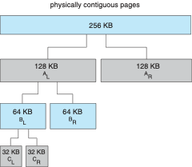

### Slab Allocator

- Alternate strategy
- Slab is one or more physically contiguous pages
- **Cache** consists of one or more slabs
- Single cache for each unique kernel data structure
  - Each cache filled with objects – instantiations of the data structure
- When cache created, filled with objects marked as free
- When structures stored, objects marked as used
- If slab is full of used objects, next object allocated from empty slab
  - If no empty slabs, new slab allocated
- Benefits include no fragmentation, fast memory request satisfaction

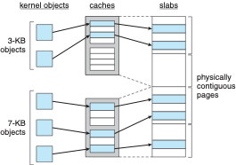

#### Slab Allocator in Linux

- For example process descriptor is of type `struct task_struct`
- Approx 1.7KB of memory
- New task -> allocate new struct from cache
  - Will use existing free `struct task_struct`
- Slab can be in three possible states
  1. Full – all used
  2. . Empty – all free
  3. Partial – mix of free and used
- Upon request, slab allocator
  1. Uses free struct in partial slab
  2. If none, takes one from empty slab
  3. If no empty slab, create new empty
- Slab started in Solaris, now wide-spread for both kernel mode and user memory in various OSes
- Linux  2.2 had SLAB, now has both SLOB and SLUB allocators
  - SLOB for systems with limited memory
    - Simple List of Blocks – maintains 3 list objects for small, medium, large objects
  - SLUB is performance-optimized SLAB removes per-CPU queues, metadata stored in page structure

<div align="right">
    <p>
        <a href="#table-of-contents-------" target="_blank"><b>☝🏼 [Back to TOP]</b></a> 
    </p>
</div>

## Other Considerations

### Prepaging

- To reduce the large number of page faults that occurs at process startup
- Prepage all or some of the pages a process will need, before they are referenced
- But if prepaged pages are unused, I/O and memory was wasted
- Assume s pages are prepaged and α of the pages is used
- Is cost of $s * \alpha$  save pages faults > or < than the cost of prepaging 
    
    $s * (1 - \alpha)$ unnecessary pages?  
- $\alpha$ near zero 👉🏻 prepaging loses 

### Page Size

- Sometimes OS designers have a choice
  - Especially if running on custom-built CPU
- Page size selection must take into consideration:
  - Fragmentation
  - Page table size 
  - Resolution
  - I/O overhead
  - Number of page faults
  - Locality
  - TLB size and effectiveness
- Always power of 2, usually in the range $2^{12}$ (4,096 bytes) to $2^{22}$ (4,194,304 bytes)
- On average, growing over time

### TLB Reach 

- TLB Reach - The amount of memory accessible from the TLB
- TLB Reach = (TLB Size) X (Page Size)
- Ideally, the working set of each process is stored in the TLB
  - Otherwise there is a high degree of page faults
- Increase the Page Size
  - This may lead to an increase in fragmentation as not all applications require a large page size
- Provide Multiple Page Sizes
  - This allows applications that require larger page sizes the opportunity to use them without an increase in fragmentation

### Program Structure

- `int[128, 128] data;`
- Each row is stored in one page 
- Program 1 	
    
    ```c
        for (j = 0; j <128; j++)
            for (i = 0; i < 128; i++)
                data[i, j] = 0;
    ```
     
    $128 \times 128 = 16,384$ page faults

- Program 2 	
             
    ```c
        for (i = 0; i < 128; i++)
            for (j = 0; j < 128; j++)
                data[i, j] = 0;
    ```
     
    $128$ page faults

### I/O interlock

- I/O Interlock – Pages must sometimes be locked into memory
- Consider I/O - Pages that are used for copying a file from a device must be locked from being selected for eviction by a page replacement algorithm
- Pinning of pages to lock into memory

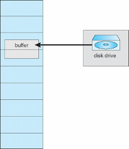

<div align="right">
    <p>
        <a href="#table-of-contents-------" target="_blank"><b>☝🏼 [Back to TOP]</b></a> 
    </p>
</div>

## Operating-System Examples

### Windows

- Uses demand paging with clustering. Clustering brings in pages surrounding the faulting page
- Processes are assigned working set minimum and working set maximum
- Working set minimum is the minimum number of pages the process is guaranteed to have in memory
- A process may be assigned as many pages up to its working set maximum
- When the amount of free memory in the system falls below a threshold, automatic working set trimming is performed to restore the amount of free memory
- Working set trimming removes pages from processes that have pages in excess of their working set minimum

### Solaris 

- Maintains a list of free pages to assign faulting processes
- `Lotsfree` – threshold parameter (amount of free memory) to begin paging
- `Desfree` – threshold parameter to increasing paging
- `Minfree` – threshold parameter to being swapping
- Paging is performed by `pageout` process
- `Pageout` scans pages using modified clock algorithm
- `Scanrate` is the rate at which pages are scanned. This ranges from `slowscan` to `fastscan`
- `Pageout` is called more frequently depending upon the amount of free memory available
- Priority paging gives priority to process code pages

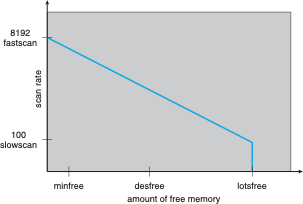

<div align="right">
    <p>
        <a href="#table-of-contents-------" target="_blank"><b>☝🏼 [Back to TOP]</b></a> 
    </p>
</div>

## Memory Compression

rather than paging out modified frames to swap space, we compress several frames into a single frame, enabling the system to reduce memory usage without resorting to swapping pages.

- Consider the following free-frame-list consisting of 6 frames
    - free frame list:
        ```mermaid
        graph LR
            head --> node1[7]
            node1[7] --> node2[2]
            node2[2] --> node3[9]
            node3[9] --> node4[21]
            node4[21] --> node5[27]
            node5[27] --> node6[16]
        ```
    - modified frame list:
        ```mermaid
        graph LR
            head --> node1[15]
            node1[15] --> node2[3]
            node2[3] --> node3[35]
            node3[35] --> node4[26]
        ```
- Assume that this number of free frames falls below a certain threshold that triggers page replacement.  The replacement algorithm (say, an LRU approximation algorithm) selects four frames -- 15, 3, 35, and 26 to place on the free-frame list. It first places these frames on a modified-frame list.  Typically, the modified-frame list would next be written to swap space, making the frames available to the free-frame list. An alternative strategy is to compress a number of frames{\mdash}say, three{\mdash}and store their compressed versions n a single page frame.
- An alternative to paging is memory compression. 
- Rather than paging out modified frames to swap space, we compress several frames into a single frame, enabling the system to reduce memory usage without resorting to swapping pages.
    - free frame list:
        ```mermaid
        graph LR
            head --> node1[2]
            node1[2] --> node2[9]
            node2[9] --> node3[21]
            node3[21] --> node4[27]
            node4[27] --> node5[16]
            node5[15] --> node6[3]
            node6[3] --> node7[35]
        ```
    - modified frame list:
        ```mermaid
        graph LR
            head --> node1[26]
        ```
    - compressed frame list:
        ```mermaid
        graph LR
            head --> node1[7]
        ```

<div align="right">
    <p>
        <a href="#table-of-contents-------" target="_blank"><b>☝🏼 [Back to TOP]</b></a> 
    </p>
</div>
