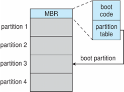
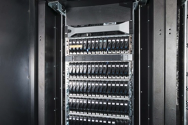
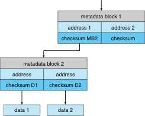

# Chapter 11 - Mass Storage Systems

> [!NOTE]
>
> - Describe the physical structure of secondary storage devices and the effect of a device’s structure on its uses
> - Explain the performance characteristics of mass-storage devices
> - Evaluate I/O scheduling algorithms
> - Discuss operating-system services provided for mass storage, including RAID

## Overview of Mass Storage Structure

- Bulk of secondary storage for modern computers is hard disk drives (HDDs) and nonvolatile memory (NVM) devices
- HDDs spin platters of magnetically-coated material under moving read-write heads
  - Drives rotate at 60 to 250 times per second
  - Transfer rate is rate at which data flow between drive and computer
  - Positioning time (random-access time) is time to move disk arm to desired cylinder (seek time) and time for desired sector to rotate under the disk head (rotational latency)
  - Head crash results from disk head making contact with the disk surface  -- That’s bad
- Disks can be removable

### Moving-head Disk Mechanism

### Hard Disk Drives

- Platters range from .85" to 14" (historically)
  - Commonly 3.5", 2.5", and 1.8"
- Range from 30GB to 3TB per drive
- Performance 
  - Transfer Rate – theoretical – 6 Gb/sec
  - Effective Transfer Rate – real – 1Gb/sec
  - Seek time from 3ms to 12ms – 9ms common for desktop drives
  - Average seek time measured or calculated based on 1/3 of tracks
  - Latency based on spindle speed
  - 1 / (RPM / 60) = 60 / RPM
  - Average latency = $\frac{1}{2}$ latency

### Hard Disk Performance

- Access Latency = Average access time = average seek time + average latency
  - For fastest disk 3ms + 2ms = 5ms
  - For slow disk 9ms + 5.56ms = 14.56ms
- Average I/O time = average access time + (amount to transfer / transfer rate) + controller overhead
- For example to transfer a 4KB block on a 7200 RPM disk with a 5ms average seek time, 1Gb/sec transfer rate with a .1ms controller overhead =
  - 5ms + 4.17ms + 0.1ms + transfer time =
  - Transfer time = 4KB / 1Gb/s * 8Gb / GB * 1GB / 10242KB = 32 / (10242) = 0.031 ms 
  - Average I/O time for 4KB block = 9.27ms + .031ms = 9.301ms

### Nonvolatile Memory Devices

- If disk-drive like, then called solid-state disks (SSDs)
- Other forms include USB drives (thumb drive, flash drive), DRAM disk replacements, surface-mounted on motherboards, and main storage in devices like smartphones
- Can be more reliable than HDDs
- More expensive per MB
- Maybe have shorter life span – need careful management
- Less capacity
- But much faster
- Busses can be too slow 👉🏻 connect directly to PCI for example
- No moving parts, so no seek time or rotational latency

### Nonvolatile Memory Devices

- Have characteristics that present challenges
- Read and written in "page" increments (think sector) but can't overwrite in place
  - Must first be erased, and erases happen in larger "block" increments
  - Can only be erased a limited number of times before worn out – ~ 100,000
  - Life span measured in drive writes per day (DWPD)
    - A 1TB NAND drive with rating of 5DWPD is expected to have 5TB per day written within warrantee period without failing

### NAND Flash Controller Algorithms

- With no overwrite, pages end up with mix of valid and invalid data
- To track which logical blocks are valid, controller maintains flash translation layer (FTL) table
- Also implements garbage collection to free invalid page space
- Allocates overprovisioning(20% of total) to provide working space for GC
- Each cell has lifespan, so wear leveling needed to write equally to all cells

NAND block with valid and invalid pages

### Volatile Memory

- DRAM frequently used as mass-storage device
  - Not technically secondary storage because volatile, but can have file systems, be used like very fast secondary storage
- RAM drives (with many names, including RAM disks) present as raw block devices, commonly file system formatted
- Computers have buffering, caching via RAM, so why RAM drives?
  - Caches / buffers allocated / managed by programmer, operating system, hardware
  - RAM drives under user control
  - Found in all major operating systems
    - Linux `/dev/ram`, macOS `diskutil` to create them, Linux `/tmp` of file system type `tmpfs`
- Used as high speed temporary storage
  - Programs could share bulk date, quickly, by reading/writing to RAM drive

### Magnetic Tape

### Disk Structure

- Disk drives are addressed as large 1-dimensional arrays of logical blocks, where the logical block is the smallest unit of transfer
  - Low-level formatting creates logical blocks on physical media
- The 1-dimensional array of logical blocks is mapped into the sectors of the disk sequentially
  - Sector 0 is the first sector of the first track on the outermost cylinder
  - Mapping proceeds in order through that track, then the rest of the tracks in that cylinder, and then through the rest of the cylinders from outermost to innermost
  - Logical to physical address should be easy
    - Except for bad sectors
    - Non-constant # of sectors per track via constant angular velocity

### Disk Attachment

- Host-attached storage accessed through I/O ports talking to I/O busses
- Several busses available, including advanced technology attachment (ATA), serial ATA (SATA), eSATA, serial attached SCSI (SAS), universal serial bus (USB), and fibre channel (FC).
- Most common is SATA
- Because NVM much faster than HDD, new fast interface for NVM called NVM express (NVMe), connecting directly to PCI bus
- Data transfers on a bus carried out by special electronic processors called controllers (or host-bus adapters, HBAs)
  - Host controller on the computer end of the bus, device controller on device end
  - Computer places command on host controller, using memory-mapped I/O ports
    - Host controller sends messages to device controller
    - Data transferred via DMA between device and computer DRAM

### Address Mapping

- Disk drives are addressed as large 1-dimensional arrays of logical blocks, where the logical block is the smallest unit of transfer
  - Low-level formatting creates logical blocks on physical media
- The 1-dimensional array of logical blocks is mapped into the sectors of the disk sequentially
  - Sector 0 is the first sector of the first track on the outermost cylinder
  - Mapping proceeds in order through that track, then the rest of the tracks in that cylinder, and then through the rest of the cylinders from outermost to innermost
  - Logical to physical address should be easy
    - Except for bad sectors
    - Non-constant # of sectors per track via constant angular velocity

## HDD Scheduling

- The operating system is responsible for using hardware efficiently — for the disk drives, this means having a fast access time and disk bandwidth
- Minimize seek time
- Seek time  seek distance
- Disk bandwidth is the total number of bytes transferred, divided by the total time between the first request for service and the completion of the last transfer
- There are many sources of disk I/O request
  - OS
  - System processes
  - Users processes
- I/O request includes input or output mode, disk address, memory address, number of sectors to transfer
- OS maintains queue of requests, per disk or device
- Idle disk can immediately work on I/O request, busy disk means work must queue
  - Optimization algorithms only make sense when a queue exists
- In the past, operating system responsible for queue management, disk drive head scheduling
  - Now, built into the storage devices, controllers
  - Just provide LBAs, handle sorting of requests
    - Some of the algorithms they use described next
- Note that drive controllers have small buffers and can manage a queue of I/O requests (of varying “depth”)
- Several algorithms exist to schedule the servicing of disk I/O requests
- The analysis is true for one or many platters
- We illustrate scheduling algorithms with a request queue (0-199)

    `98, 183, 37, 122, 14, 124, 65, 67`
    
    Head pointer 53

### FCFS (First-Come, First-Served)

Illustration shows total head movement of 640 cylinders

### SSTF (Shortest Seek Time First)

- Shortest Seek Time First selects the request with the minimum seek time from the current head position
- SSTF scheduling is a form of SJF scheduling; but it is not optimal. It may cause starvation of some requests
- a request queue (0-199)

    `98, 183, 37, 122, 14, 124, 65, 67`
    
    Head pointer 53
- Illustration shows total head movement of 236 cylinders
- SSTF total movements = (67 – 53) + (67 – 14) + (183 – 14) = 236
- LOOK : assume head move from 53 to lower(down direction)
- By moving head from 53 to 37 , even the latter is not closest, and then to 14 , before turing around to service 65, 67,98, 122,124, and 183.
- LOOK total movements = (53 – 14) + (183 – 14) = 208 

### SCAN (Elevator)

- The disk arm starts at one end of the disk, and moves toward the other end, servicing requests until it gets to the other end of the disk, where the head movement is reversed and servicing continues.
- SCAN algorithm Sometimes called the elevator algorithm
- Illustration shows total head movement of 236 cylinders
- But note that if requests are uniformly dense, largest density at other end of disk and those wait the longest

- Request queue 沒有 0, 電梯算法總回到0 
- total movements = 53 + 183 =236

### Circular-SCAN

- Provides a more uniform wait time than SCAN
- The head moves from one end of the disk to the other, servicing requests as it goes
  - When it reaches the other end, however, it immediately returns to the beginning of the disk (快速抽回), without servicing any requests on the return trip
- Treats the cylinders as a circular list that wraps around from the last cylinder to the first one
- Total number of cylinders?

Total movements= (199 – 53) + quick back return + (37 -0) = Quick back to 0 + 183

### Selecting a Disk-Scheduling Algorithm

- SSTF(Shortest Seek Time First) is common and has a natural appeal
- SCAN and C-SCAN perform better for systems that place a heavy load on the disk
  - Less starvation, but still possible
- To avoid starvation Linux implements deadline scheduler
  - Maintains separate read and write queues, gives read priority
    - Because processes more likely to block on read than write
  - Implements four queues: 2 x read and 2 x write
    - 1 read and 1 write queue sorted in LBA(Logical Block Adress) order, essentially implementing C-SCAN
    - 1 read and 1 write queue sorted in FCFS order
    - All I/O requests sent in batch sorted in that queue’s order
    - After each batch, checks if any requests in FCFS older than configured age (default 500ms)
      - If so, LBA queue containing that request is selected for next batch of I/O
- In RHEL 7 also NOOP and completely fair queueing scheduler (CFQ) also available, defaults vary by storage device

## NVM Scheduling

- No disk heads or rotational latency but still room for optimization
- In RHEL 7 NOOP (no scheduling) is used but adjacent LBA requests are combined
  - NVM best at random I/O, HDD at sequential
  - Throughput can be similar
  - Input/Output operations per second (IOPS) much higher with NVM (hundreds of thousands vs hundreds)
  - But write amplification (one write, causing garbage collection and many read/writes) can decrease the performance advantage

## Error Detection and Correction

- Fundamental aspect of many parts of computing (memory, networking, storage)
- Error detection determines if there a problem has occurred (for example a bit flipping)
  - If detected, can halt the operation
  - Detection frequently done via parity bit
- Parity one form of checksum – uses modular arithmetic to compute, store, compare values of fixed-length words
  - Another error-detection method common in networking is cyclic redundancy check (CRC) which uses hash function to detect multiple-bit errors
- Error-correction code (ECC) not only detects, but can correct some errors
  - Soft errors correctable, hard errors detected but not corrected

## Storage Device Management

- Low-level formatting, or physical formatting — Dividing a disk into sectors that the disk controller can read and write
  - Each sector can hold header information, plus data, plus error correction code (ECC)
  - Usually 512 bytes of data but can be selectable
- To use a disk to hold files, the operating system still needs to record its own data structures on the disk
  - Partition the disk into one or more groups of cylinders, each treated as a logical disk
  - Logical formatting or “making a file system”
  - To increase efficiency most file systems group blocks into clusters
    - Disk I/O done in blocks
    - File I/O done in clusters
- Root partition contains the OS, other partitions can hold other Oses, other file systems, or be raw
  - Mounted at boot time
  - Other partitions can mount automatically or manually
- At mount time, file system consistency checked
  - Is all metadata correct?
    - If not, fix it, try again
    - If yes, add to mount table, allow access
- Boot block can point to boot volume or boot loader set of blocks that contain enough code to know how to load the kernel from the file system
  - Or a boot management program for multi-os booting
- Raw disk access for apps that want to do their own block management, keep OS out of the way (databases for example)
- Boot block initializes system
  - The bootstrap is stored in ROM, firmware
  - Bootstrap loader program stored in boot blocks of boot partition
- Methods such as sector sparing used to handle bad blocks

Booting from secondary storage in Windows

## Swap-Space Management

- Used for moving entire processes (swapping), or pages (paging), from DRAM to secondary storage when DRAM not large enough for all processes
- Operating system provides swap space management
  - Secondary storage slower than DRAM, so important to optimize performance
  - Usually multiple swap spaces possible – decreasing I/O load on any given device
  - Best to have dedicated devices
  - Can be in raw partition or a file within a file system (for convenience of adding)
  - Data structures for swapping on Linux systems:

## Storage Attachment

- Computers access storage in three ways
  - host-attached
  - network-attached
  - cloud
- Host attached access through local I/O ports, using one of several technologies
  - To attach many devices, use storage busses such as USB, firewire, thunderbolt
  - High-end systems use fibre channel (FC)
    - High-speed serial architecture using fibre or copper cables
    - Multiple hosts and storage devices can connect to the FC fabric

### Network-Attached Storage

- Network-attached storage (NAS) is storage made available over a network rather than over a local connection (such as a bus)
  - Remotely attaching to file systems
- NFS and CIFS are common protocols
- Implemented via remote procedure calls (RPCs) between host and storage over typically TCP or UDP on IP network
- iSCSI protocol uses IP network to carry the SCSI protocol
  - Remotely attaching to devices (blocks)

### Cloud Storage

- Similar to NAS, provides access to storage across a network
  - Unlike NAS, accessed over the Internet or a WAN to remote data center
- NAS presented as just another file system, while cloud storage is API based, with programs using the APIs to provide access
  - Examples include Dropbox, Amazon S3, Microsoft OneDrive, Apple iCloud
  - Use APIs because of latency and failure scenarios (NAS protocols wouldn't work well)

### Storage Array

- Can just attach disks, or arrays of disks
- Avoids the NAS drawback of using network bandwidth
- Storage Array has controller(s), provides features to attached host(s)
  - Ports to connect hosts to array
  - Memory, controlling software (sometimes NVRAM, etc)
  - A few to thousands of disks
  - RAID, hot spares, hot swap (discussed later)
  - Shared storage -> more efficiency
  - Features found in some file systems
  - Snaphots, clones, thin provisioning, replication, deduplication, etc

### Storage Area Network

- Common in large storage environments
- Multiple hosts attached to multiple storage arrays – flexible

Common in large storage environments
Multiple hosts attached to multiple storage arrays – flexible

- SAN is one or more storage arrays
  - Connected to one or more Fibre Channel switches or InfiniBand (IB) network
- Hosts also attach to the switches
- Storage made available via LUN Masking from specific arrays to specific servers
- Easy to add or remove storage, add new host and allocate it storage
- Why have separate storage networks and communications networks?
  - Consider iSCSI, FCOE

A Storage Array

## RAID Structure

- RAID – redundant array of inexpensive disks
  - multiple disk drives provides reliability via redundancy
- Increases the mean time to failure
- Mean time to repair – exposure time when another failure could cause data loss
- Mean time to data loss based on above factors
- If mirrored disks fail independently, consider disk with 100,000 hour mean time to failure and 10 hour mean time to repair
  - Mean time to data loss is $\frac{100000^2}{(2 ∗ 10)} = 500 ∗ 10^6$ hours, or $57000$ years! 
- Frequently combined with NVRAM to improve write performance
- Several improvements in disk-use techniques involve the use of multiple disks working cooperatively
- Disk striping uses a group of disks as one storage unit
- RAID is arranged into six different levels
- RAID schemes improve performance and improve the reliability of the storage system by storing redundant data
  - Mirroring or shadowing (RAID 1) keeps duplicate of each disk
  - Striped mirrors (RAID 1+0) or mirrored stripes (RAID 0+1) provides high performance and high reliability
  - Block interleaved parity (RAID 4, 5, 6) uses much less redundancy
- RAID within a storage array can still fail if the array fails, so automatic replication of the data between arrays is common
- Frequently, a small number of hot-spare disks are left unallocated, automatically replacing a failed disk and having data rebuilt onto them

### RAID Levels

### RAID (0 + 1) mirrored stripes and (1 + 0) Striped mirrors 

### Other Features

- Regardless of where RAID implemented, other useful features can be added
- Snapshot is a view of file system before a set of changes take place (i.e. at a point in time)
  - More in Ch 12
- Replication is automatic duplication of writes between separate sites
  - For redundancy and disaster recovery
  - Can be synchronous or asynchronous
- Hot spare disk is unused, automatically used by RAID production if a disk fails to replace the failed disk and rebuild the RAID set if possible
  - Decreases mean time to repair

### Extensions

- RAID alone does not prevent or detect data corruption or other errors, just disk failures
- Solaris ZFS adds checksums of all data and metadata
- Checksums kept with pointer to object, to detect if object is the right one and whether it changed
- Can detect and correct data and metadata corruption
- ZFS also removes volumes, partitions
  - Disks allocated in pools
  - Filesystems with a pool share that pool, use and release space like `malloc()` and` free()` memory allocate / release calls

ZFS checksums all metadata and data

### Traditional and Pooled Storage

### Object Storage

- General-purpose computing, file systems not sufficient for very large scale
- Another approach – start with a storage pool and place objects in it
  - Object just a container of data
  - No way to navigate the pool to find objects (no directory structures), few services
  - Computer-oriented, not user-oriented
- Typical sequence
  - Create an object within the pool, receive an object ID
  - Access object via that ID
  - Delete object via that ID
- Object storage management software like Hadoop file system (HDFS) and Ceph determine where to store objects, manages protection
  - Typically by storing N copies, across N systems, in the object storage cluster
  - Horizontally scalable
  - Content addressable (根據 object ID 尋找), unstructured

