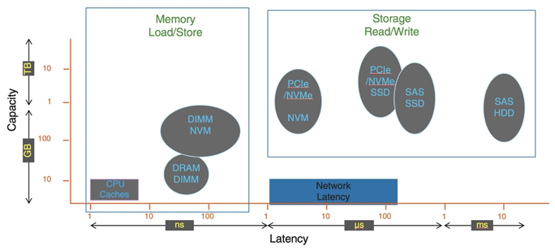

# Chapter 12: I/O System

> [!NOTE]
> - Explore the structure of an operating system's I/O subsystem
> - Discuss the principles and complexities of I/O hardware
> - Explain the performance aspects of I/O hardware and software

## Overview

- I/O management is a major component of operating system design and operation
  - Important aspect of computer operation
  - I/O devices vary greatly
  - Various methods to control them
  - Performance management 
  - New types of devices frequent
- Ports, busses, device controllers connect to various devices
- Device drivers encapsulate device details
  - Present uniform device-access interface to I/O subsystem

## I/O Hardware

- Incredible variety of I/O devices
  - Storage
  - Transmission
  - Human-interface
- Common concepts – signals from I/O devices interface with computer
  - Port – connection point for device
  - Bus - daisy chain or shared direct access
    - PCI bus common in PCs and servers, PCI Express (PCIe) 
    - expansion bus connects relatively slow devices
    - Serial-attached SCSI (SAS) common disk interface
  - Controller (host adapter) – electronics that operate port, bus, device
    - Sometimes integrated
    - Sometimes separate circuit board (host adapter)
    - Contains processor, microcode, private memory, bus controller, etc.
      - Some talk to per-device controller with bus controller, microcode, memory, etc.

- Fibre channel (FC) is complex controller, usually separate circuit board (host-bus adapter, HBA) plugging into bus
- I/O instructions control devices
- Devices usually have registers where device driver places commands, addresses, and data to write, or read data from registers after command execution
  - Data-in register, data-out register, status register, control register
  - Typically 1-4 bytes, or FIFO buffer
- Devices have addresses, used by 
  - Direct I/O instructions
  - Memory-mapped I/O
    - Device data and command registers mapped to processor address space
    - Especially for large address spaces (graphics)

### A Typical PC Bus Structure

### Device I/O Port Locations on PCs (partial)

### Polling

- For each byte of I/O
  1. Read busy bit from status register until 0
  2. Host sets read or write bit and if write copies data into data-out register
  3. Host sets command-ready bit
  4. Controller sets busy bit, executes transfer
  5. Controller clears busy bit, error bit, command-ready bit when transfer done
- Step 1 is busy-wait cycle to wait for I/O from device
  - Reasonable if device is fast
  - But inefficient if device slow
  - CPU switches to other tasks?
    - But if miss a cycle data overwritten / lost

### Interrupts

- Polling can happen in 3 instruction cycles
  - Read status, logical-and to extract status bit, branch if not zero
  - How to be more efficient if non-zero infrequently?
- CPU Interrupt-request line triggered by I/O device
  - Checked by processor after each instruction
- Interrupt handler receives interrupts
  - Maskable to ignore or delay some interrupts
- Interrupt vector to dispatch interrupt to correct handler
  - Context switch at start and end
  - Based on priority
  - Some nonmaskable
  - Interrupt chaining if more than one device at same interrupt number

Interrupt-Driven I/O Cycle

- Interrupt mechanism also used for exceptions
  - Terminate process, crash system due to hardware error
- Page fault executes when memory access error
- System call executes via trap to trigger kernel to execute request
- Multi-CPU systems can process interrupts concurrently
  - If operating system designed to handle it
- Used for time-sensitive processing, frequent, must be fast

### Latency

- Stressing interrupt management because even single-user systems manage hundreds or interrupts per second and servers hundreds of thousands
- For example, a quiet macOS desktop generated 23,000 interrupts over 10 seconds

### Intel Pentium Processor Event-Vector Table

### Direct Memory Access

- Used to avoid programmed I/O (one byte at a time) for large data movement 
- Requires DMA controller
- Bypasses CPU to transfer data directly between I/O device and memory 
- OS writes DMA command block into memory 
  - Source and destination addresses
  - Read or write mode
  - Count of bytes
  - Writes location of command block to DMA controller
  - Bus mastering of DMA controller – grabs bus from CPU
    - Cycle stealing from CPU but still much more efficient
  - When done, interrupts to signal completion
- Version that is aware of virtual addresses can be even more efficient - DVMA

### Six Step Process to Perform DMA Transfer

## Application I/O Interface

- I/O system calls encapsulate device behaviors in generic classes
- Device-driver layer hides differences among I/O controllers from kernel
- New devices talking already-implemented protocols need no extra work
- Each OS has its own I/O subsystem structures and device driver frameworks
- Devices vary in many dimensions
  - Character-stream or block
  - Sequential or random-access
  - Synchronous or asynchronous (or both)
  - Sharable or dedicated
  - Speed of operation
  - read-write, read only, or write only

### A Kernel I/O Structure

### Characteristics of I/O Devices

| Aspect | Variation | Example |
| --- | --- | --- |
| data-transfer mode | character block | terminal disk |
| access mode | sequential random | modem CD-ROM |
| transfer schedule | synchronous asynchronous | tape keyboard |
| sharing | dedicated sharable | tape keyboard |
| device speed | latency, seek time, transfer rate, delay between operaitons | |
| I/O direction | read only, write only, read-write | CD-ROM, graphics controller, disk |

- Subtleties of devices handled by device drivers
- Broadly I/O devices can be grouped by the OS into
  - Block I/O
  - Character I/O (Stream)
  - Memory-mapped file access
  - Network sockets
- For direct manipulation of I/O device specific characteristics, usually an escape / back door
  - Unix `ioctl()` call to send arbitrary bits to a device control register and data to device data register
- UNIX and Linux use tuple of "major" and "minor" device numbers to identify type and instance of devices (here major 8 and minors 0-4)

    `% ls –l /dev/sda*`

    

### Block and Character Devices

- Block devices include disk drives
  - Commands include read, write, seek 
  - Raw I/O, direct I/O, or file-system access
  - Memory-mapped file access possible
    - File mapped to virtual memory and clusters brought via demand paging
  - DMA
- Character devices include keyboards, mice, serial ports
  - Commands include `get()`, `put()`
  - Libraries layered on top allow line editing

### Network Devices

- Varying enough from block and character to have own interface
- Linux, Unix, Windows and many others include socket interface
  - Separates network protocol from network operation
  - Includes `select()` functionality
- Approaches vary widely (pipes, FIFOs, streams, queues, mailboxes)

### Clocks and Timers

- Provide current time, elapsed time, timer
- Normal resolution about 1/60 second
- Some systems provide higher-resolution timers
- Programmable interval timer used for timings, periodic interrupts
- `ioctl()` (on UNIX) covers odd aspects of I/O such as clocks and timers

### Nonblocking and Asynchronous I/O

- Blocking - process suspended until I/O completed
  - Easy to use and understand
  - Insufficient for some needs
- Nonblocking - I/O call returns as much as available
  - User interface, data copy (buffered I/O)
  - Implemented via multi-threading
  - Returns quickly with count of bytes read or written
  - `select()` to find if data ready then `read()` or `write()` to transfer
- Asynchronous - process runs while I/O executes
  - Difficult to use
  - I/O subsystem signals process when I/O completed

### Two I/O Methods

### Vectored I/O

- Vectored I/O allows one system call to perform multiple I/O operations
- For example, Unix `readve()` accepts a vector of multiple buffers to read into or write from
- This scatter-gather method better than multiple individual I/O calls
  - Decreases context switching and system call overhead
  - Some versions provide atomicity
    - Avoid for example worry about multiple threads changing data as reads / writes occurring 

## Kernel I/O Subsystem

- Scheduling
  - Some I/O request ordering via per-device queue
  - Some OSs try fairness
  - Some implement Quality Of Service (i.e. IPQOS)
- Buffering - store data in memory while transferring between devices
  - To cope with device speed mismatch
  - To cope with device transfer size mismatch
  - To maintain “copy semantics”
  - Double buffering – two copies of the data
    - Kernel and user
    - Varying sizes
    - Full  / being processed and not-full / being used
    - Copy-on-write can be used for efficiency in some cases
- Caching - faster device holding copy of data
  - Always just a copy
  - Key to performance
  - Sometimes combined with buffering
- Spooling - hold output for a device
  - If device can serve only one request at a time 
  - i.e., Printing
- Device reservation - provides exclusive access to a device
  - System calls for allocation and de-allocation
  - Watch out for deadlock

### Device-status Table

### Common PC and Data-center I/O devices and Interface Speeds

### Error Handling

- OS can recover from disk read, device unavailable, transient write failures
  - Retry a read or write, for example
  - Some systems more advanced – Solaris FMA, AIX 
    - Track error frequencies, stop using device with increasing frequency of retry-able errors
- Most return an error number or code when I/O request fails 
- System error logs hold problem reports

### I/O Protection

- User process may accidentally or purposefully attempt to disrupt normal operation via illegal I/O instructions
  - All I/O instructions defined to be privileged
  - I/O must be performed via system calls
    - Memory-mapped and I/O port memory locations must be protected too

### Use of a System Call to Perform I/O

### Kernel Data Structures

- Kernel keeps state info for I/O components, including open file tables, network connections, character device state
- Many, many complex data structures to track buffers, memory allocation, "dirty" blocks
- Some use object-oriented methods and message passing to implement I/O
  - Windows uses message passing
    - Message with I/O information passed from user mode into kernel
    - Message modified as it flows through to device driver and back to process
    - Pros / cons?

### UNIX I/O Kernel Structure

### Power Management

- Not strictly domain of I/O, but much is I/O related
- Computers and devices use electricity, generate heat, frequently require cooling
- OSes can help manage and improve use
  - Cloud computing environments move virtual machines between servers
    - Can end up evacuating whole systems and shutting them down
- Mobile computing has power management as first class OS aspect
- For example, Android implements
  - Component-level power management
    - Understands relationship between components
    - Build device tree representing physical device topology
    - System bus -> I/O subsystem -> {flash, USB storage}
    - Device driver tracks state of device, whether in use
    - Unused component – turn it off
    - All devices in tree branch unused – turn off branch
  - Wake locks – like other locks but prevent sleep of device when lock is held
  - Power collapse – put a device into very deep sleep
    - Marginal power use
    - Only awake enough to respond to external stimuli (button press, incoming call)
  - Modern systems use advanced configuration and power interface (ACPI) firmware providing code that runs as routines called by kernel for device discovery, management, error and power management 

### Kernel I/O Subsystem Summary

- In summary, the I/O subsystem coordinates an extensive collection of services that are available to applications and to other parts of the kernel
  - Management of the name space for files and devices
  - Access control to files and devices
  - Operation control (for example, a modem cannot seek())
  - File-system space allocation
  - Device allocation
  - Buffering, caching, and spooling
  - I/O scheduling
  - Device-status monitoring, error handling, and failure recovery
  - Device-driver configuration and initialization
  - Power management of I/O devices
- The upper levels of the I/O subsystem access devices via the uniform interface provided by the device drivers

## Transforming I/O Requests to Hardware Operations

Consider reading a file from disk for a process:

1. Determine device holding file 
2. Translate name to device representation
3. Physically read data from disk into buffer
4. Make data available to requesting process
5. Return control to process

### Life Cycle of An I/O Request

## STREAMS 

- STREAM – a full-duplex communication channel between a user-level process and a device in Unix System V and beyond
- A STREAM consists of:
  - STREAM head interfaces with the user process
  - driver end interfaces with the device
  - zero or more STREAM modules between them
- Each module contains a read queue and a write queue
- Message passing is used to communicate between queues
  - Flow control option to indicate available or busy
- Asynchronous internally, synchronous where user process communicates with stream head

### The STREAMS Structure

## Performance

- I/O a major factor in system performance:
  - Demands CPU to execute device driver, kernel I/O code
  - Context switches due to interrupts
  - Data copying
  - Network traffic especially stressful

### Intercomputer Communications

### Improving Performance

- Reduce number of context switches
- Reduce data copying
- Reduce interrupts by using large transfers, smart controllers, polling
- Use DMA
- Use smarter hardware devices
- Balance CPU, memory, bus, and I/O performance for highest throughput
- Move user-mode processes / daemons to kernel threads

### Device-Functionality Progression

### I/O Performance of Storage (and Network Latency)

