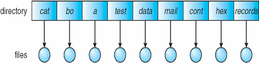
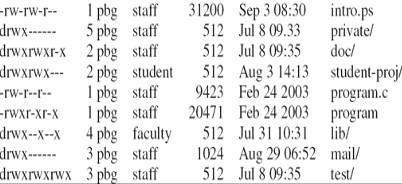

# Chapter 13: File-System Interface


> [!NOTE]
>
> - To explain the function of file systems
> - To describe the interfaces to file systems
> - To discuss file-system design tradeoffs, including access methods, file sharing, file locking, and directory structures
> - To explore file-system protection


## File Concept

- Contiguous logical address space
- Types: 
  - Data
    - Numeric
    - Character
    - Binary
  - Program
- Contents defined by file’s creator
  - Many types
    - text file, 
    - source file, 
    - executable file

### File Attributes

- Name – only information kept in human-readable form
- Identifier – unique tag (number) identifies file within file system
- Type – needed for systems that support different types
- Location – pointer to file location on device
- Size – current file size
- Protection – controls who can do reading, writing, executing
- Time, date, and user identification – data for protection, security, and usage monitoring
- Information about files are kept in the directory structure, which is maintained on the disk
- Many variations, including extended file attributes such as file checksum
- Information kept in the directory structure

### Directory Structure

- A collection of nodes containing information about all files

    
- Both the directory structure and the files reside on disk

### File Operations

- Create
- Write – at write pointer location
- Read – at read pointer location
- Reposition within file - seek
- Delete
- Truncate
- Open ($F_i$) – search the directory structure on disk for entry $F_i$, and move the content of entry to memory
- Close ($F_i$) – move the content of entry $F_i$ in memory to directory structure on disk

### Open Files

- Several pieces of data are needed to manage open files:
  - Open-file table: tracks open files
  - File pointer:  pointer to last read/write location, per process that has the file open
  - File-open count: counter of number of times a file is open – to allow removal of data from open-file table when last processes closes it
  - Disk location of the file: cache of data access information
  - Access rights: per-process access mode information

###  File Locking

- Provided by some operating systems and file systems
  - Similar to reader-writer locks
  - Shared lock similar to reader lock – several processes can acquire concurrently
  - Exclusive lock similar to writer lock
- Mediates access to a file
- Mandatory or advisory:
  - Mandatory – access is denied depending on locks held and requested
  - Advisory – processes can find status of locks and decide what to do

### File Locking Example – Java API

```java
import java.io.*;
import java.nio.channels.*;
public class LockingExample { 
    public static final boolean EXCLUSIVE = false;
    public static final boolean SHARED = true;
    public static void main(String arsg[]) throws IOException { 
        FileLock sharedLock = null;
        FileLock exclusiveLock = null;
        try { 
            RandomAccessFile raf = new RandomAccessFile("file.txt", "rw");
            // get the channel for the file
            FileChannel ch = raf.getChannel();
            // this locks the first half of the file - exclusive
            exclusiveLock = ch.lock(0, raf.length()/2, EXCLUSIVE);
            /** Now modify the data . . . */
            // release the lock
            exclusiveLock.release();
            // this locks the second half of the file - shared
            sharedLock = ch.lock(raf.length()/2+1, raf.length(), 				SHARED);
            /** Now read the data . . . */
            // release the lock
            sharedLock.release();
        } catch (java.io.IOException ioe) { 
            System.err.println(ioe);
        } finally { 
            if (exclusiveLock != null)
            exclusiveLock.release();
            if (sharedLock != null)
            sharedLock.release();
        }
    }
}
```

### File Types – Name, Extension


### File Structure

- None - sequence of words, bytes
- Simple record structure
  - Lines 
  - Fixed length
  - Variable length
- Complex Structures
  - Formatted document
  - Relocatable load file	
- Can simulate last two with first method by inserting appropriate control characters
- Who decides:
  - Operating system
  - Program


## Access Methods

### Sequential Access

- Operations
  - `read next`
  - `write next `
  - `Reset`
  - no read after last write  (rewrite)


### Direct Access

- Operations
  - `read n`
  - `write n`
  - `position to n`
  - `read next`
  - `write next` 
  - `rewrite n`

    n = relative block number

- Relative block numbers allow OS to decide where file should be placed

#### Simulation of Sequential Access on Direct-access File

| Sequential Access | Implementation for direct access |
|-------------------|----------------------------------|
| `reset` | `cp = 0;` |
| `read next` | `read cp;`, `cp = cp + 1;` |
| `write next` | `write cp;`, `cp = cp + 1;` |

### Other Access Methods

- Can be other access methods built on top of base methods
- General involve creation of an index for the file
- Keep index in memory for fast determination of location of data to be operated on (consider Universal Produce Code (UPC code) plus record of data about that item)
- If the index is too large, create an in-memory index, which an index of a disk index
- IBM indexed sequential-access method (ISAM)
  - Small master index, points to disk blocks of secondary index
  - File kept sorted on a defined key
  - All done by the OS
- VMS operating system provides index and relative files as another example (see next slide)

### Example of Index and Relative Files


## Disk and Directory Structure

- Disk can be subdivided into partitions
- Disks or partitions can be RAID protected against failure
- Disk or partition can be used raw – without a file system, or formatted with a file system
- Partitions also known as minidisks, slices
- Entity containing file system is known as a volume
- Each volume containing a file system also tracks that file system’s info in device directory or volume table of contents
- In addition to general-purpose file systems there are many special-purpose file systems, frequently all within the same operating system or computer

### A Typical File-system Organization


### Types of File Systems

- We mostly talk of general-purpose file systems
- But systems frequently have may file systems, some general - and some special- purpose
- Consider Solaris has
  - `tmpfs` – memory-based volatile FS for fast, temporary I/O
  - `objfs` – interface into kernel memory to get kernel symbols for debugging
  - `ctfs` – contract file system for managing daemons 
  - `lofs` – loopback file system allows one FS to be accessed in place of another
  - `procfs` – kernel interface to process structures
  - `ufs`, `zfs` – general purpose file systems

### Operations Performed on Directory

- Search for a file
- Create a file
- Delete a file
- List a directory
- Rename a file
- Traverse the file system

### Directory Organization

The directory is organized logically to obtain 

- Efficiency – locating a file quickly
- Naming – convenient to users
  - Two users can have same name for different files
  - The same file can have several different names
- Grouping – logical grouping of files by properties, (e.g., all Java programs, all games, …)

### Single-Level Directory

A single directory for all users



- Naming problem
- Grouping problem

### Two-Level Directory

Separate directory for each user


- Path name
- Can have the same file name for different user
- Efficient searching
- No grouping capability

### Tree-Structured Directories


### Acyclic-Graph Directories

Have shared subdirectories and files


- Two different names (aliasing)
- If dict deletes w/list  dangling pointer
    
    **Solutions:**
    - Backpointers, so we can delete all pointers.
      - Variable size records a problem
    - Backpointers using a daisy chain organization
    - Entry-hold-count solution
- New directory entry type
    - Link – another name (pointer) to an existing file
    - Resolve the link – follow pointer to locate the file

### General Graph Directory


**How do we guarantee no cycles?**

- Allow only links to files not subdirectories
- Garbage collection
- Every time a new link is added use a cycle detection algorithm to determine whether it is OK

### Current Directory

- Can designate one of the directories as the current (working) directory
    - `cd /spell/mail/prog`
    - `type list`
- Creating and deleting a file is done in current directory
- Example of creating a new file
    - If in current directory  is  /mail
    - The command 
    
    `mkdir <dir-name>`

    - Results in:

        

    - Deleting “mail”  deleting the entire subtree rooted by “mail”

        


## Protection

- File owner/creator should be able to control:
  - What can be done
  - By whom
- Types of access
  - `Read`
  - `Write`
  - `Execute`
  - `Append`
  - `Delete`
  - `List`

### Access Lists and Groups in Unix

- Mode of access: read, write, execute
- Three classes of users on Unix / Linux
    - a) owner access : 7 👉🏻 1 1 1 (R W X)
    - b) group access : 6 👉🏻 1 1 0 (R W X)
    - c) public access: 1 👉🏻 0 0 1 (R W X)
- Ask manager to create a group (unique name), say G, and add some users to the group.
- For a file (say game) or subdirectory, define an appropriate access.
    
    

- Attach a group to a file

    `chgrp     G    game`

### A Sample UNIX Directory Listing




## Memory-Mapped Files
