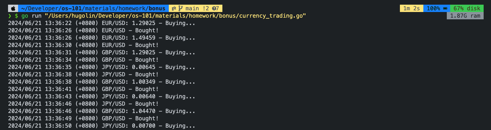

# [CE3002] Operating System -- Homework （Bonus）

> CE3002 Operating System
> 
> - Year: 2024 Spring  
> - Lecturer: 曾黎明
> - Student: 林群賀
> - Dept: ATM
> - Student ID: 109601003

最近一直想對 Go 語言有更多的著墨，加上前個學期有修習計網課程，發現 Go 語言在系統的設計上非常有潛力，因此想嘗試使用 Go 語言來完成這次的作業。

另外想嘗試使用 Go 語言的 `goroutine` 和 `channel` 來嘗試有 multi-threading 的效果，並且使用 `select` 來處理 channel 的資料。因為在做交易的時候，可能會有突然大量的資料湧進來，因此需要一個非同步的處理方式。

希望可以做到幣種的買賣，在合理目標價格時做交易：
1. 當 EUR/USD 的價格大於 1.2 時，買入 EUR/USD
2. 當 GBP/USD 的價格小於 1.35 時，買入 GBP/USD
3. 當 JPY/USD 的價格小於 0.0085 時，買入 JPY/USD

## 程式說明

### Pair

`Pair` 結構包含了幣種的名稱 `name` 和價格 `price`，價格是一個 `chan float64` 類型的 channel，用來接收市場價格的資料。

```go
type Pair struct {
	name  string
	price chan float64
}
```

### simulateMarketData

`simulateMarketData` 函數用來模擬市場價格的變化，每秒隨機生成 EUR/USD 和 GBP/USD 的價格，並將價格通過 channel 發送給 `selectPair` 函數。

```go
func simulateMarketData(pairs *[]Pair, wg *sync.WaitGroup) {
	for {
		randPrice := rand.Float64()

		eur_price := randPrice*0.5 + 1.0
		gbp_price := randPrice*0.5 + 1.0

		// EUR/USD
		(*pairs)[0].price <- eur_price
		// GBP/USD
		(*pairs)[1].price <- gbp_price

		jyp_price := randPrice*0.003 + 0.006

		// JPY/USD
		(*pairs)[2].price <- jyp_price

		time.Sleep(1 * time.Second)
	}
}
```

### selectPair

`selectPair` 函數用來選擇合適的時機進行買賣操作，根據市場價格的變化，當符合條件時進行買入操作。

```go
func selectPair(pairs *[]Pair, wg *sync.WaitGroup) {
	for {
		select {
		case price := <-(*pairs)[0].price:
			if price > 1.2 {
				formattedPrice := fmt.Sprintf("%.5f", price)
				println(time.Now().Format("2006/01/02 15:04:05 (-0700)"), "EUR/USD:", formattedPrice, "- Buying...")
				time.Sleep(4 * time.Second)
				println(time.Now().Format("2006/01/02 15:04:05 (-0700)"), "EUR/USD", "- Bought!")
			}
		case price := <-(*pairs)[1].price:
			if price < 1.35 {
				formattedPrice := fmt.Sprintf("%.5f", price)
				println(time.Now().Format("2006/01/02 15:04:05 (-0700)"), "GBP/USD:", formattedPrice, "- Buying...")
				time.Sleep(3 * time.Second)
				println(time.Now().Format("2006/01/02 15:04:05 (-0700)"), "GBP/USD", "- Bought!")
			}
		case price := <-(*pairs)[2].price:
			if price < 0.0085 {
				formattedPrice := fmt.Sprintf("%.5f", price)
				println(time.Now().Format("2006/01/02 15:04:05 (-0700)"), "JPY/USD:", formattedPrice, "- Buying...")
				time.Sleep(3 * time.Second)
				println(time.Now().Format("2006/01/02 15:04:05 (-0700)"), "JPY/USD", "- Bought!")
			}
		default:
		}

		time.Sleep(500 * time.Millisecond)
	}
}
```

### main

在 `main` 函數中，創建了三個 `Pair` 結構的實例，分別代表 EUR/USD、GBP/USD 和 JPY/USD 三種幣種，並且啟動了兩個 goroutine 分別來模擬市場價格的變化和選擇合適的時機進行買賣操作。

```go
func main() {
	rand.New(rand.NewSource(time.Now().UnixNano()))

	wg := sync.WaitGroup{}

	pairs := []Pair{
		{"EUR/USD", make(chan float64, 1)},
		{"GBP/USD", make(chan float64, 1)},
		{"JPY/USD", make(chan float64, 1)},
	}

	go simulateMarketData(&pairs, &wg)
	go selectPair(&pairs, &wg)

	time.Sleep(1 * time.Minute)
}
```

## 遇到的困難

在執行程式的時候，很順例如以下的結果：

```shell
06:21:01 GBP/USD: 1.28838 - Buying...
06:21:01 GBP/USD - Bought!
06:21:01 EUR/USD: 1.28838 - Buying...
06:21:01 EUR/USD - Bought!
06:21:01 EUR/USD: 1.24694 - Buying...
06:21:01 EUR/USD - Bought!
06:21:01 GBP/USD: 1.24694 - Buying...
06:21:01 GBP/USD - Bought!
06:21:01 EUR/USD: 1.38071 - Buying...
```



不過出現了莫名其妙的中斷，就是沒出現任何錯誤訊息，程式就中斷了，應該是遇到 Deadlock 的問題，因此我有去請教 ChatGPT。

他的回覆是以下兩個問題：

1. **WaitGroup 的使用問題**:
   - 你在 `main` 函數中創建了一個 `sync.WaitGroup` 對象 `wg`，但在啟動 `simulateMarketData` 和 `selectPair` 的 goroutine 後沒有調用 `wg.Wait()` 來等待這些 goroutine 的完成。這可能會導致程序在 `main` 函數結束時提前退出，而未完成所有 goroutine 的執行。
2. **價格通道的阻塞**:
   - 當價格通道（`price chan float64`）滿了之後，`simulateMarketData` 中的 `(*pairs)[0].price <- eur_price` 和 `(*pairs)[1].price <- gbp_price` 將會阻塞，直到有某個 goroutine 從通道中讀取數據為止。這可能導致程序在這裡陷入死鎖狀態，因為 `simulateMarketData` 在循環中不斷地往通道裡寫數據，但 `selectPair` 卻可能沒有及時讀取數據。


### 修正方法

#### 1. 確保正確使用 WaitGroup：

```go
func main() {
	wg := sync.WaitGroup{}

	pairs := []Pair{
		{"EUR/USD", make(chan float64, 1)},
		{"GBP/USD", make(chan float64, 1)},
		{"JPY/USD", make(chan float64, 1)},
	}

	wg.Add(2) // 增加 WaitGroup 的計數器，表示要等待兩個 goroutine 完成

	go simulateMarketData(&pairs, &wg)
	go selectPair(&pairs, &wg)

	wg.Wait() // 等待所有 goroutine 完成
}
```

#### 2. 避免阻塞問題：

```go
func simulateMarketData(pairs *[]Pair, wg *sync.WaitGroup) {
	defer wg.Done() // 減少 WaitGroup 的計數器，表示該 goroutine 已完成

	for {
		randPrice := rand.Float64()

		eur_price := randPrice*0.5 + 1.0
		gbp_price := randPrice*0.5 + 1.0

		// 嘗試往通道裡發送數據，但不會阻塞
		select {
		case (*pairs)[0].price <- eur_price:
		default:
		}

		select {
		case (*pairs)[1].price <- gbp_price:
		default:
		}

		jpy_price := randPrice*0.003 + 0.006

		// 嘗試往通道裡發送數據，但不會阻塞
		select {
		case (*pairs)[2].price <- jpy_price:
		default:
		}

		time.Sleep(1 * time.Second)
	}
}
```

#### 3. 確保 selectPair 函數能夠及時處理價格數據：

```go
func selectPair(pairs *[]Pair, wg *sync.WaitGroup) {
	defer wg.Done() // 減少 WaitGroup 的計數器，表示該 goroutine 已完成

	for {
		select {
		case price := <-(*pairs)[0].price:
			if price > 1.2 {
				formattedPrice := fmt.Sprintf("%.5f", price)
				println(time.Now().Format("2006/01/02 15:04:05 (-0700)"), "EUR/USD:", formattedPrice, "- Buying...")
				time.Sleep(4 * time.Second)
				println(time.Now().Format("2006/01/02 15:04:05 (-0700)"), "EUR/USD", "- Bought!")
			}
		case price := <-(*pairs)[1].price:
			if price < 1.35 {
				formattedPrice := fmt.Sprintf("%.5f", price)
				println(time.Now().Format("2006/01/02 15:04:05 (-0700)"), "GBP/USD:", formattedPrice, "- Buying...")
				time.Sleep(3 * time.Second)
				println(time.Now().Format("2006/01/02 15:04:05 (-0700)"), "GBP/USD", "- Bought!")
			}
		case price := <-(*pairs)[2].price:
			if price < 0.0085 {
				formattedPrice := fmt.Sprintf("%.5f", price)
				println(time.Now().Format("2006/01/02 15:04:05 (-0700)"), "JPY/USD:", formattedPrice, "- Buying...")
				time.Sleep(3 * time.Second)
				println(time.Now().Format("2006/01/02 15:04:05 (-0700)"), "JPY/USD", "- Bought!")
			}
		default:
		}

		time.Sleep(500 * time.Millisecond)
	}
}
```

於是乎程式就可以正常運行了，並且可以正常的進行買入操作。

## 學習到的內容

我有參考了 [Golang 教學系列 - WaitGroup 常見的坑以及應用介紹](https://blog.kennycoder.io/2020/12/20/Golang%E6%95%99%E5%AD%B8%E7%B3%BB%E5%88%97-WaitGroup%E5%B8%B8%E8%A6%8B%E7%9A%84%E5%9D%91%E4%BB%A5%E5%8F%8A%E6%87%89%E7%94%A8%E4%BB%8B%E7%B4%B9/) 並且學習到「當 WaitGroup 等待 Goroutine 與實際 Goroutine 數目不一致」的問題，這樣會導致 Deadlock 的問題。


